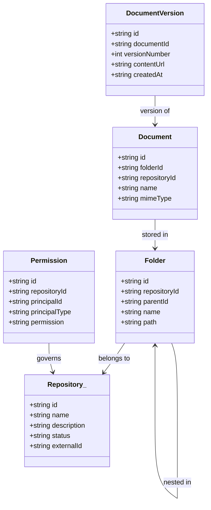
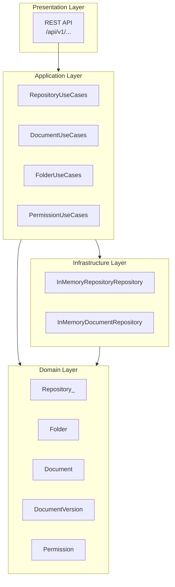
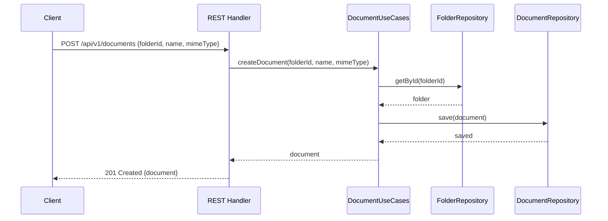

# UML Diagrams — DMS Integration Service

## Class Diagram

```mermaid
classDiagram
    class Repository_ {
        +string id
        +string name
        +string description
        +string status
        +string externalId
    }
    class Folder {
        +string id
        +string repositoryId
        +string parentId
        +string name
        +string path
    }
    class Document {
        +string id
        +string folderId
        +string repositoryId
        +string name
        +string mimeType
    }
    class DocumentVersion {
        +string id
        +string documentId
        +int versionNumber
        +string contentUrl
        +string createdAt
    }
    class Permission {
        +string id
        +string repositoryId
        +string principalId
        +string principalType
        +string permission
    }

    Folder --> Repository_ : belongs to
    Folder --> Folder : nested in
    Document --> Folder : stored in
    DocumentVersion --> Document : version of
    Permission --> Repository_ : governs
```

## Component Diagram

```mermaid
flowchart TB
    subgraph Presentation["Presentation Layer"]
        REST["REST API\n/api/v1/..."]
    end
    subgraph Application["Application Layer"]
        REPO_UC["RepositoryUseCases"]
        DOC_UC["DocumentUseCases"]
        FOLDER_UC["FolderUseCases"]
        PERM_UC["PermissionUseCases"]
    end
    subgraph Domain["Domain Layer"]
        REPO["Repository_"]
        FOLDER["Folder"]
        DOC["Document"]
        VER["DocumentVersion"]
        PERM["Permission"]
    end
    subgraph Infrastructure["Infrastructure Layer"]
        REPO_REPO["InMemoryRepositoryRepository"]
        DOC_REPO["InMemoryDocumentRepository"]
    end

    REST --> Application
    Application --> Domain
    Infrastructure --> Domain
    Application --> Infrastructure
```

## Sequence Diagram — Upload Document

```mermaid
sequenceDiagram
    participant C as Client
    participant R as REST Handler
    participant UC as DocumentUseCases
    participant FR as FolderRepository
    participant DR as DocumentRepository

    C->>R: POST /api/v1/documents {folderId, name, mimeType}
    R->>UC: createDocument(folderId, name, mimeType)
    UC->>FR: getById(folderId)
    FR-->>UC: folder
    UC->>DR: save(document)
    DR-->>UC: saved
    UC-->>R: document
    R-->>C: 201 Created {document}
```
