# Document AI Service — UML Diagrams

## 1. Component Diagram — Hexagonal Architecture

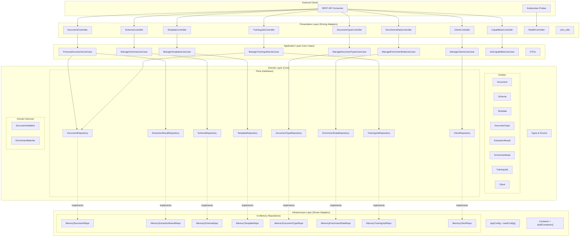

## 2. Class Diagram — Domain Model

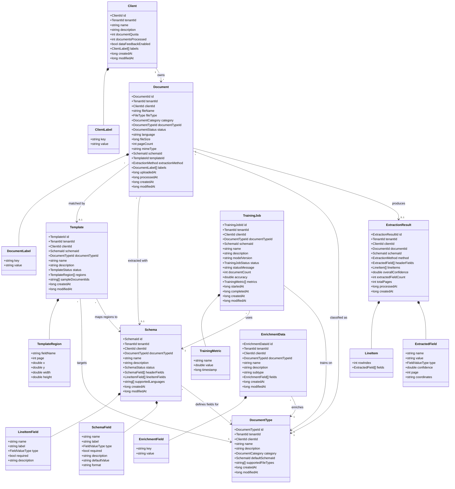

## 3. Enumeration Diagram

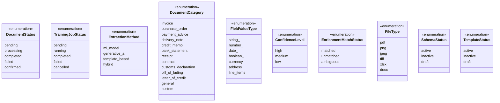

## 4. Sequence Diagram — Document Upload & Extraction

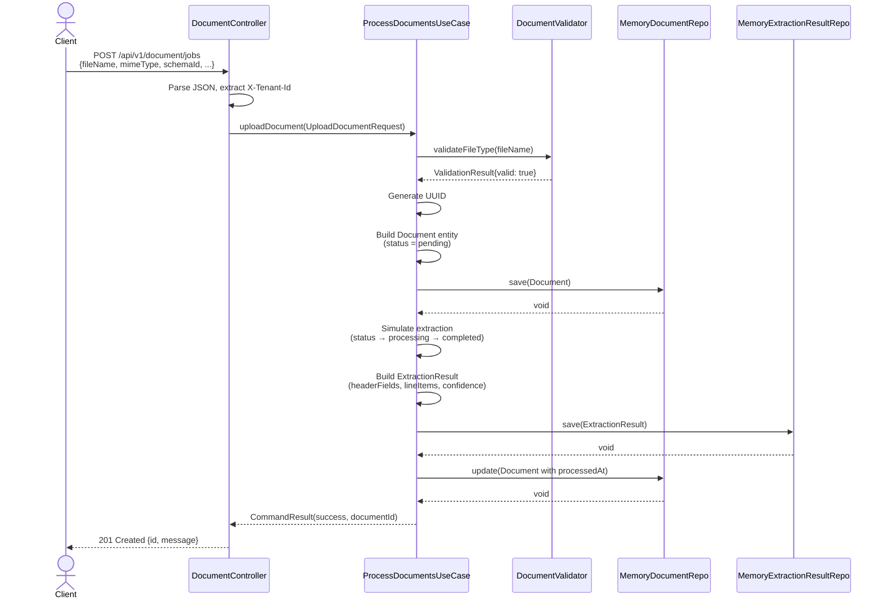

## 5. Sequence Diagram — Confirm Extraction Results

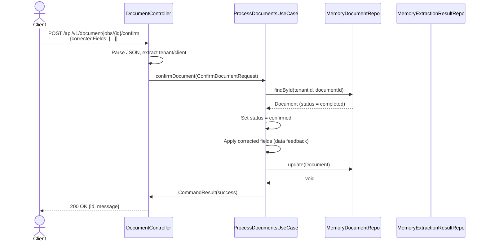

## 6. Sequence Diagram — Enrichment Matching

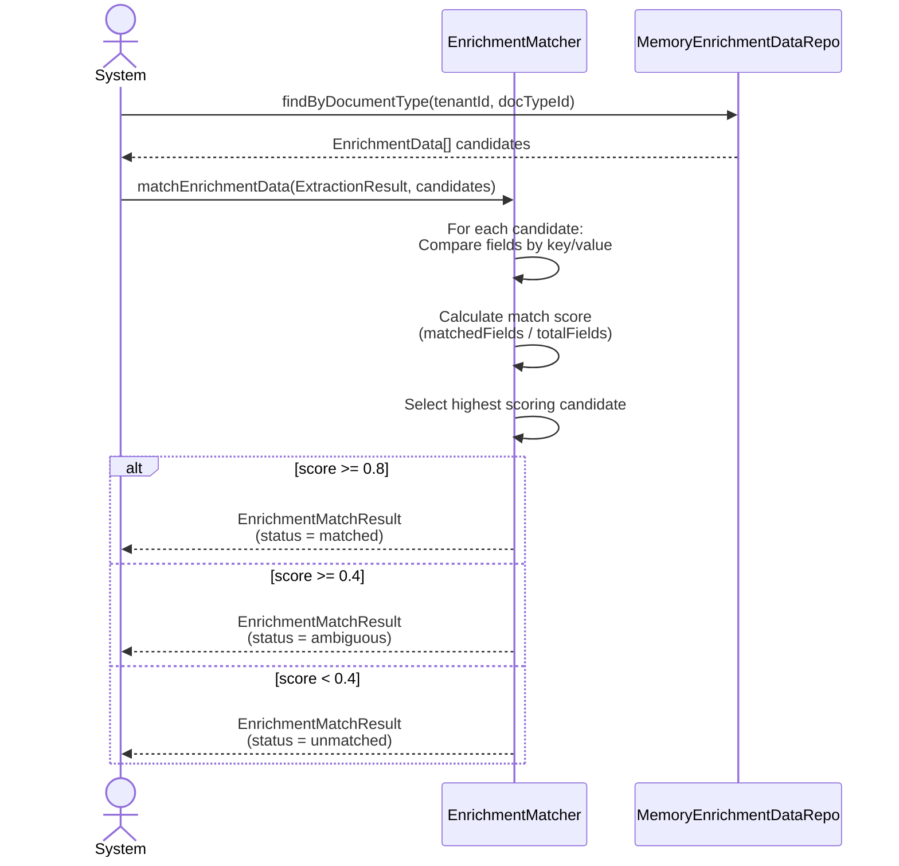

## 7. Sequence Diagram — Training Job Lifecycle

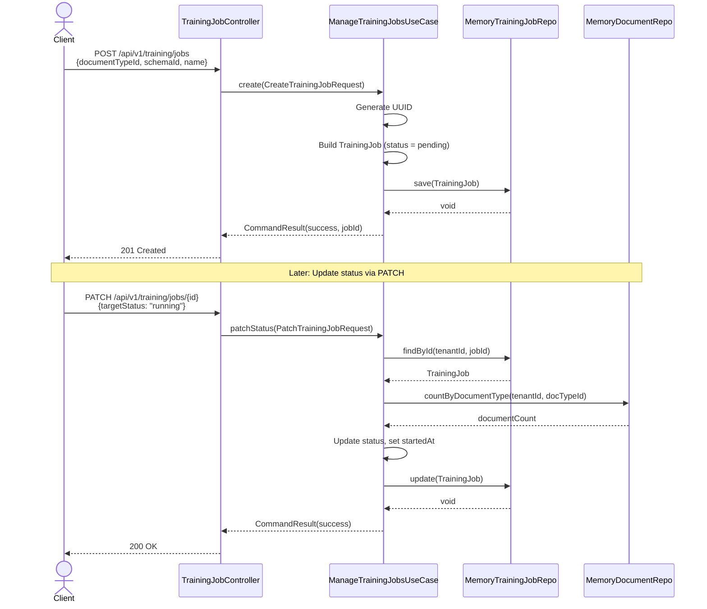

## 8. State Diagram — Document Processing Lifecycle

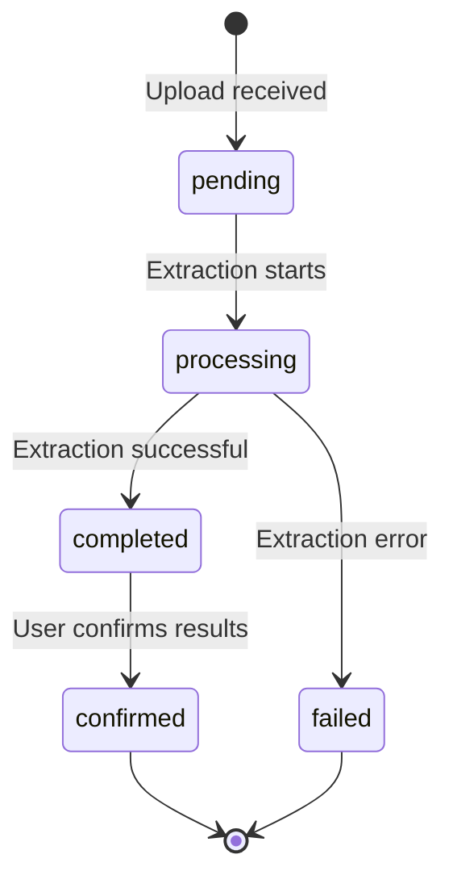

## 9. State Diagram — Training Job Lifecycle

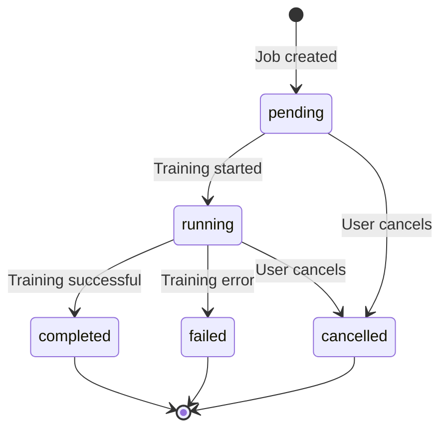

## 10. Deployment Diagram

```mermaid
graph TB
    subgraph K8S["Kubernetes Cluster"]
        subgraph Pod["Pod: cloud-document-ai"]
            SVC["uim-document-ai<br/>-platform-service<br/>Port 8096"]
            MEM["In-Memory Store"]
            SVC --> MEM
        end
        CM["ConfigMap<br/>cloud-document-ai-config<br/>DOCAI_HOST=0.0.0.0<br/>DOCAI_PORT=8096"]
        KSVC["Service<br/>cloud-document-ai<br/>ClusterIP:8096"]
        CM -.->|envFrom| Pod
        KSVC -->|routes to| Pod
    end

    subgraph Build["Container Build (Multi-Stage)"]
        B1["Stage 1: dlang2/ldc-ubuntu:1.40.1<br/>Build binary"]
        B2["Stage 2: ubuntu:24.04<br/>Runtime image"]
        B1 -->|COPY binary| B2
    end

    actor CLIENT["API Consumer"]
    CLIENT -->|HTTP :8096| KSVC
```

## 11. Package Dependency Diagram

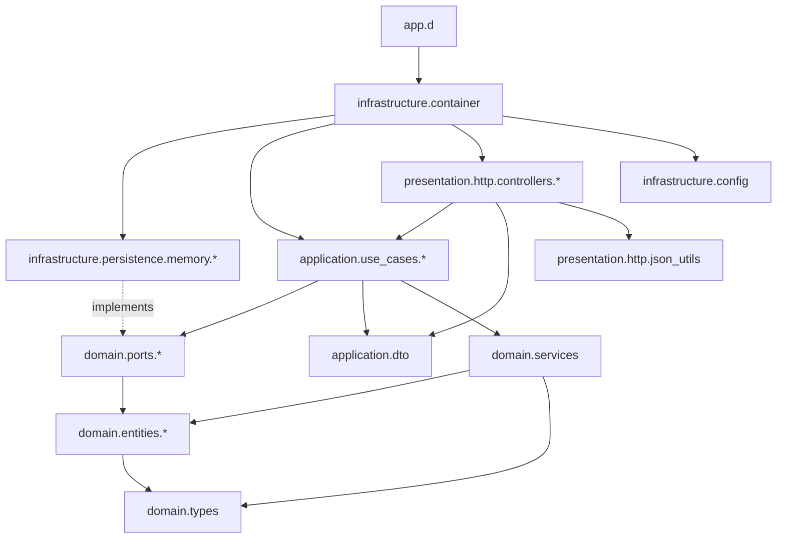

## 12. Domain Services Detail

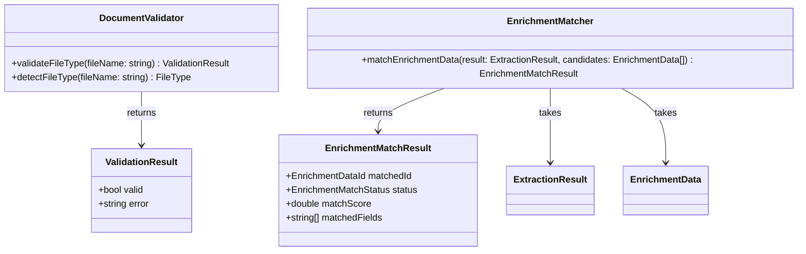
