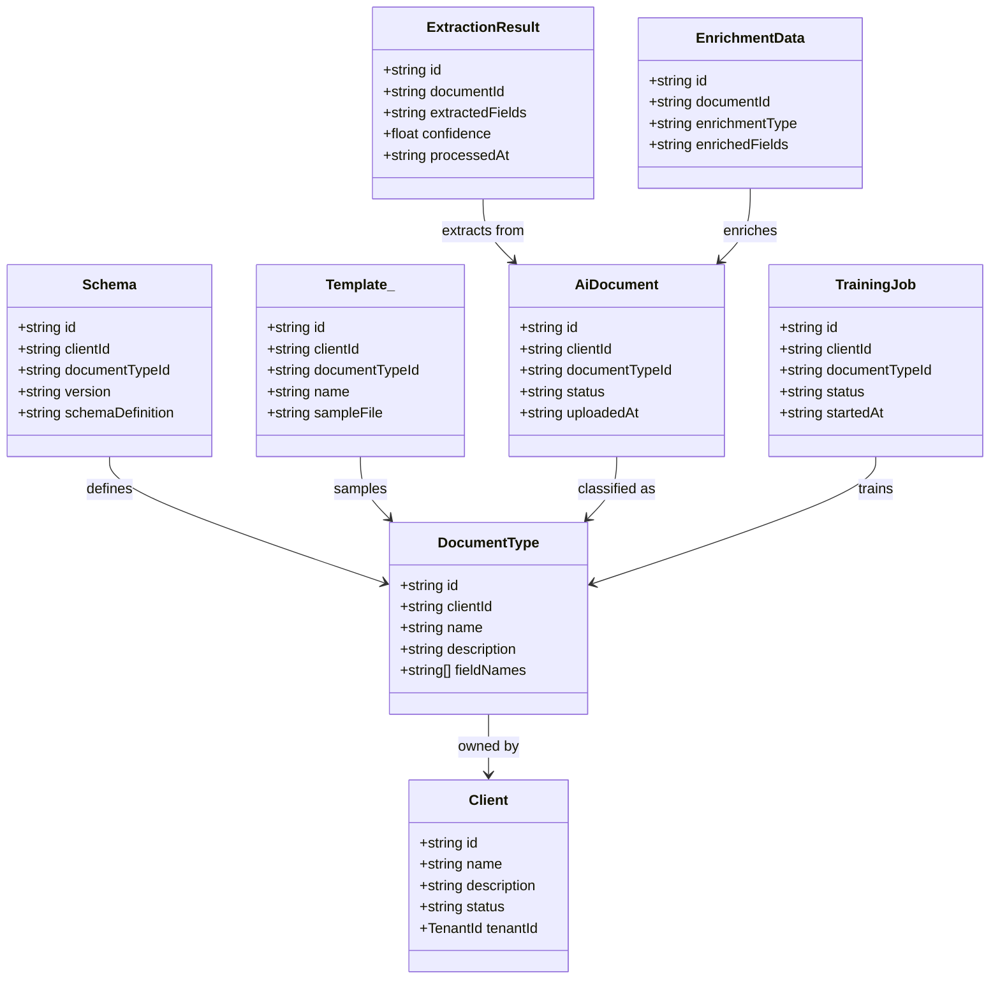
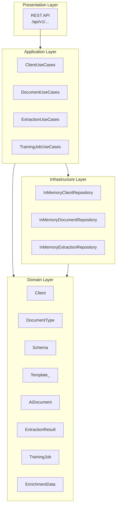
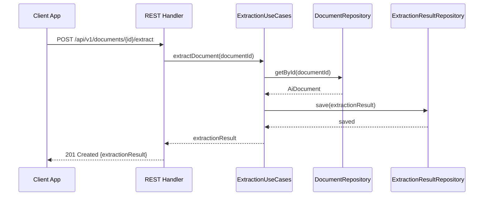

# UML Diagrams — AiDocument AI Service

## Documentation update

This AiDocument is maintained alongside the implementation, deployment manifests, and tests for the same package so the service documentation stays aligned with the codebase.

## Class Diagram

```mermaid
classDiagram
    class Client {
        +string id
        +string name
        +string description
        +string status
        +TenantId tenantId
    }
    class DocumentType {
        +string id
        +string clientId
        +string name
        +string description
        +string[] fieldNames
    }
    class Schema {
        +string id
        +string clientId
        +string documentTypeId
        +string version
        +string schemaDefinition
    }
    class Template_ {
        +string id
        +string clientId
        +string documentTypeId
        +string name
        +string sampleFile
    }
    class AiDocument {
        +string id
        +string clientId
        +string documentTypeId
        +string status
        +string uploadedAt
    }
    class ExtractionResult {
        +string id
        +string documentId
        +string extractedFields
        +float confidence
        +string processedAt
    }
    class TrainingJob {
        +string id
        +string clientId
        +string documentTypeId
        +string status
        +string startedAt
    }
    class EnrichmentData {
        +string id
        +string documentId
        +string enrichmentType
        +string enrichedFields
    }

    DocumentType --> Client : owned by
    Schema --> DocumentType : defines
    Template_ --> DocumentType : samples
    AiDocument --> DocumentType : classified as
    ExtractionResult --> AiDocument : extracts from
    TrainingJob --> DocumentType : trains
    EnrichmentData --> AiDocument : enriches
```

## Component Diagram

```mermaid
flowchart TB
    subgraph Presentation["Presentation Layer"]
        REST["REST API\n/api/v1/..."]
    end
    subgraph Application["Application Layer"]
        CLIENT_UC["ClientUseCases"]
        DOC_UC["DocumentUseCases"]
        EXTRACT_UC["ExtractionUseCases"]
        TRAIN_UC["TrainingJobUseCases"]
    end
    subgraph Domain["Domain Layer"]
        CLIENT["Client"]
        DOCTYPE["DocumentType"]
        SCHEMA["Schema"]
        TMPL["Template_"]
        DOC["AiDocument"]
        RESULT["ExtractionResult"]
        JOB["TrainingJob"]
        ENRICH["EnrichmentData"]
    end
    subgraph Infrastructure["Infrastructure Layer"]
        CLIENT_REPO["InMemoryClientRepository"]
        DOC_REPO["InMemoryDocumentRepository"]
        RESULT_REPO["InMemoryExtractionRepository"]
    end

    REST --> Application
    Application --> Domain
    Infrastructure --> Domain
    Application --> Infrastructure
```

## Sequence Diagram — Extract AiDocument Fields

```mermaid
sequenceDiagram
    participant C as Client App
    participant R as REST Handler
    participant UC as ExtractionUseCases
    participant DR as DocumentRepository
    participant RR as ExtractionResultRepository

    C->>R: POST /api/v1/documents/{id}/extract
    R->>UC: extractDocument(documentId)
    UC->>DR: getById(documentId)
    DR-->>UC: AiDocument
    UC->>RR: save(extractionResult)
    RR-->>UC: saved
    UC-->>R: extractionResult
    R-->>C: 201 Created {extractionResult}
```
