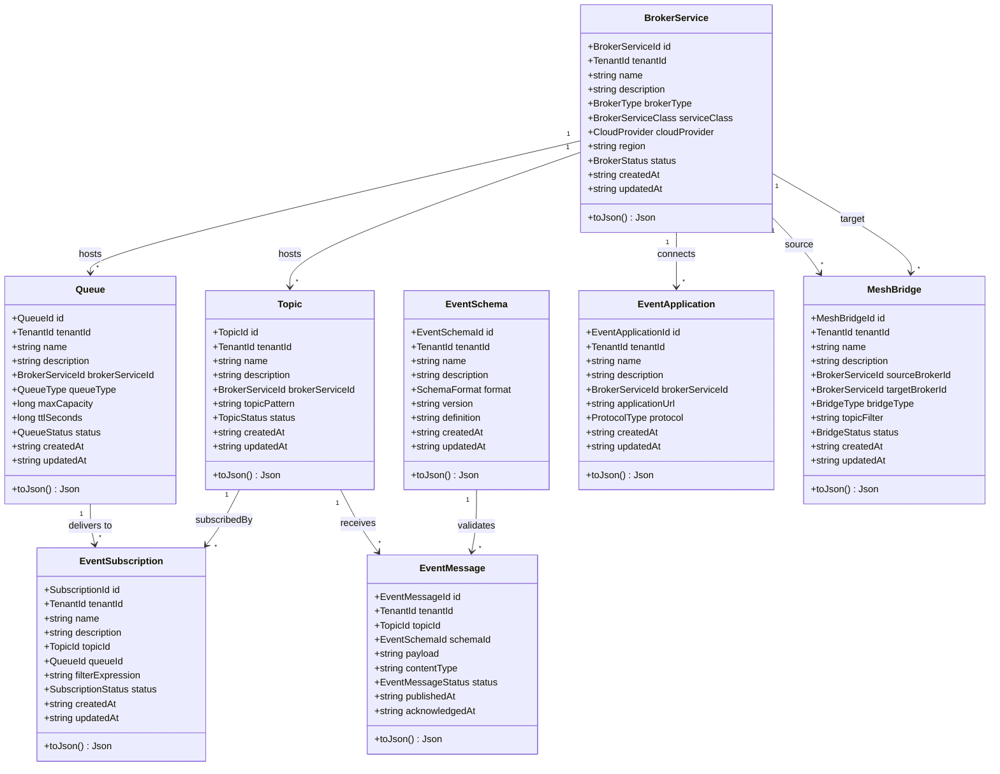
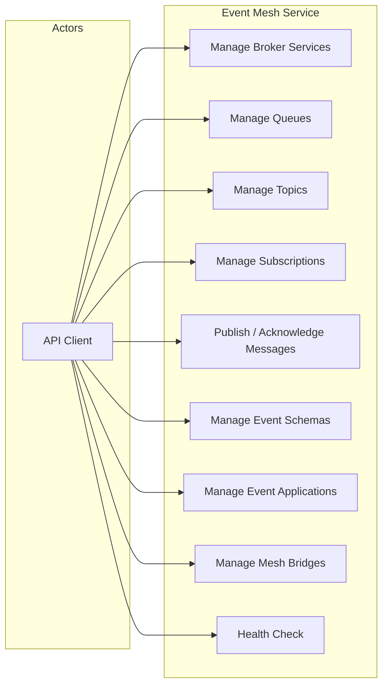
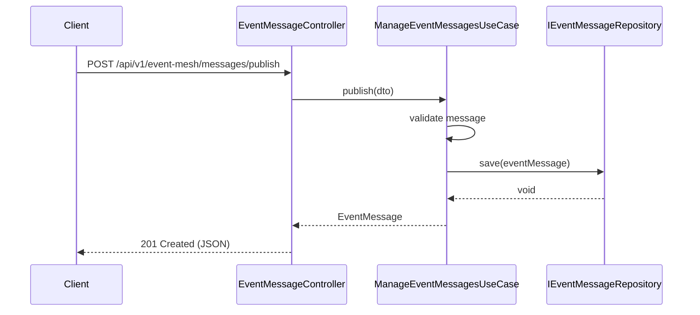
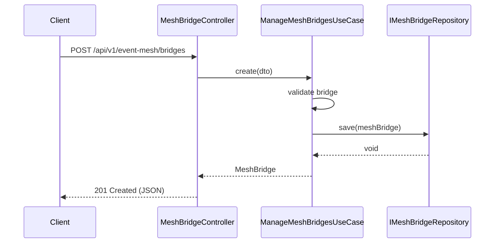

# Event Mesh — UML Diagrams

## Class Diagram — Domain Entities

## Class Diagram — Repository Interfaces

```mermaid
classDiagram
    class IBrokerServiceRepository {
        <<interface>>
        +findAll() BrokerService[]
        +findByTenant(tenantId) BrokerService[]
        +findById(id) BrokerService
        +save(entity) void
        +update(entity) void
        +removeById(id) void
    }

    class IQueueRepository {
        <<interface>>
        +findAll() Queue[]
        +findByTenant(tenantId) Queue[]
        +findById(id) Queue
        +findByBrokerServiceId(id) Queue[]
        +save(entity) void
        +update(entity) void
        +removeById(id) void
    }

    class ITopicRepository {
        <<interface>>
        +findAll() Topic[]
        +findByTenant(tenantId) Topic[]
        +findById(id) Topic
        +findByBrokerServiceId(id) Topic[]
        +save(entity) void
        +update(entity) void
        +removeById(id) void
    }

    class ISubscriptionRepository {
        <<interface>>
        +findAll() EventSubscription[]
        +findByTenant(tenantId) EventSubscription[]
        +findById(id) EventSubscription
        +findByTopicId(id) EventSubscription[]
        +save(entity) void
        +update(entity) void
        +removeById(id) void
    }

    class IEventMessageRepository {
        <<interface>>
        +findAll() EventMessage[]
        +findByTenant(tenantId) EventMessage[]
        +findById(id) EventMessage
        +findByTopicId(id) EventMessage[]
        +findByStatus(status) EventMessage[]
        +save(entity) void
        +update(entity) void
        +removeById(id) void
    }

    class IEventSchemaRepository {
        <<interface>>
        +findAll() EventSchema[]
        +findByTenant(tenantId) EventSchema[]
        +findById(id) EventSchema
        +save(entity) void
        +update(entity) void
        +removeById(id) void
    }

    class IEventApplicationRepository {
        <<interface>>
        +findAll() EventApplication[]
        +findByTenant(tenantId) EventApplication[]
        +findById(id) EventApplication
        +findByBrokerServiceId(id) EventApplication[]
        +save(entity) void
        +update(entity) void
        +removeById(id) void
    }

    class IMeshBridgeRepository {
        <<interface>>
        +findAll() MeshBridge[]
        +findByTenant(tenantId) MeshBridge[]
        +findById(id) MeshBridge
        +findByStatus(status) MeshBridge[]
        +save(entity) void
        +update(entity) void
        +removeById(id) void
    }
```

## Use Case Diagram

## Component Diagram

```mermaid
graph TB
    subgraph Presentation
        C1[BrokerServiceController]
        C2[QueueController]
        C3[TopicController]
        C4[SubscriptionController]
        C5[EventMessageController]
        C6[EventSchemaController]
        C7[EventApplicationController]
        C8[MeshBridgeController]
    end

    subgraph Application
        U1[ManageBrokerServicesUseCase]
        U2[ManageQueuesUseCase]
        U3[ManageTopicsUseCase]
        U4[ManageSubscriptionsUseCase]
        U5[ManageEventMessagesUseCase]
        U6[ManageEventSchemasUseCase]
        U7[ManageEventApplicationsUseCase]
        U8[ManageMeshBridgesUseCase]
    end

    subgraph Domain
        E[Entities]
        R[Repository Interfaces]
        V[EventMeshValidator]
    end

    subgraph Infrastructure
        MR[Memory Repositories]
        CFG[AppConfig]
        DI[Container]
    end

    C1 --> U1
    C2 --> U2
    C3 --> U3
    C4 --> U4
    C5 --> U5
    C6 --> U6
    C7 --> U7
    C8 --> U8

    U1 --> R
    U2 --> R
    U3 --> R
    U4 --> R
    U5 --> R
    U6 --> R
    U7 --> R
    U8 --> R

    U1 --> V
    U2 --> V
    U3 --> V
    U4 --> V
    U5 --> V
    U6 --> V
    U7 --> V
    U8 --> V

    MR -.-> R

    DI --> MR
    DI --> U1
    DI --> U2
    DI --> U3
    DI --> U4
    DI --> U5
    DI --> U6
    DI --> U7
    DI --> U8
    DI --> C1
    DI --> C2
    DI --> C3
    DI --> C4
    DI --> C5
    DI --> C6
    DI --> C7
    DI --> C8
```

## Sequence Diagram — Publish Event Message

## Sequence Diagram — Create Mesh Bridge

