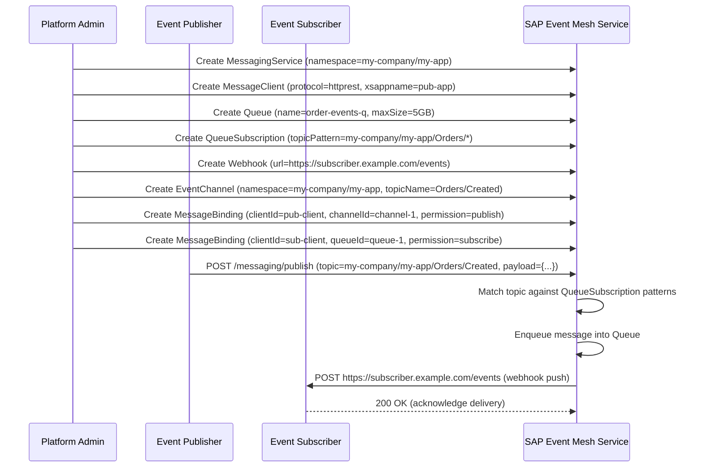
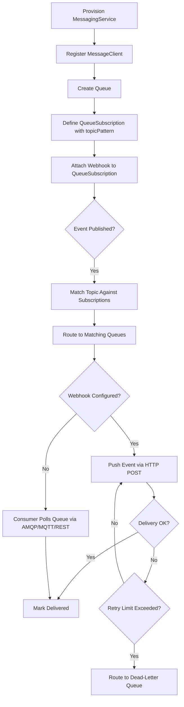
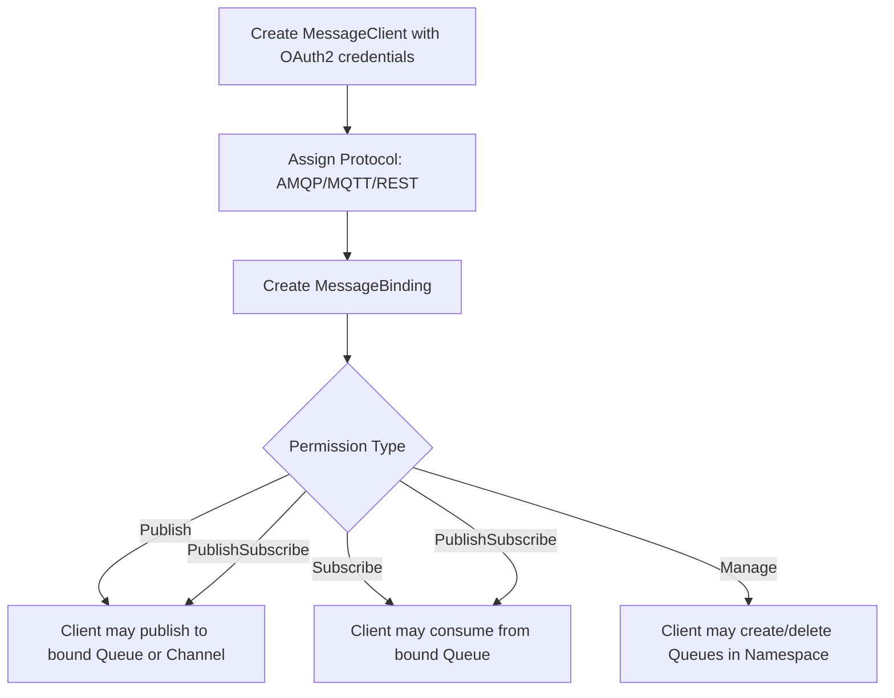

# NAFv4 — SAP Event Mesh Service

NATO Architecture Framework v4 (NAFv4) views for the SAP Event Mesh microservice.

---

## C1 — Capability Taxonomy

```
SAP Event Mesh Capability
├── Messaging Infrastructure Management
│   ├── Service Instance Provisioning
│   ├── Namespace Management
│   └── Service Configuration
├── Client Access Management
│   ├── Message Client Registration
│   ├── OAuth2 Credential Provisioning
│   ├── Protocol Binding (AMQP 1.0, MQTT 3.1.1, MQTT 5.0, HTTP REST)
│   └── Namespace Permission Control
├── Queue Management
│   ├── Queue Provisioning
│   ├── Access Type Configuration (Exclusive / Non-Exclusive)
│   ├── Size and TTL Policy
│   ├── Dead-Letter Queue Assignment
│   └── Ingress / Egress Control
├── Topic-Based Routing
│   ├── Queue Subscription Creation
│   ├── Wildcard Topic Pattern Matching
│   └── Namespace-Scoped Routing
├── Event Delivery
│   ├── Webhook Push Delivery
│   ├── Authentication (OAuth2, Basic, API Key)
│   ├── Delivery Mode (At-Least-Once, At-Most-Once)
│   └── Retry and Parallelity Policy
├── Event Channel Management
│   ├── Channel Definition (Topic / Queue / Event Channel)
│   ├── Namespace and Topic Name Assignment
│   └── AsyncAPI Definition Association
└── Message Binding
    ├── Publish / Subscribe / Manage Permission Assignment
    ├── Client-to-Queue Binding
    └── Client-to-Channel Binding
```

---

## C2 — Enterprise Vision

**Vision Statement**  
The SAP Event Mesh service delivers a managed, namespace-scoped event backbone for loosely coupled microservices and cloud applications on SAP BTP. It enables reliable event-driven integration across producers and consumers through durable queues, topic-based routing, webhook push delivery, and AsyncAPI-defined event channels.

**Strategic Goals**
1. Provide a standards-based pub/sub messaging backbone for enterprise event-driven architectures.
2. Decouple event producers from consumers through namespace-isolated routing.
3. Enable reliable at-least-once delivery via durable queues and dead-letter support.
4. Allow event consumers to receive events via HTTP push (webhooks) without requiring persistent connections.
5. Support multiple messaging protocols (AMQP 1.0, MQTT, HTTP REST) through configurable message clients.
6. Expose AsyncAPI-compliant event channel definitions for schema-driven event governance.

---

## L1 — Node Types

| Node | Type | Description |
|---|---|---|
| `MessagingService` | Service Instance | A provisioned SAP Event Mesh instance with a dedicated namespace |
| `MessageClient` | Access Actor | An OAuth2 client application bound to a messaging service |
| `Queue` | Message Buffer | A durable queue holding unconsumed messages |
| `QueueSubscription` | Routing Rule | A wildcard topic pattern that routes matching messages into a queue |
| `Webhook` | Delivery Adapter | An HTTP endpoint that receives events via push when a queue subscription matches |
| `EventChannel` | Logical Channel | A named publish/subscribe channel with optional AsyncAPI definition |
| `MessageBinding` | Authorization Link | Links a client to a queue or channel with a defined permission scope |

---

## L2 — Logical Scenario: Provision, Publish, Subscribe, Deliver



---

## L4 — Logical Activity: Event Lifecycle



---

## L4 — Logical Activity: Message Client Binding



---

## P1 — Resource Types

| Resource Type | Category | Notes |
|---|---|---|
| D Runtime (LDC2) | Compute | Compiled to native binary via LDC2 1.40.x |
| vibe.d HTTP server | Compute | Async I/O event loop; single process |
| In-memory store | Storage | Per-process volatile state; swap for Redis/Postgres for persistence |
| Docker/Podman container | Compute | OCI-compliant image; multi-stage build |
| Kubernetes Pod | Compute | Single replica deployment; horizontal scaling via ReplicaSet |
| Kubernetes ConfigMap | Configuration | Externalises `SAP_EVENT_MESH_HOST` / `SAP_EVENT_MESH_PORT` |
| Kubernetes ClusterIP Service | Network | Internal cluster routing on port 8109 |
| AMQP 1.0 / MQTT / HTTP REST | Network Protocol | Client-facing messaging protocols for publish/subscribe |

---

## References

- SAP Enterprise Messaging FSD: https://help.sap.com/doc/e56d7e676cc74906b813d226062d8634/Cloud/en-US/EnterpriseMessaging_FSD_en.pdf
- SAP Event Mesh product help: https://help.sap.com/viewer/product/SAP_ENTERPRISE_MESSAGING/Cloud/en-US
- NATO Architecture Framework v4: https://www.nato.int/cps/en/natohq/topics_157575.htm
