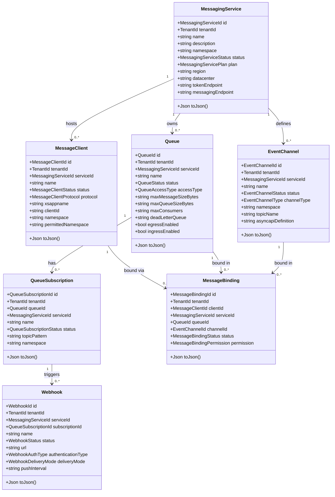
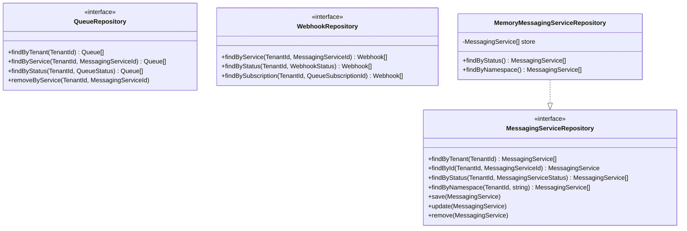
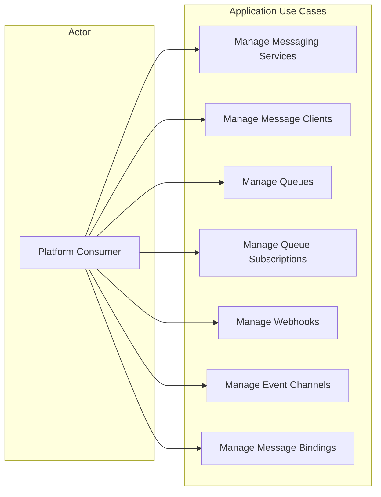
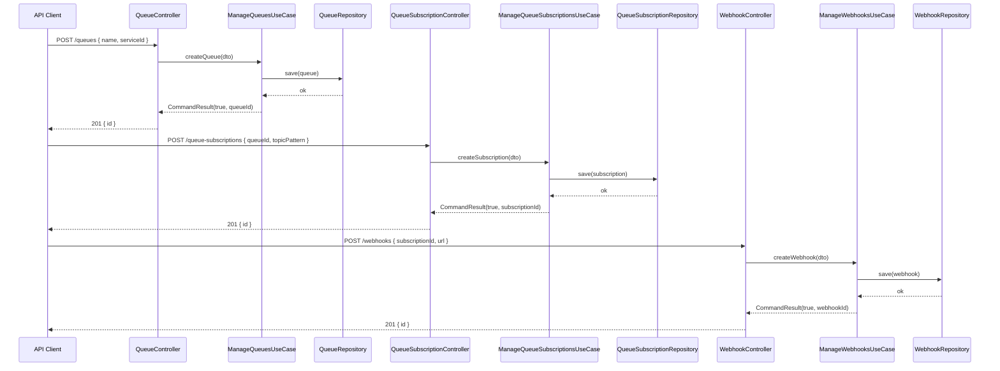
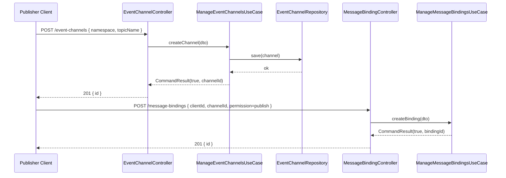

# UML — SAP Event Mesh Service

## Class Diagram — Domain Entities

---

## Class Diagram — Repository Interfaces

---

## Use Case Diagram

---

## Component Diagram

```mermaid
flowchart TB
    subgraph Presentation["Presentation Layer (HTTP)"]
        C1[MessagingServiceController]
        C2[MessageClientController]
        C3[QueueController]
        C4[QueueSubscriptionController]
        C5[WebhookController]
        C6[EventChannelController]
        C7[MessageBindingController]
        HC[HealthController]
    end

    subgraph Application["Application Layer"]
        UC1[ManageMessagingServicesUseCase]
        UC2[ManageMessageClientsUseCase]
        UC3[ManageQueuesUseCase]
        UC4[ManageQueueSubscriptionsUseCase]
        UC5[ManageWebhooksUseCase]
        UC6[ManageEventChannelsUseCase]
        UC7[ManageMessageBindingsUseCase]
    end

    subgraph Domain["Domain Layer"]
        E1[MessagingService]
        E2[MessageClient]
        E3[Queue]
        E4[QueueSubscription]
        E5[Webhook]
        E6[EventChannel]
        E7[MessageBinding]
        V[EventsValidator]
    end

    subgraph Infrastructure["Infrastructure Layer"]
        CFG[Config]
        CTR[Container]
        MEM1[MemoryMessagingServiceRepository]
        MEM2[MemoryMessageClientRepository]
        MEM3[MemoryQueueRepository]
        MEM4[MemoryQueueSubscriptionRepository]
        MEM5[MemoryWebhookRepository]
        MEM6[MemoryEventChannelRepository]
        MEM7[MemoryMessageBindingRepository]
    end

    C1 --> UC1
    C2 --> UC2
    C3 --> UC3
    C4 --> UC4
    C5 --> UC5
    C6 --> UC6
    C7 --> UC7

    UC1 --> E1
    UC1 --> V
    UC2 --> E2
    UC3 --> E3
    UC4 --> E4
    UC5 --> E5
    UC6 --> E6
    UC7 --> E7

    MEM1 --> E1
    MEM2 --> E2
    MEM3 --> E3
    MEM4 --> E4
    MEM5 --> E5
    MEM6 --> E6
    MEM7 --> E7

    CTR --> UC1
    CTR --> MEM1
```

---

## Sequence Diagram — Create Queue with Subscription and Webhook

---

## Sequence Diagram — Publish Event via Event Channel

