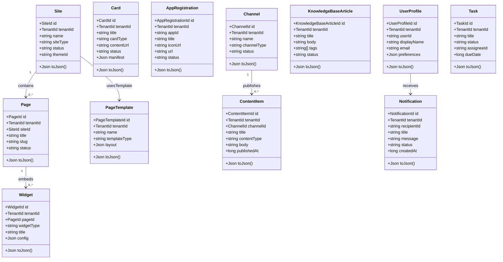
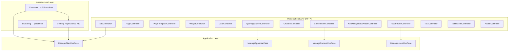
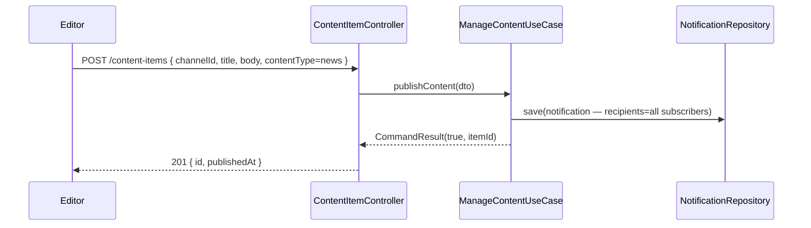

# UML — Workzone Service

## Class Diagram — Domain Entities

```mermaid
classDiagram
    class Site {
        +SiteId id
        +TenantId tenantId
        +string name
        +string siteType
        +string status
        +string themeId
        +Json toJson()
    }
    class Page {
        +PageId id
        +TenantId tenantId
        +SiteId siteId
        +string title
        +string slug
        +string status
        +Json toJson()
    }
    class PageTemplate {
        +PageTemplateId id
        +TenantId tenantId
        +string name
        +string templateType
        +Json layout
        +Json toJson()
    }
    class Widget {
        +WidgetId id
        +TenantId tenantId
        +PageId pageId
        +string widgetType
        +string title
        +Json config
        +Json toJson()
    }
    class Card {
        +CardId id
        +TenantId tenantId
        +string title
        +string cardType
        +string contentUrl
        +string status
        +Json manifest
        +Json toJson()
    }
    class AppRegistration {
        +AppRegistrationId id
        +TenantId tenantId
        +string appId
        +string title
        +string iconUrl
        +string url
        +string status
        +Json toJson()
    }
    class Channel {
        +ChannelId id
        +TenantId tenantId
        +string name
        +string channelType
        +string status
        +Json toJson()
    }
    class ContentItem {
        +ContentItemId id
        +TenantId tenantId
        +ChannelId channelId
        +string title
        +string contentType
        +string body
        +long publishedAt
        +Json toJson()
    }
    class KnowledgeBaseArticle {
        +KnowledgeBaseArticleId id
        +TenantId tenantId
        +string title
        +string body
        +string[] tags
        +string status
        +Json toJson()
    }
    class UserProfile {
        +UserProfileId id
        +TenantId tenantId
        +string userId
        +string displayName
        +string email
        +Json preferences
        +Json toJson()
    }
    class Task {
        +TaskId id
        +TenantId tenantId
        +string title
        +string status
        +string assigneeId
        +long dueDate
        +Json toJson()
    }
    class Notification {
        +NotificationId id
        +TenantId tenantId
        +string recipientId
        +string title
        +string message
        +string status
        +long createdAt
        +Json toJson()
    }

    Site "1" --> "0..*" Page : contains
    Site --> PageTemplate : usesTemplate
    Page "1" --> "0..*" Widget : embeds
    Channel "1" --> "0..*" ContentItem : publishes
    UserProfile --> Notification : receives
```

---

## Component Diagram

```mermaid
flowchart TB
    subgraph Presentation["Presentation Layer (HTTP)"]
        C1[SiteController]
        C2[PageController]
        C3[PageTemplateController]
        C4[WidgetController]
        C5[CardController]
        C6[AppRegistrationController]
        C7[ChannelController]
        C8[ContentItemController]
        C9[KnowledgeBaseArticleController]
        C10[UserProfileController]
        C11[TaskController]
        C12[NotificationController]
        HC[HealthController]
    end
    subgraph Application["Application Layer"]
        UC1[ManageSitesUseCase]
        UC2[ManageContentUseCase]
        UC3[ManageUsersUseCase]
        UC4[ManageAppsUseCase]
    end
    subgraph Infrastructure["Infrastructure Layer"]
        MEM[Memory Repositories ×12]
        CFG[SrvConfig — port 8084]
        CTR[Container / buildContainer]
    end
    C1 --> UC1
    C8 --> UC2
    C10 --> UC3
    C6 --> UC4
    MEM --> UC1
    CTR --> UC1
    CTR --> MEM
```

---

## Sequence Diagram — Publish Content Item to Channel

```mermaid
sequenceDiagram
    participant Editor
    participant CC as ContentItemController
    participant CUC as ManageContentUseCase
    participant NR as NotificationRepository

    Editor->>CC: POST /content-items { channelId, title, body, contentType=news }
    CC->>CUC: publishContent(dto)
    CUC->>NR: save(notification — recipients=all subscribers)
    CUC-->>CC: CommandResult(true, itemId)
    CC-->>Editor: 201 { id, publishedAt }
```
