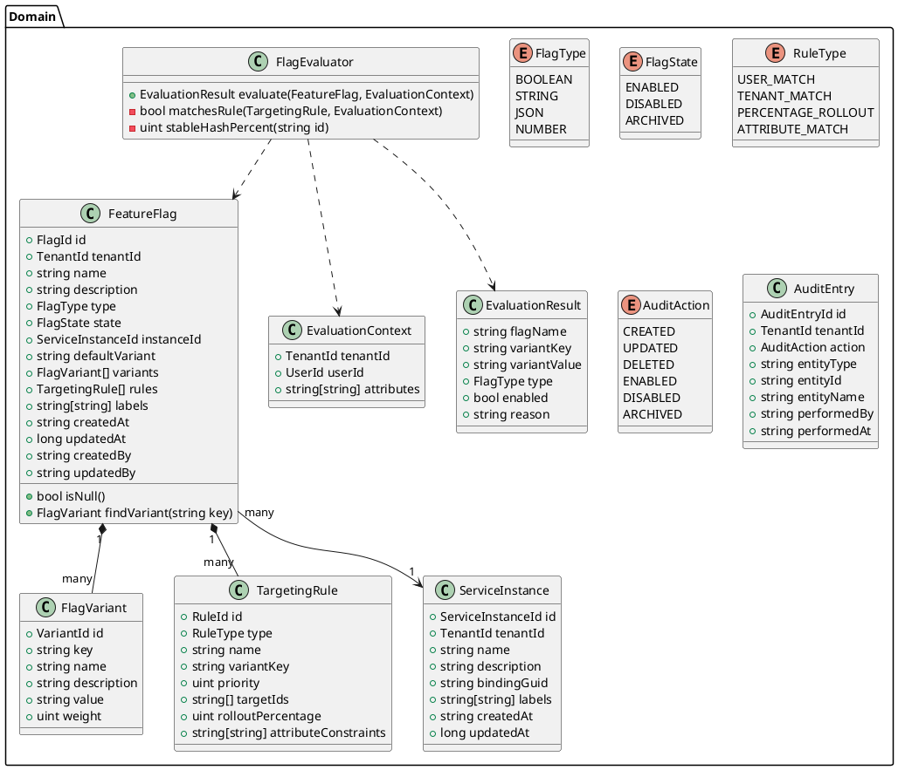
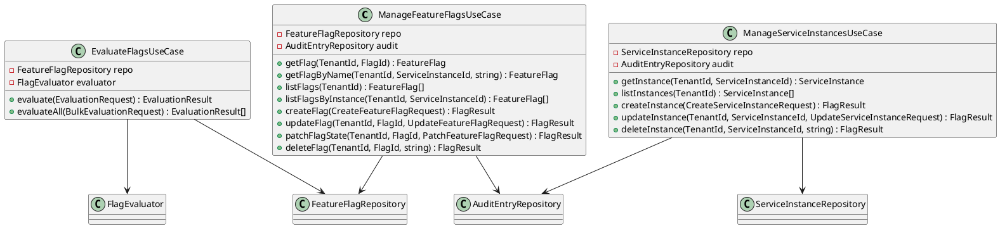
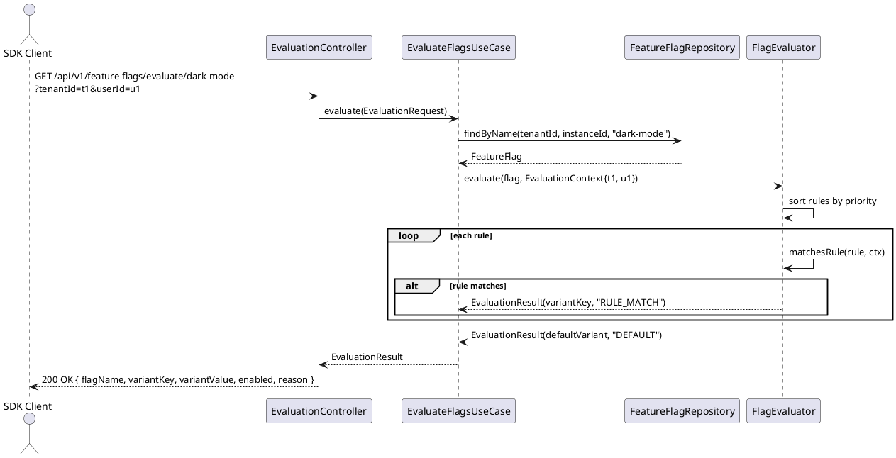

# UML — Feature Flags Service

## Domain Model

---

## Ports & Adapters (Hexagonal Architecture)

```plantuml
@startuml

interface FeatureFlagRepository {
  +save(FeatureFlag)
  +update(FeatureFlag)
  +remove(FeatureFlag)
  +findById(TenantId, FlagId) : FeatureFlag
  +findByName(TenantId, ServiceInstanceId, string) : FeatureFlag
  +findByTenant(TenantId) : FeatureFlag[]
  +findByInstance(TenantId, ServiceInstanceId) : FeatureFlag[]
  +findByState(TenantId, ServiceInstanceId, FlagState) : FeatureFlag[]
  +countByInstance(TenantId, ServiceInstanceId) : size_t
}

interface ServiceInstanceRepository {
  +save(ServiceInstance)
  +update(ServiceInstance)
  +remove(ServiceInstance)
  +findById(TenantId, ServiceInstanceId) : ServiceInstance
  +findByName(TenantId, string) : ServiceInstance
  +findByTenant(TenantId) : ServiceInstance[]
  +countByTenant(TenantId) : size_t
}

interface AuditEntryRepository {
  +append(AuditEntry)
  +findByTenant(TenantId) : AuditEntry[]
  +findByEntity(TenantId, string) : AuditEntry[]
  +findByTenantPaged(TenantId, offset, limit) : AuditEntry[]
}

class MemoryFeatureFlagRepository
class FileFeatureFlagRepository
class MongoDbFeatureFlagRepository

class MemoryServiceInstanceRepository
class FileServiceInstanceRepository
class MongoDbServiceInstanceRepository

class MemoryAuditEntryRepository
class FileAuditEntryRepository
class MongoDbAuditEntryRepository

FeatureFlagRepository <|.. MemoryFeatureFlagRepository
FeatureFlagRepository <|.. FileFeatureFlagRepository
FeatureFlagRepository <|.. MongoDbFeatureFlagRepository

ServiceInstanceRepository <|.. MemoryServiceInstanceRepository
ServiceInstanceRepository <|.. FileServiceInstanceRepository
ServiceInstanceRepository <|.. MongoDbServiceInstanceRepository

AuditEntryRepository <|.. MemoryAuditEntryRepository
AuditEntryRepository <|.. FileAuditEntryRepository
AuditEntryRepository <|.. MongoDbAuditEntryRepository

@enduml
```

---

## Application Layer — Use Cases

---

## Presentation Layer — MVC

```plantuml
@startuml

package "HTTP Controllers" {
  class FeatureFlagController {
    +registerRoutes(URLRouter)
    -handleList(req, res)
    -handleCreate(req, res)
    -handleGet(req, res)
    -handleUpdate(req, res)
    -handlePatch(req, res)
    -handleDelete(req, res)
  }
  class EvaluationController {
    +registerRoutes(URLRouter)
    -handleEvaluate(req, res)
    -handleEvaluateAll(req, res)
  }
  class ServiceInstanceController {
    +registerRoutes(URLRouter)
    -handleList(req, res)
    -handleCreate(req, res)
    -handleGet(req, res)
    -handleUpdate(req, res)
    -handleDelete(req, res)
  }
}

package "Web Views" {
  class FeatureFlagWebView {
    +registerRoutes(URLRouter)
    -renderList(req, res)
    -renderDetail(req, res)
  }
}

package "CLI Commands" {
  class FeatureFlagCliCommand {
    +listFlags(tenantId, instanceId)
    +getFlag(tenantId, id)
    +enableFlag(tenantId, id, updatedBy)
    +disableFlag(tenantId, id, updatedBy)
    +archiveFlag(tenantId, id, updatedBy)
    +deleteFlag(tenantId, id, deletedBy)
  }
  class EvaluationCliCommand {
    +evaluate(tenantId, instanceId, flagName, userId, attributes)
    +evaluateAll(tenantId, instanceId, userId, attributes)
  }
}

package "GUI Widgets" {
  class FeatureFlagWidget {
    +buildListViewModel(tenantId, instanceId) : FlagRowViewModel[]
    +buildDetailViewModel(tenantId, id) : FlagDetailViewModel
  }
}

FeatureFlagController --> ManageFeatureFlagsUseCase
EvaluationController --> EvaluateFlagsUseCase
ServiceInstanceController --> ManageServiceInstancesUseCase
FeatureFlagWebView --> ManageFeatureFlagsUseCase
FeatureFlagCliCommand --> ManageFeatureFlagsUseCase
EvaluationCliCommand --> EvaluateFlagsUseCase
FeatureFlagWidget --> ManageFeatureFlagsUseCase

@enduml
```

---

## Evaluation Flow Sequence

