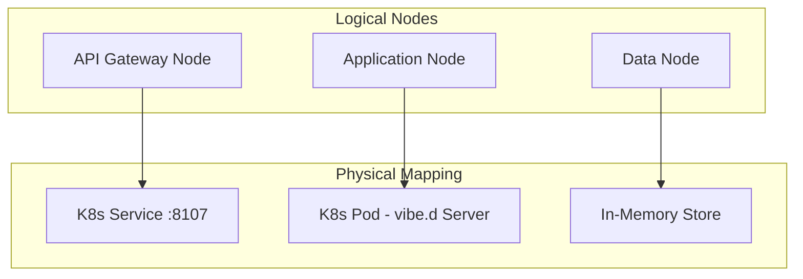
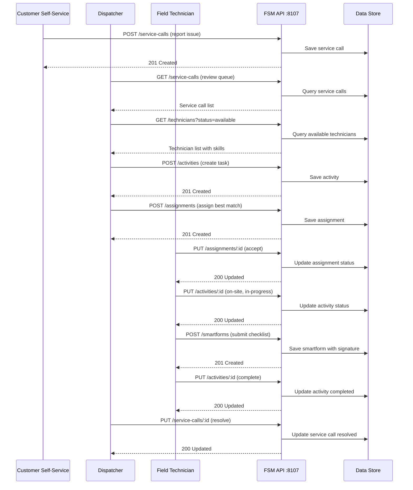
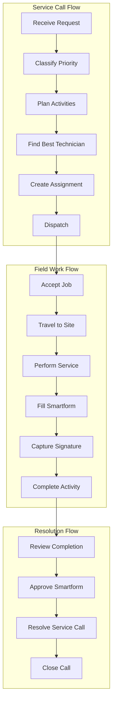
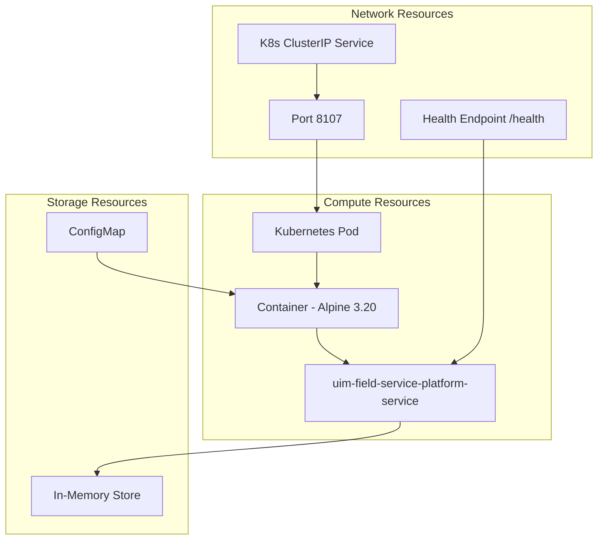
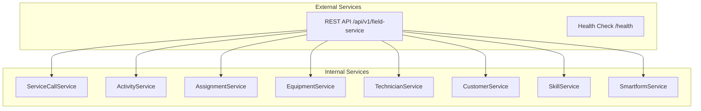

# NAF v4 Architecture Views - Field Service Management

NATO Architecture Framework v4 (NAFv4) views for the Field Service Management Service, modeled after SAP Field Service Management (SAP FSM).

## C1 - Capability Taxonomy

```mermaid
graph TB
    FSM[Field Service Management]
    FSM --> SCM[Service Call Management]
    FSM --> PAD[Planning and Dispatching]
    FSM --> EQM[Equipment Management]
    FSM --> TEM[Technician Management]
    FSM --> CUM[Customer Management]
    FSM --> SKM[Skill Management]
    FSM --> SFM[Smartform Management]
    FSM --> ASM[Assignment Management]

    SCM --> SCM1[Create Service Calls]
    SCM --> SCM2[Track Call Status]
    SCM --> SCM3[Prioritize Requests]
    SCM --> SCM4[Resolve and Close]

    PAD --> PAD1[Schedule Activities]
    PAD --> PAD2[Dispatch Technicians]
    PAD --> PAD3[Best Match Scheduling]
    PAD --> PAD4[Route Optimization]

    EQM --> EQM1[Register Equipment]
    EQM --> EQM2[Track Warranty]
    EQM --> EQM3[Service History]
    EQM --> EQM4[Measuring Points]

    TEM --> TEM1[Manage Technician Profiles]
    TEM --> TEM2[Track Availability]
    TEM --> TEM3[Manage Workload]
    TEM --> TEM4[Regional Assignment]

    CUM --> CUM1[Customer Registry]
    CUM --> CUM2[Contact Management]
    CUM --> CUM3[Account Classification]
    CUM --> CUM4[Location Tracking]

    SKM --> SKM1[Define Skills]
    SKM --> SKM2[Certification Tracking]
    SKM --> SKM3[Proficiency Levels]
    SKM --> SKM4[Expiration Management]

    SFM --> SFM1[Build Checklists]
    SFM --> SFM2[Service Reports]
    SFM --> SFM3[Signature Capture]
    SFM --> SFM4[Safety Labels]

    ASM --> ASM1[Propose Assignments]
    ASM --> ASM2[Accept/Reject]
    ASM --> ASM3[Track Progress]
    ASM --> ASM4[Match Scoring]
```

## C2 - Enterprise Vision

The Field Service Management Service provides a comprehensive platform for field service operations optimization. It enables:

1. **Service Call Management** through customer request creation, priority-based classification, multi-channel origin tracking, and resolution workflows
2. **Planning and Dispatching** through activity scheduling, technician assignment, skill-based matching, and route optimization
3. **Equipment Management** through equipment registration, serial number tracking, warranty management, measuring points, and service history
4. **Technician Workforce** through profile management, availability windows, workload capacity, travel radius, and regional assignment
5. **Customer Master Data** through business partner registration, contact management, geolocation, industry classification, and account tracking
6. **Skill and Certification** through skill definitions, proficiency levels, certification tracking, expiration management, and issuing authority
7. **Smartforms and Reporting** through digital checklists, service reports, work instructions, safety labels, signature capture, and approval workflows
8. **Assignment Lifecycle** through technician-activity matching, scheduling policies, match scoring, acceptance tracking, and completion management

## L1 - Node Types

## L2 - Logical Scenario

## L4 - Logical Activity

## P1 - Resource Types

## S1 - Service Taxonomy

## Sv1 - Service Interface

| Service | Method | Path | Description |
|---------|--------|------|-------------|
| Service Calls | GET | `/api/v1/field-service/service-calls` | List all service calls |
| Service Calls | POST | `/api/v1/field-service/service-calls` | Create service call |
| Service Calls | GET | `/api/v1/field-service/service-calls/:id` | Get by ID |
| Service Calls | PUT | `/api/v1/field-service/service-calls/:id` | Update |
| Service Calls | DELETE | `/api/v1/field-service/service-calls/:id` | Delete |
| Activities | GET | `/api/v1/field-service/activities` | List all activities |
| Activities | POST | `/api/v1/field-service/activities` | Create activity |
| Activities | GET | `/api/v1/field-service/activities/:id` | Get by ID |
| Activities | PUT | `/api/v1/field-service/activities/:id` | Update |
| Activities | DELETE | `/api/v1/field-service/activities/:id` | Delete |
| Assignments | GET | `/api/v1/field-service/assignments` | List all assignments |
| Assignments | POST | `/api/v1/field-service/assignments` | Create assignment |
| Assignments | GET | `/api/v1/field-service/assignments/:id` | Get by ID |
| Assignments | PUT | `/api/v1/field-service/assignments/:id` | Update |
| Assignments | DELETE | `/api/v1/field-service/assignments/:id` | Delete |
| Equipment | GET | `/api/v1/field-service/equipment` | List all equipment |
| Equipment | POST | `/api/v1/field-service/equipment` | Create equipment |
| Equipment | GET | `/api/v1/field-service/equipment/:id` | Get by ID |
| Equipment | PUT | `/api/v1/field-service/equipment/:id` | Update |
| Equipment | DELETE | `/api/v1/field-service/equipment/:id` | Delete |
| Technicians | GET | `/api/v1/field-service/technicians` | List all technicians |
| Technicians | POST | `/api/v1/field-service/technicians` | Create technician |
| Technicians | GET | `/api/v1/field-service/technicians/:id` | Get by ID |
| Technicians | PUT | `/api/v1/field-service/technicians/:id` | Update |
| Technicians | DELETE | `/api/v1/field-service/technicians/:id` | Delete |
| Customers | GET | `/api/v1/field-service/customers` | List all customers |
| Customers | POST | `/api/v1/field-service/customers` | Create customer |
| Customers | GET | `/api/v1/field-service/customers/:id` | Get by ID |
| Customers | PUT | `/api/v1/field-service/customers/:id` | Update |
| Customers | DELETE | `/api/v1/field-service/customers/:id` | Delete |
| Skills | GET | `/api/v1/field-service/skills` | List all skills |
| Skills | POST | `/api/v1/field-service/skills` | Create skill |
| Skills | GET | `/api/v1/field-service/skills/:id` | Get by ID |
| Skills | PUT | `/api/v1/field-service/skills/:id` | Update |
| Skills | DELETE | `/api/v1/field-service/skills/:id` | Delete |
| Smartforms | GET | `/api/v1/field-service/smartforms` | List all smartforms |
| Smartforms | POST | `/api/v1/field-service/smartforms` | Create smartform |
| Smartforms | GET | `/api/v1/field-service/smartforms/:id` | Get by ID |
| Smartforms | PUT | `/api/v1/field-service/smartforms/:id` | Update |
| Smartforms | DELETE | `/api/v1/field-service/smartforms/:id` | Delete |
| Health | GET | `/health` | Service health check |

## Cr1 - Security Policies

| Policy | Implementation |
|--------|---------------|
| Tenant Isolation | X-Tenant-Id header required for all write operations |
| Input Validation | FieldServiceValidator validates all domain objects before persistence |
| Error Handling | Controllers catch all exceptions, return generic error messages |
| Transport Security | HTTPS termination at ingress/load balancer level |
| Container Security | Minimal Alpine base image, non-root execution recommended |
