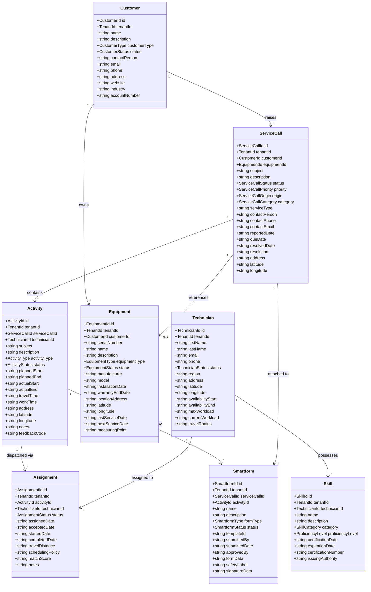
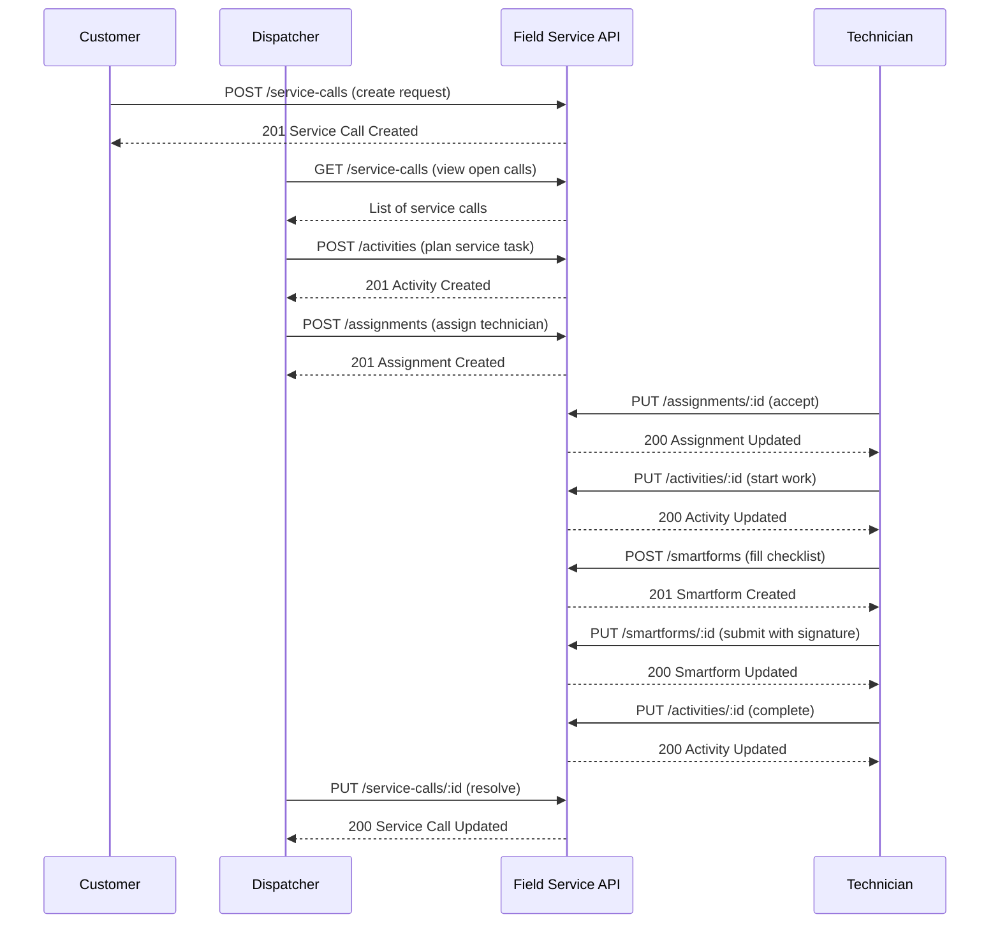
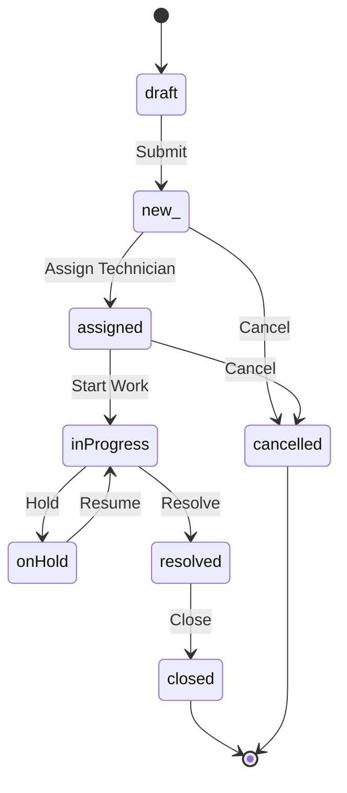
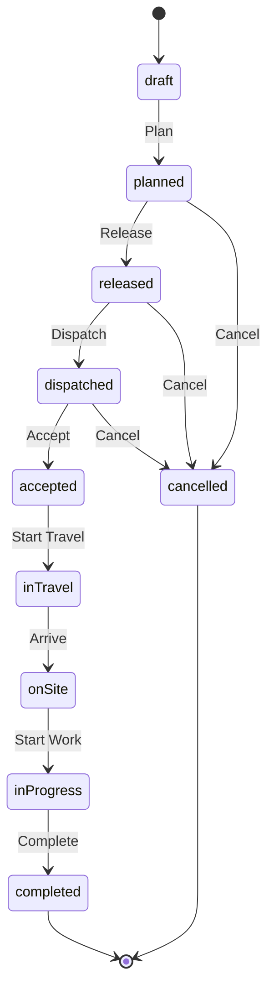

# UML Diagrams - Field Service Management

## Domain Model

## Use Case Diagram

```mermaid
graph TB
    subgraph Actors
        D[Dispatcher]
        T[Technician]
        C[Customer]
        M[Manager]
    end

    subgraph "Service Call Management"
        SC1[Create Service Call]
        SC2[Assign Priority]
        SC3[Track Resolution]
        SC4[Close Service Call]
    end

    subgraph "Planning and Dispatching"
        PD1[Schedule Activities]
        PD2[Assign Technicians]
        PD3[Best Match Technician]
        PD4[Route Optimization]
    end

    subgraph "Mobile Field Work"
        MW1[Accept Assignment]
        MW2[Update Activity Status]
        MW3[Fill Smartform]
        MW4[Capture Signature]
    end

    subgraph "Master Data"
        MD1[Manage Equipment]
        MD2[Manage Technicians]
        MD3[Manage Skills]
        MD4[Manage Customers]
    end

    C --> SC1
    D --> SC2
    D --> PD1
    D --> PD2
    D --> PD3
    D --> PD4
    T --> MW1
    T --> MW2
    T --> MW3
    T --> MW4
    M --> SC3
    M --> SC4
    M --> MD1
    M --> MD2
    M --> MD3
    M --> MD4
```

## Component Diagram

```mermaid
graph TB
    subgraph Presentation["Presentation Layer"]
        SCC[ServiceCallController]
        AC[ActivityController]
        ASC[AssignmentController]
        EC[EquipmentController]
        TC[TechnicianController]
        CC[CustomerController]
        SKC[SkillController]
        SFC[SmartformController]
        HC[HealthController]
    end

    subgraph Application["Application Layer"]
        SCUC[ManageServiceCallsUseCase]
        AUC[ManageActivitiesUseCase]
        ASUC[ManageAssignmentsUseCase]
        EUC[ManageEquipmentUseCase]
        TUC[ManageTechniciansUseCase]
        CUC[ManageCustomersUseCase]
        SKUC[ManageSkillsUseCase]
        SFUC[ManageSmartformsUseCase]
    end

    subgraph Domain["Domain Layer"]
        ENT[Entities]
        REPO[Repository Interfaces]
        VAL[FieldServiceValidator]
    end

    subgraph Infrastructure["Infrastructure Layer"]
        CFG[AppConfig]
        CON[Container]
        MEM[Memory Repositories]
    end

    SCC --> SCUC
    AC --> AUC
    ASC --> ASUC
    EC --> EUC
    TC --> TUC
    CC --> CUC
    SKC --> SKUC
    SFC --> SFUC

    SCUC --> REPO
    AUC --> REPO
    ASUC --> REPO
    EUC --> REPO
    TUC --> REPO
    CUC --> REPO
    SKUC --> REPO
    SFUC --> REPO

    SCUC --> VAL
    AUC --> VAL
    ASUC --> VAL
    EUC --> VAL
    TUC --> VAL
    CUC --> VAL
    SKUC --> VAL
    SFUC --> VAL

    MEM -.-> REPO
    CON --> MEM
    CON --> CFG
```

## Sequence Diagram - Service Call Lifecycle

## State Diagram - Service Call

## State Diagram - Activity

