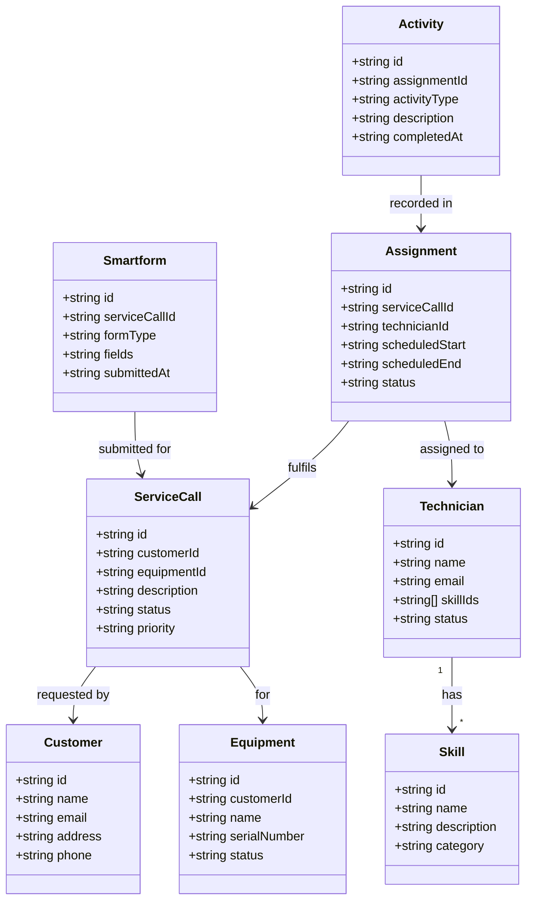
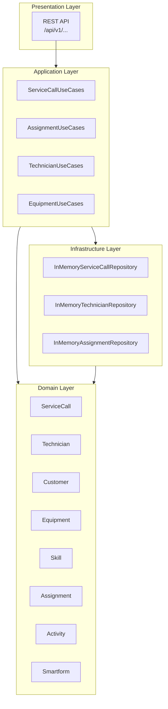
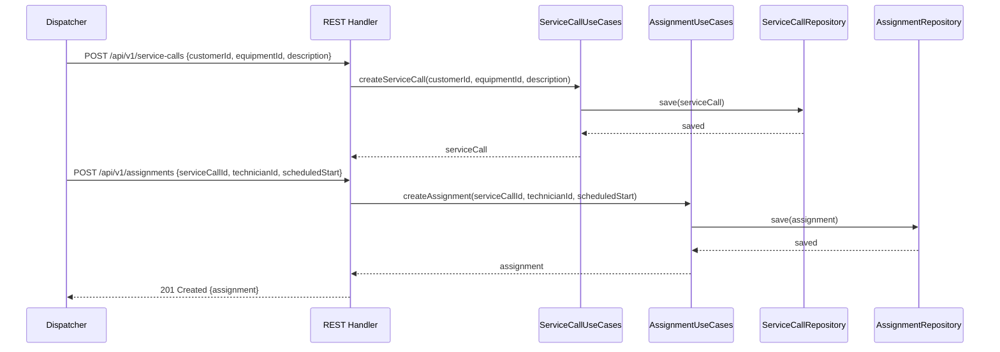

# UML Diagrams — Field Service Service

## Class Diagram

```mermaid
classDiagram
    class ServiceCall {
        +string id
        +string customerId
        +string equipmentId
        +string description
        +string status
        +string priority
    }
    class Technician {
        +string id
        +string name
        +string email
        +string[] skillIds
        +string status
    }
    class Customer {
        +string id
        +string name
        +string email
        +string address
        +string phone
    }
    class Equipment {
        +string id
        +string customerId
        +string name
        +string serialNumber
        +string status
    }
    class Skill {
        +string id
        +string name
        +string description
        +string category
    }
    class Assignment {
        +string id
        +string serviceCallId
        +string technicianId
        +string scheduledStart
        +string scheduledEnd
        +string status
    }
    class Activity {
        +string id
        +string assignmentId
        +string activityType
        +string description
        +string completedAt
    }
    class Smartform {
        +string id
        +string serviceCallId
        +string formType
        +string fields
        +string submittedAt
    }

    ServiceCall --> Customer : requested by
    ServiceCall --> Equipment : for
    Assignment --> ServiceCall : fulfils
    Assignment --> Technician : assigned to
    Technician "1" --> "*" Skill : has
    Activity --> Assignment : recorded in
    Smartform --> ServiceCall : submitted for
```

## Component Diagram

```mermaid
flowchart TB
    subgraph Presentation["Presentation Layer"]
        REST["REST API\n/api/v1/..."]
    end
    subgraph Application["Application Layer"]
        SC_UC["ServiceCallUseCases"]
        ASSIGN_UC["AssignmentUseCases"]
        TECH_UC["TechnicianUseCases"]
        EQUIP_UC["EquipmentUseCases"]
    end
    subgraph Domain["Domain Layer"]
        SC["ServiceCall"]
        TECH["Technician"]
        CUST["Customer"]
        EQUIP["Equipment"]
        SKILL["Skill"]
        ASSIGN["Assignment"]
        ACT["Activity"]
        FORM["Smartform"]
    end
    subgraph Infrastructure["Infrastructure Layer"]
        SC_REPO["InMemoryServiceCallRepository"]
        TECH_REPO["InMemoryTechnicianRepository"]
        ASSIGN_REPO["InMemoryAssignmentRepository"]
    end

    REST --> Application
    Application --> Domain
    Infrastructure --> Domain
    Application --> Infrastructure
```

## Sequence Diagram — Create and Assign Service Call

```mermaid
sequenceDiagram
    participant D as Dispatcher
    participant R as REST Handler
    participant SC_UC as ServiceCallUseCases
    participant A_UC as AssignmentUseCases
    participant SCR as ServiceCallRepository
    participant AR as AssignmentRepository

    D->>R: POST /api/v1/service-calls {customerId, equipmentId, description}
    R->>SC_UC: createServiceCall(customerId, equipmentId, description)
    SC_UC->>SCR: save(serviceCall)
    SCR-->>SC_UC: saved
    SC_UC-->>R: serviceCall
    D->>R: POST /api/v1/assignments {serviceCallId, technicianId, scheduledStart}
    R->>A_UC: createAssignment(serviceCallId, technicianId, scheduledStart)
    A_UC->>AR: save(assignment)
    AR-->>A_UC: saved
    A_UC-->>R: assignment
    R-->>D: 201 Created {assignment}
```
