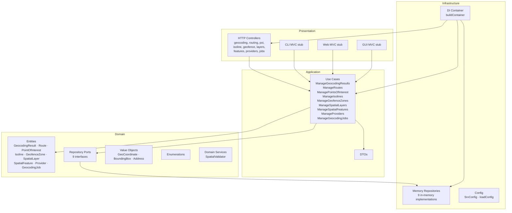
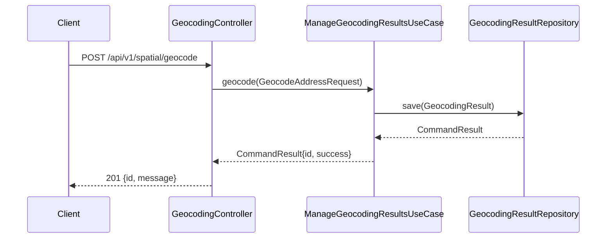
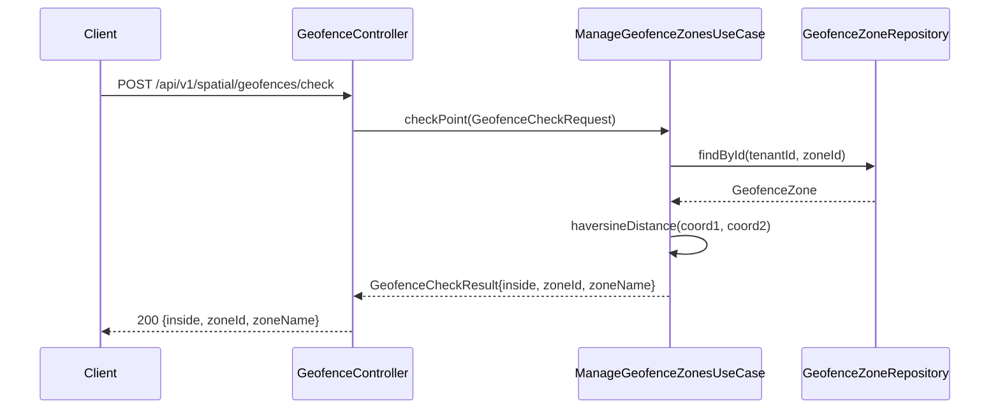
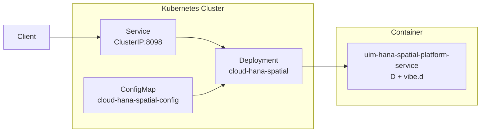

# UML — UIM HANA Spatial Platform Service

## Hexagonal Architecture Overview

## Domain Class Diagram

```mermaid
classDiagram
    class GeocodingResult {
        +GeocodingResultId id
        +TenantId tenantId
        +string inputAddress
        +GeocodingType type
        +GeoCoordinate coordinate
        +Address address
        +GeocodingMatchLevel matchLevel
        +double confidence
        +string providerId
        +string language
        +string countryCode
        +long createdAt
    }

    class Route {
        +RouteId id
        +TenantId tenantId
        +GeoCoordinate origin
        +GeoCoordinate destination
        +TravelMode travelMode
        +RouteOptimization optimization
        +RouteLeg[] legs
        +double totalDistanceMeters
        +long totalDurationSeconds
        +string providerId
        +long createdAt
    }

    class PointOfInterest {
        +PointOfInterestId id
        +TenantId tenantId
        +string name
        +string description
        +PoiCategory category
        +GeoCoordinate coordinate
        +Address address
        +string phoneNumber
        +string website
        +string openingHours
        +string providerId
        +string externalId
        +string[string] attributes
        +long createdAt
    }

    class Isoline {
        +IsolineId id
        +TenantId tenantId
        +GeoCoordinate center
        +IsolineMode mode
        +double rangeValue
        +TravelMode travelMode
        +GeoCoordinate[] polygon
        +string providerId
        +long createdAt
    }

    class GeofenceZone {
        +GeofenceZoneId id
        +TenantId tenantId
        +string name
        +GeofenceShapeType shapeType
        +GeoCoordinate center
        +double radiusMeters
        +GeoCoordinate[] polygon
        +bool active
        +string[string] metadata
        +long createdAt
    }

    class SpatialLayer {
        +SpatialLayerId id
        +TenantId tenantId
        +string name
        +SpatialLayerType type
        +string coordinateSystem
        +long featureCount
        +bool isPublic
        +string[string] metadata
        +long createdAt
    }

    class SpatialFeature {
        +SpatialFeatureId id
        +TenantId tenantId
        +SpatialLayerId layerId
        +string name
        +GeometryType geometryType
        +string geometry
        +string properties
        +string[string] tags
        +long createdAt
    }

    class Provider {
        +ProviderId id
        +TenantId tenantId
        +string name
        +ProviderType type
        +ProviderStatus status
        +string apiKey
        +string baseUrl
        +bool supportsGeocoding
        +bool supportsRouting
        +bool supportsMapping
        +bool supportsIsoline
        +bool supportsPoi
        +string[] supportedRegions
        +string[string] config
        +long createdAt
    }

    class GeocodingJob {
        +GeocodingJobId id
        +TenantId tenantId
        +string name
        +SpatialJobStatus status
        +string providerId
        +string language
        +string countryCode
        +long totalItems
        +long processedItems
        +long failedItems
        +GeocodingJobItem[] items
        +long createdAt
    }

    class GeoCoordinate {
        +double latitude
        +double longitude
    }

    class Address {
        +string street
        +string houseNumber
        +string city
        +string postalCode
        +string country
        +string countryCode
    }

    Route --> GeoCoordinate : origin/destination
    PointOfInterest --> GeoCoordinate : coordinate
    PointOfInterest --> Address : address
    Isoline --> GeoCoordinate : center
    GeofenceZone --> GeoCoordinate : center
    GeocodingResult --> GeoCoordinate : coordinate
    GeocodingResult --> Address : address
    SpatialFeature --> SpatialLayer : layerId
    GeocodingJob --> GeocodingJob : items[]
```

## Sequence: Forward Geocoding

## Sequence: Geofence Point Check

## Deployment Architecture

