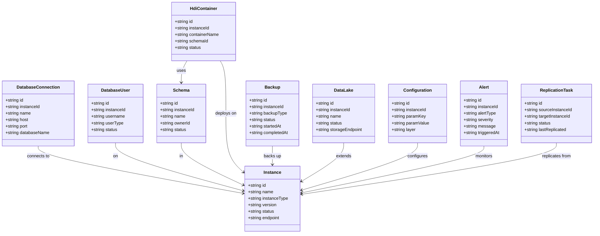
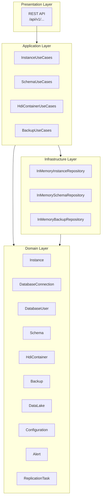
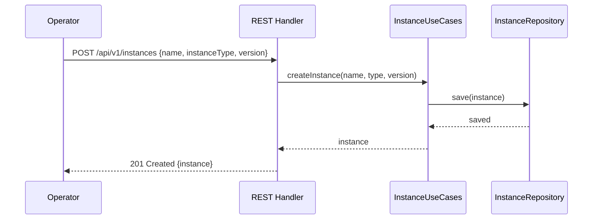

# UML Diagrams — HANA Service

## Class Diagram

```mermaid
classDiagram
    class Instance {
        +string id
        +string name
        +string instanceType
        +string version
        +string status
        +string endpoint
    }
    class DatabaseConnection {
        +string id
        +string instanceId
        +string name
        +string host
        +string port
        +string databaseName
    }
    class DatabaseUser {
        +string id
        +string instanceId
        +string username
        +string userType
        +string status
    }
    class Schema {
        +string id
        +string instanceId
        +string name
        +string ownerId
        +string status
    }
    class HdiContainer {
        +string id
        +string instanceId
        +string containerName
        +string schemaId
        +string status
    }
    class Backup {
        +string id
        +string instanceId
        +string backupType
        +string status
        +string startedAt
        +string completedAt
    }
    class DataLake {
        +string id
        +string instanceId
        +string name
        +string status
        +string storageEndpoint
    }
    class Configuration {
        +string id
        +string instanceId
        +string paramKey
        +string paramValue
        +string layer
    }
    class Alert {
        +string id
        +string instanceId
        +string alertType
        +string severity
        +string message
        +string triggeredAt
    }
    class ReplicationTask {
        +string id
        +string sourceInstanceId
        +string targetInstanceId
        +string status
        +string lastReplicated
    }

    DatabaseConnection --> Instance : connects to
    DatabaseUser --> Instance : on
    Schema --> Instance : in
    HdiContainer --> Instance : deploys on
    HdiContainer --> Schema : uses
    Backup --> Instance : backs up
    DataLake --> Instance : extends
    Configuration --> Instance : configures
    Alert --> Instance : monitors
    ReplicationTask --> Instance : replicates from
```

## Component Diagram

```mermaid
flowchart TB
    subgraph Presentation["Presentation Layer"]
        REST["REST API\n/api/v1/..."]
    end
    subgraph Application["Application Layer"]
        INST_UC["InstanceUseCases"]
        SCHEMA_UC["SchemaUseCases"]
        HDI_UC["HdiContainerUseCases"]
        BACKUP_UC["BackupUseCases"]
    end
    subgraph Domain["Domain Layer"]
        INST["Instance"]
        CONN["DatabaseConnection"]
        USER["DatabaseUser"]
        SCHEMA["Schema"]
        HDI["HdiContainer"]
        BACKUP["Backup"]
        LAKE["DataLake"]
        CONFIG["Configuration"]
        ALERT["Alert"]
        REPL["ReplicationTask"]
    end
    subgraph Infrastructure["Infrastructure Layer"]
        INST_REPO["InMemoryInstanceRepository"]
        SCHEMA_REPO["InMemorySchemaRepository"]
        BACKUP_REPO["InMemoryBackupRepository"]
    end

    REST --> Application
    Application --> Domain
    Infrastructure --> Domain
    Application --> Infrastructure
```

## Sequence Diagram — Create HANA Instance

```mermaid
sequenceDiagram
    participant O as Operator
    participant R as REST Handler
    participant UC as InstanceUseCases
    participant IR as InstanceRepository

    O->>R: POST /api/v1/instances {name, instanceType, version}
    R->>UC: createInstance(name, type, version)
    UC->>IR: save(instance)
    IR-->>UC: saved
    UC-->>R: instance
    R-->>O: 201 Created {instance}
```
