# HANA Cloud Service — UML Diagrams

## 1. Component Diagram — Hexagonal Architecture

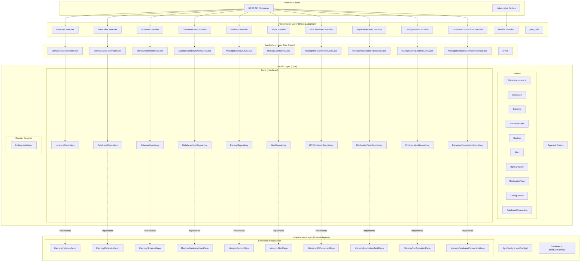

## 2. Class Diagram — Domain Model

```mermaid
classDiagram
    class DatabaseInstance {
        +InstanceId id
        +TenantId tenantId
        +string name
        +string description
        +InstanceType type
        +InstanceStatus status
        +InstanceSize size
        +string version_
        +string region
        +string availabilityZone
        +InstanceEndpoint endpoint
        +InstanceResource resources
        +InstanceLabel[] labels
        +bool enableScriptServer
        +bool enableDocStore
        +bool enableDataLake
        +bool allowAllIpAccess
        +string[] whitelistedIps
        +long createdAt
        +long modifiedAt
    }

    class InstanceEndpoint {
        +string host
        +int port
        +string protocol
    }

    class InstanceResource {
        +long memoryGB
        +int vcpus
        +long storageGB
        +long usedStorageGB
    }

    class DataLake {
        +DataLakeId id
        +TenantId tenantId
        +InstanceId instanceId
        +string name
        +string description
        +DataLakeStatus status
        +DataLakeEndpoint endpoint
        +DataLakeStorage[] storage
        +FileFormat[] supportedFormats
        +int computeNodes
        +long createdAt
        +long modifiedAt
    }

    class DataLakeStorage {
        +StorageTier tier
        +long capacityGB
        +long usedGB
    }

    class Schema {
        +SchemaId id
        +TenantId tenantId
        +InstanceId instanceId
        +string name
        +string owner
        +SchemaType type
        +bool hasPrivileges
        +long tableCount
        +long viewCount
        +long procedureCount
        +long sizeBytes
        +long createdAt
        +long modifiedAt
    }

    class DatabaseUser {
        +DatabaseUserId id
        +TenantId tenantId
        +InstanceId instanceId
        +string userName
        +AuthType authType
        +UserStatus status
        +UserRole[] roles
        +UserPrivilege[] privileges
        +string defaultSchema
        +bool isRestricted
        +bool forcePasswordChange
        +int failedLoginAttempts
        +long passwordExpiresAt
        +long lastLoginAt
        +long createdAt
        +long modifiedAt
    }

    class UserPrivilege {
        +PrivilegeType type
        +string name
        +string schemaName
        +bool grantable
    }

    class Backup {
        +BackupId id
        +TenantId tenantId
        +InstanceId instanceId
        +string name
        +BackupType type
        +BackupStatus status
        +long sizeBytes
        +string destination
        +string encryptionKey
        +bool encrypted
        +BackupSchedule schedule
        +long startedAt
        +long completedAt
        +long expiresAt
        +long createdAt
    }

    class BackupSchedule {
        +string cronExpression
        +int retentionDays
        +bool enabled
    }

    class Alert {
        +AlertId id
        +TenantId tenantId
        +InstanceId instanceId
        +string name
        +string description
        +AlertSeverity severity
        +AlertStatus status
        +AlertCategory category
        +string source
        +string metricName
        +double metricValue
        +AlertThreshold threshold
        +string acknowledgedBy
        +long triggeredAt
        +long acknowledgedAt
        +long resolvedAt
        +long createdAt
    }

    class AlertThreshold {
        +string metric
        +double warningValue
        +double criticalValue
        +string unit
    }

    class HDIContainer {
        +HDIContainerId id
        +TenantId tenantId
        +InstanceId instanceId
        +string name
        +string description
        +HDIContainerStatus status
        +string schemaName
        +string appUser
        +string appUserSchema
        +int artifactCount
        +long sizeBytes
        +string[] grantedSchemas
        +long createdAt
        +long modifiedAt
    }

    class ReplicationTask {
        +ReplicationTaskId id
        +TenantId tenantId
        +InstanceId instanceId
        +string name
        +string description
        +ReplicationMode mode
        +ReplicationTaskStatus status
        +string sourceConnectionId
        +string targetConnectionId
        +ReplicationMapping[] mappings
        +string scheduleExpression
        +long lastRunAt
        +long nextRunAt
        +long rowsReplicated
        +long errorCount
        +long createdAt
        +long modifiedAt
    }

    class ReplicationMapping {
        +string sourceSchema
        +string sourceTable
        +string targetSchema
        +string targetTable
    }

    class Configuration {
        +ConfigurationId id
        +TenantId tenantId
        +InstanceId instanceId
        +string section
        +string key
        +string value
        +string defaultValue
        +ConfigScope scope_
        +ConfigDataType dataType
        +string description
        +bool isReadOnly
        +bool requiresRestart
        +long modifiedAt
        +string modifiedBy
    }

    class DatabaseConnection {
        +DatabaseConnectionId id
        +TenantId tenantId
        +InstanceId instanceId
        +string name
        +string description
        +ConnectionType type
        +ConnectionStatus status
        +string host
        +int port
        +string database
        +string user
        +bool useTls
        +string tlsCertificate
        +ConnectionPoolConfig poolConfig
        +string[][] properties
        +long createdAt
        +long modifiedAt
    }

    class ConnectionPoolConfig {
        +int minConnections
        +int maxConnections
        +long idleTimeoutMs
        +long connectionTimeoutMs
    }

    DatabaseInstance "1" --> "0..*" DataLake : hosts
    DatabaseInstance "1" --> "0..*" Schema : contains
    DatabaseInstance "1" --> "0..*" DatabaseUser : manages
    DatabaseInstance "1" --> "0..*" Backup : has
    DatabaseInstance "1" --> "0..*" Alert : monitors
    DatabaseInstance "1" --> "0..*" HDIContainer : runs
    DatabaseInstance "1" --> "0..*" ReplicationTask : executes
    DatabaseInstance "1" --> "0..*" Configuration : configures
    DatabaseInstance "1" --> "0..*" DatabaseConnection : connects via
    DatabaseInstance *-- InstanceEndpoint
    DatabaseInstance *-- InstanceResource
    DataLake *-- DataLakeStorage
    DatabaseUser *-- UserPrivilege
    Backup *-- BackupSchedule
    Alert *-- AlertThreshold
    ReplicationTask *-- ReplicationMapping
    DatabaseConnection *-- ConnectionPoolConfig
```

## 3. Enumeration Diagram

```mermaid
classDiagram
    class InstanceType {
        <<enumeration>>
        hana
        hanaExpress
        hanaCloud
        trial
        free
    }

    class InstanceStatus {
        <<enumeration>>
        creating
        running
        stopped
        starting
        stopping
        updating
        deleting
        error
        suspended
    }

    class InstanceSize {
        <<enumeration>>
        xs
        s
        m
        l
        xl
        xxl
        custom
    }

    class StorageTier {
        <<enumeration>>
        hot
        warm
        cold
    }

    class DataLakeStatus {
        <<enumeration>>
        creating
        running
        stopped
        error
        deleting
    }

    class FileFormat {
        <<enumeration>>
        parquet
        csv
        orc
        json
        avro
    }

    class SchemaType {
        <<enumeration>>
        standard
        hdi
        virtual
        system
        temporary
    }

    class AuthType {
        <<enumeration>>
        password
        kerberos
        saml
        x509
        jwt
        ldap
    }

    class UserStatus {
        <<enumeration>>
        active
        deactivated
        locked
        expired
    }

    class BackupType {
        <<enumeration>>
        full
        incremental
        differential
        log
        snapshot
    }

    class BackupStatus {
        <<enumeration>>
        scheduled
        running
        completed
        failed
        cancelled
    }

    class AlertSeverity {
        <<enumeration>>
        info
        warning
        error
        critical
    }

    class AlertStatus {
        <<enumeration>>
        active
        acknowledged
        resolved
        suppressed
    }

    class AlertCategory {
        <<enumeration>>
        performance
        availability
        storage
        memory
        cpu
        replication
        backup
        security
        configuration
    }

    class HDIContainerStatus {
        <<enumeration>>
        creating
        active
        inactive
        error
        deleting
    }

    class ReplicationMode {
        <<enumeration>>
        none
        realtime
        scheduled
        snapshot
        logBased
    }

    class ReplicationTaskStatus {
        <<enumeration>>
        active
        inactive
        running
        completed
        failed
        paused
    }

    class ConfigScope {
        <<enumeration>>
        system
        database
        tenant
        session
    }

    class ConnectionType {
        <<enumeration>>
        jdbc
        odbc
        hdbsql
        nodeJs
        python
        java
        go
        dotnet
    }

    class ConnectionStatus {
        <<enumeration>>
        active
        inactive
        error
        pooled
    }
```

## 4. Sequence Diagram — Create Instance

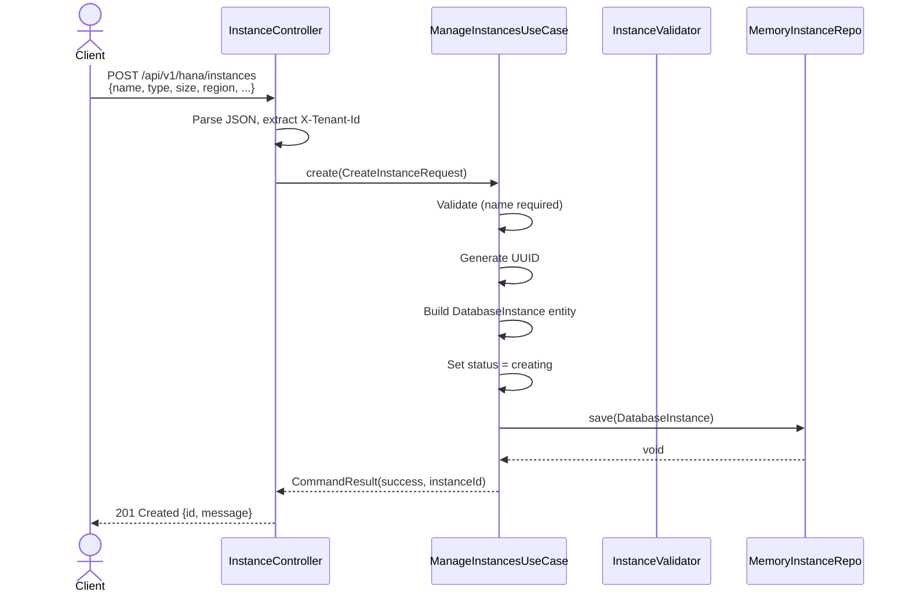

## 5. Sequence Diagram — Instance Action (Start/Stop/Restart)

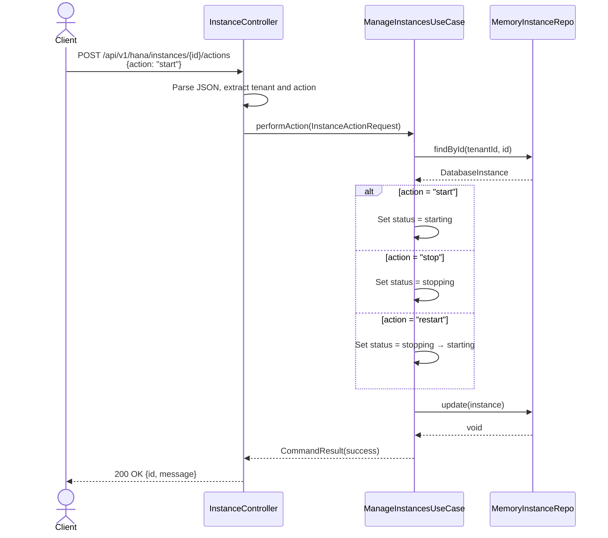

## 6. Sequence Diagram — Alert Acknowledgment

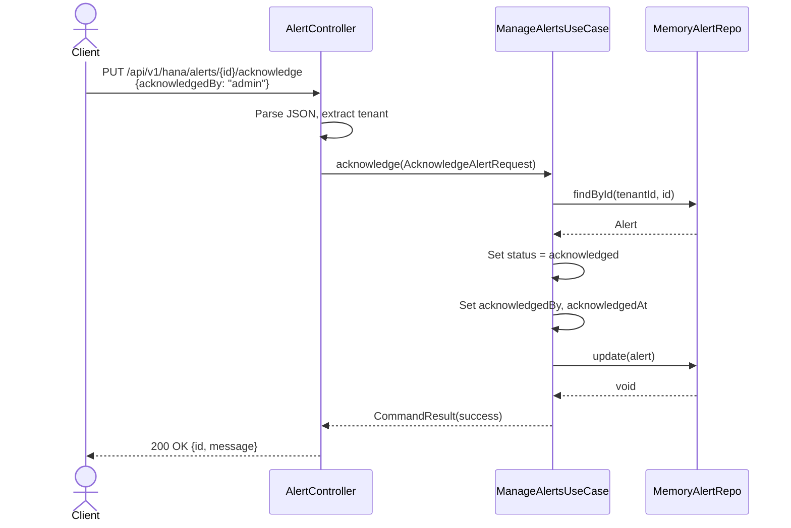

## 7. State Diagram — Instance Lifecycle

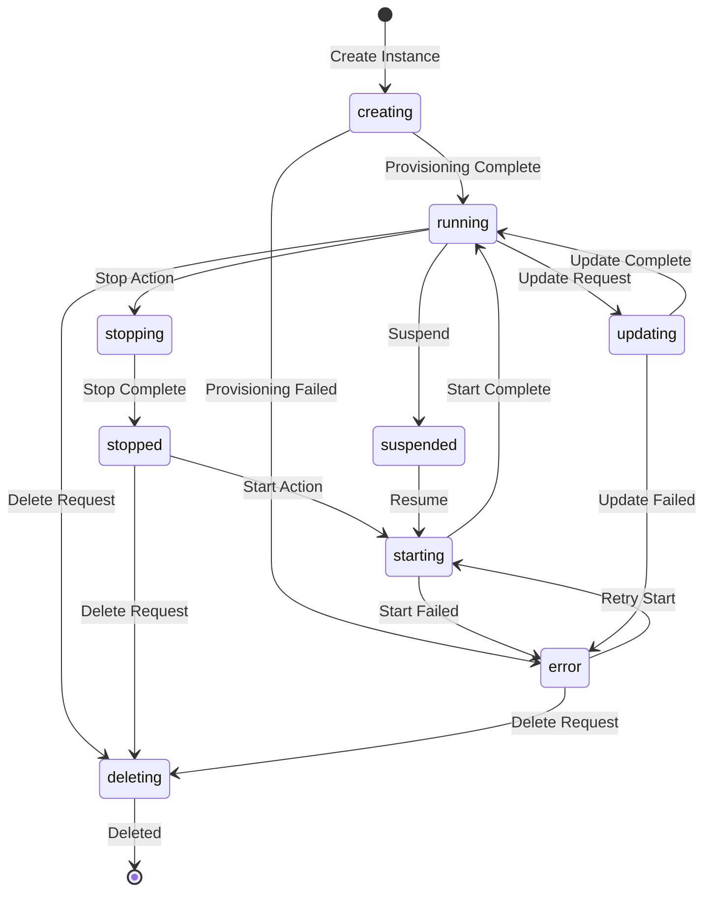

## 8. State Diagram — Alert Lifecycle

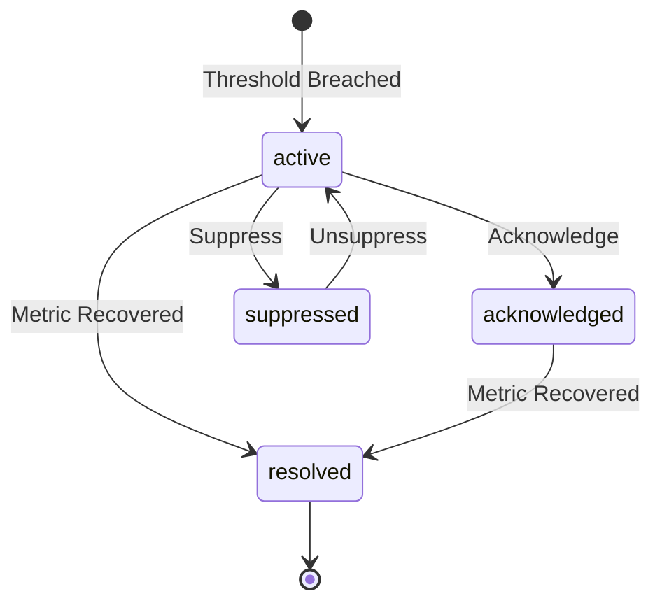

## 9. State Diagram — Backup Lifecycle

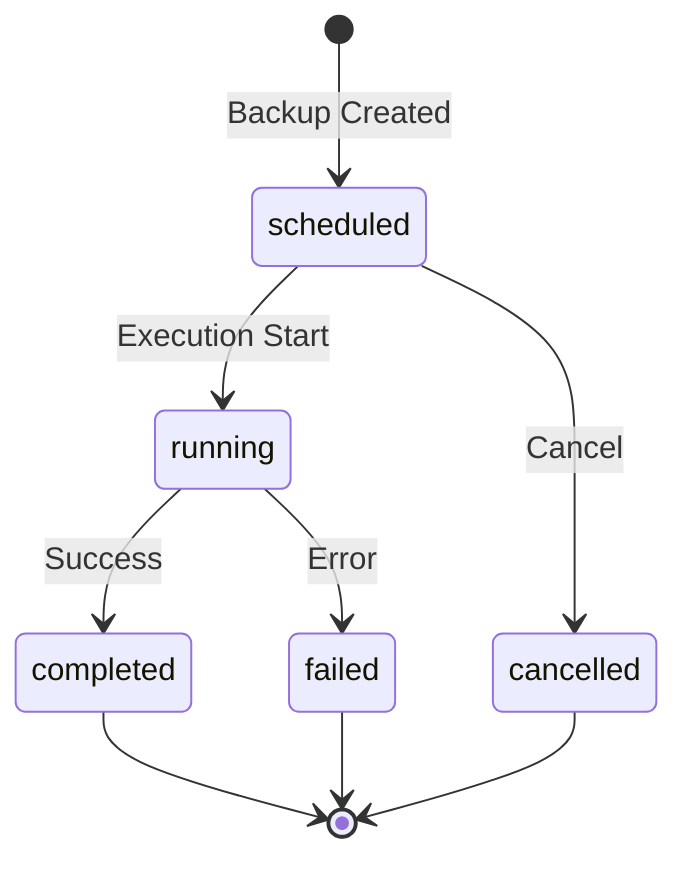

## 10. Deployment Diagram

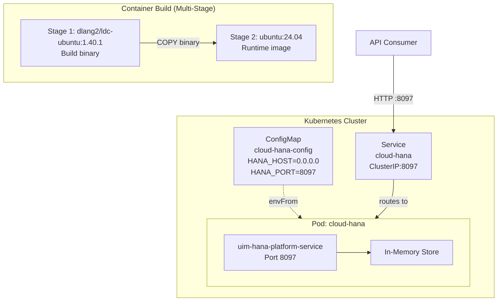

## 11. Package Dependency Diagram

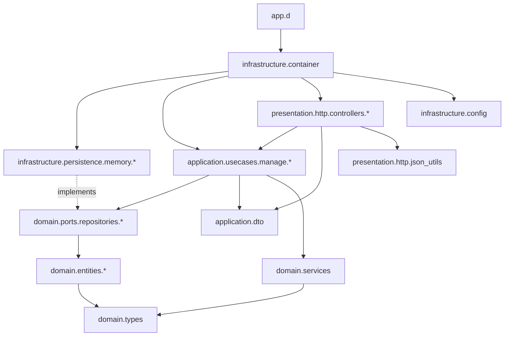
