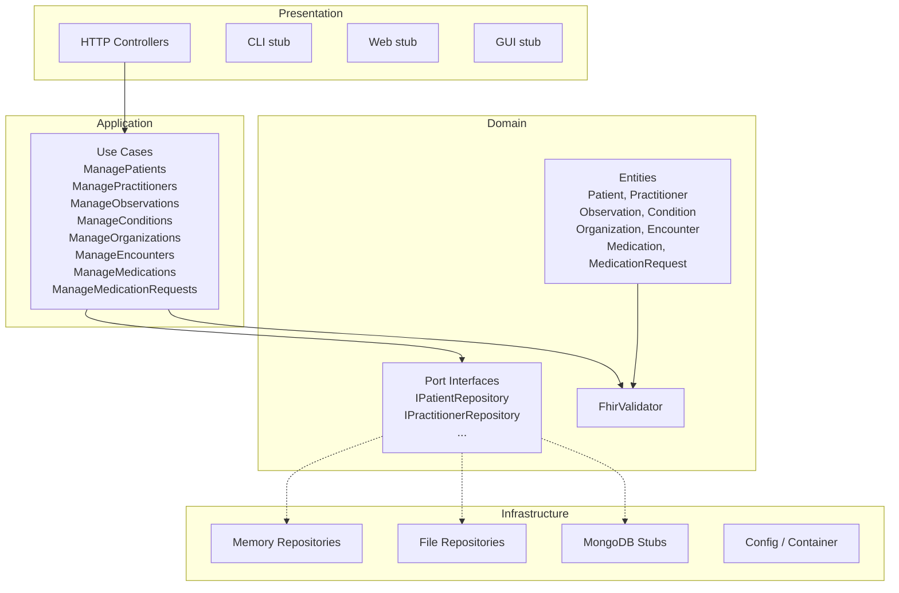
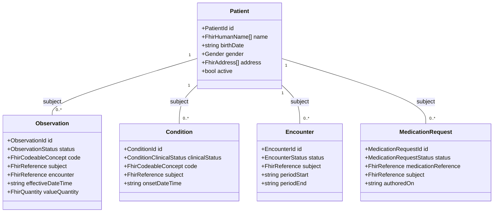
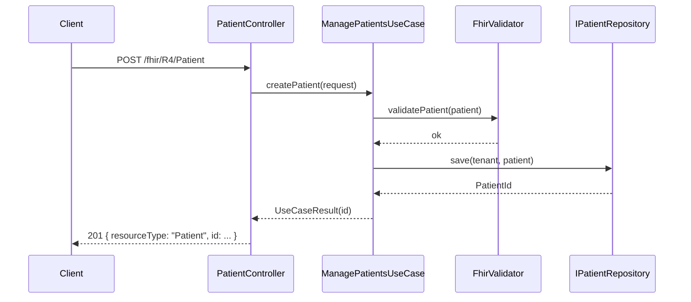

# UML Architecture — UIM Health FHIR Service

## Hexagonal Architecture Overview

```mermaid
graph TD
    subgraph Presentation
        HTTP[HTTP Controllers]
        CLI[CLI stub]
        WEB[Web stub]
        GUI[GUI stub]
    end

    subgraph Application
        UC[Use Cases\nManagePatients\nManagePractitioners\nManageObservations\nManageConditions\nManageOrganizations\nManageEncounters\nManageMedications\nManageMedicationRequests]
    end

    subgraph Domain
        E[Entities\nPatient, Practitioner\nObservation, Condition\nOrganization, Encounter\nMedication, MedicationRequest]
        P[Port Interfaces\nIPatientRepository\nIPractitionerRepository\n...]
        V[FhirValidator]
    end

    subgraph Infrastructure
        MEM[Memory Repositories]
        FILE[File Repositories]
        MONGO[MongoDB Stubs]
        CFG[Config / Container]
    end

    HTTP --> UC
    UC --> P
    P -.-> MEM
    P -.-> FILE
    P -.-> MONGO
    UC --> V
    E --> V
```

## FHIR R4 Resource Model

```mermaid
classDiagram
    class Patient {
        +PatientId id
        +FhirHumanName[] name
        +string birthDate
        +Gender gender
        +FhirAddress[] address
        +bool active
    }
    class Observation {
        +ObservationId id
        +ObservationStatus status
        +FhirCodeableConcept code
        +FhirReference subject
        +FhirReference encounter
        +string effectiveDateTime
        +FhirQuantity valueQuantity
    }
    class Condition {
        +ConditionId id
        +ConditionClinicalStatus clinicalStatus
        +FhirCodeableConcept code
        +FhirReference subject
        +string onsetDateTime
    }
    class Encounter {
        +EncounterId id
        +EncounterStatus status
        +FhirReference subject
        +string periodStart
        +string periodEnd
    }
    class MedicationRequest {
        +MedicationRequestId id
        +MedicationRequestStatus status
        +FhirReference medicationReference
        +FhirReference subject
        +string authoredOn
    }

    Patient "1" -- "0..*" Observation : subject
    Patient "1" -- "0..*" Condition : subject
    Patient "1" -- "0..*" Encounter : subject
    Patient "1" -- "0..*" MedicationRequest : subject
```

## Sequence: Create Patient

```mermaid
sequenceDiagram
    Client ->> PatientController: POST /fhir/R4/Patient
    PatientController ->> ManagePatientsUseCase: createPatient(request)
    ManagePatientsUseCase ->> FhirValidator: validatePatient(patient)
    FhirValidator -->> ManagePatientsUseCase: ok
    ManagePatientsUseCase ->> IPatientRepository: save(tenant, patient)
    IPatientRepository -->> ManagePatientsUseCase: PatientId
    ManagePatientsUseCase -->> PatientController: UseCaseResult(id)
    PatientController -->> Client: 201 { resourceType: "Patient", id: ... }
```
