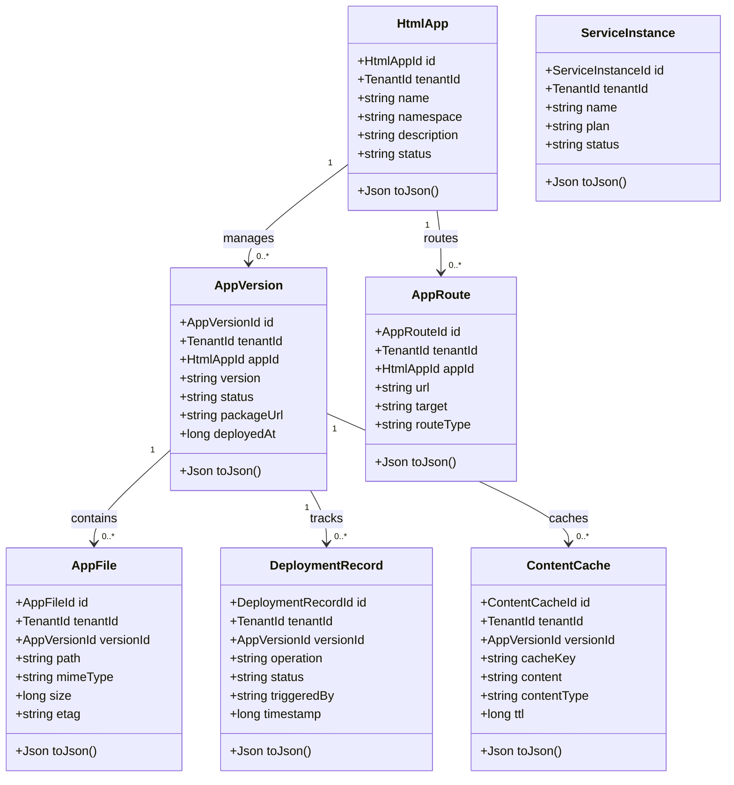
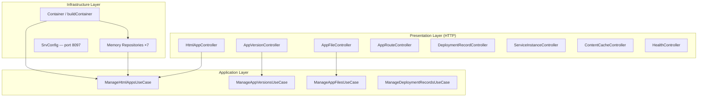
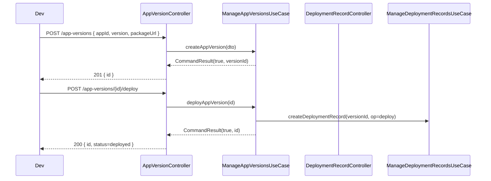

# UML — HTML5 Repository Service

## Class Diagram — Domain Entities

```mermaid
classDiagram
    class HtmlApp {
        +HtmlAppId id
        +TenantId tenantId
        +string name
        +string namespace
        +string description
        +string status
        +Json toJson()
    }
    class AppVersion {
        +AppVersionId id
        +TenantId tenantId
        +HtmlAppId appId
        +string version
        +string status
        +string packageUrl
        +long deployedAt
        +Json toJson()
    }
    class AppFile {
        +AppFileId id
        +TenantId tenantId
        +AppVersionId versionId
        +string path
        +string mimeType
        +long size
        +string etag
        +Json toJson()
    }
    class AppRoute {
        +AppRouteId id
        +TenantId tenantId
        +HtmlAppId appId
        +string url
        +string target
        +string routeType
        +Json toJson()
    }
    class DeploymentRecord {
        +DeploymentRecordId id
        +TenantId tenantId
        +AppVersionId versionId
        +string operation
        +string status
        +string triggeredBy
        +long timestamp
        +Json toJson()
    }
    class ServiceInstance {
        +ServiceInstanceId id
        +TenantId tenantId
        +string name
        +string plan
        +string status
        +Json toJson()
    }
    class ContentCache {
        +ContentCacheId id
        +TenantId tenantId
        +AppVersionId versionId
        +string cacheKey
        +string content
        +string contentType
        +long ttl
        +Json toJson()
    }

    HtmlApp "1" --> "0..*" AppVersion : manages
    HtmlApp "1" --> "0..*" AppRoute : routes
    AppVersion "1" --> "0..*" AppFile : contains
    AppVersion "1" --> "0..*" DeploymentRecord : tracks
    AppVersion "1" --> "0..*" ContentCache : caches
```

---

## Component Diagram

```mermaid
flowchart TB
    subgraph Presentation["Presentation Layer (HTTP)"]
        C1[HtmlAppController]
        C2[AppVersionController]
        C3[AppFileController]
        C4[AppRouteController]
        C5[DeploymentRecordController]
        C6[ServiceInstanceController]
        C7[ContentCacheController]
        HC[HealthController]
    end
    subgraph Application["Application Layer"]
        UC1[ManageHtmlAppsUseCase]
        UC2[ManageAppVersionsUseCase]
        UC3[ManageAppFilesUseCase]
        UC4[ManageDeploymentRecordsUseCase]
    end
    subgraph Infrastructure["Infrastructure Layer"]
        MEM[Memory Repositories ×7]
        CFG[SrvConfig — port 8097]
        CTR[Container / buildContainer]
    end
    C1 --> UC1
    C2 --> UC2
    C3 --> UC3
    MEM --> UC1
    CTR --> UC1
    CTR --> MEM
```

---

## Sequence Diagram — Deploy App Version

```mermaid
sequenceDiagram
    participant Dev
    participant AVC as AppVersionController
    participant AVUC as ManageAppVersionsUseCase
    participant DRC as DeploymentRecordController
    participant DRUC as ManageDeploymentRecordsUseCase

    Dev->>AVC: POST /app-versions { appId, version, packageUrl }
    AVC->>AVUC: createAppVersion(dto)
    AVUC-->>AVC: CommandResult(true, versionId)
    AVC-->>Dev: 201 { id }

    Dev->>AVC: POST /app-versions/{id}/deploy
    AVC->>AVUC: deployAppVersion(id)
    AVUC->>DRUC: createDeploymentRecord(versionId, op=deploy)
    AVUC-->>AVC: CommandResult(true, id)
    AVC-->>Dev: 200 { id, status=deployed }
```
