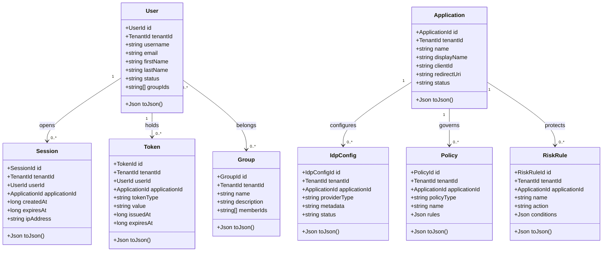
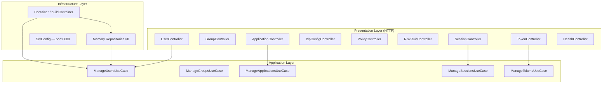
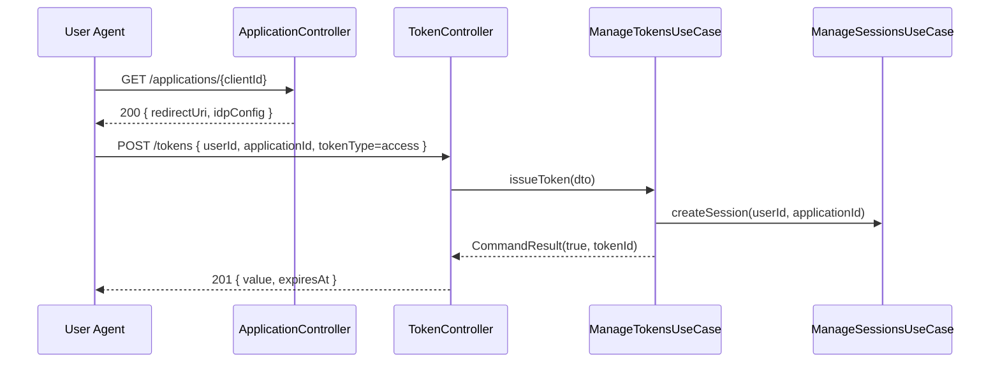

# UML — Identity Authentication Service

## Class Diagram — Domain Entities

```mermaid
classDiagram
    class User {
        +UserId id
        +TenantId tenantId
        +string username
        +string email
        +string firstName
        +string lastName
        +string status
        +string[] groupIds
        +Json toJson()
    }
    class Group {
        +GroupId id
        +TenantId tenantId
        +string name
        +string description
        +string[] memberIds
        +Json toJson()
    }
    class Application {
        +ApplicationId id
        +TenantId tenantId
        +string name
        +string displayName
        +string clientId
        +string redirectUri
        +string status
        +Json toJson()
    }
    class IdpConfig {
        +IdpConfigId id
        +TenantId tenantId
        +ApplicationId applicationId
        +string providerType
        +string metadata
        +string status
        +Json toJson()
    }
    class Policy {
        +PolicyId id
        +TenantId tenantId
        +ApplicationId applicationId
        +string policyType
        +string name
        +Json rules
        +Json toJson()
    }
    class RiskRule {
        +RiskRuleId id
        +TenantId tenantId
        +ApplicationId applicationId
        +string name
        +string action
        +Json conditions
        +Json toJson()
    }
    class Session {
        +SessionId id
        +TenantId tenantId
        +UserId userId
        +ApplicationId applicationId
        +long createdAt
        +long expiresAt
        +string ipAddress
        +Json toJson()
    }
    class Token {
        +TokenId id
        +TenantId tenantId
        +UserId userId
        +ApplicationId applicationId
        +string tokenType
        +string value
        +long issuedAt
        +long expiresAt
        +Json toJson()
    }

    Application "1" --> "0..*" IdpConfig : configures
    Application "1" --> "0..*" Policy : governs
    Application "1" --> "0..*" RiskRule : protects
    User "1" --> "0..*" Session : opens
    User "1" --> "0..*" Token : holds
    User "0..*" --> "0..*" Group : belongs
```

---

## Component Diagram

```mermaid
flowchart TB
    subgraph Presentation["Presentation Layer (HTTP)"]
        C1[UserController]
        C2[GroupController]
        C3[ApplicationController]
        C4[IdpConfigController]
        C5[PolicyController]
        C6[RiskRuleController]
        C7[SessionController]
        C8[TokenController]
        HC[HealthController]
    end
    subgraph Application["Application Layer"]
        UC1[ManageUsersUseCase]
        UC2[ManageGroupsUseCase]
        UC3[ManageApplicationsUseCase]
        UC4[ManageSessionsUseCase]
        UC5[ManageTokensUseCase]
    end
    subgraph Infrastructure["Infrastructure Layer"]
        MEM[Memory Repositories ×8]
        CFG[SrvConfig — port 8080]
        CTR[Container / buildContainer]
    end
    C1 --> UC1
    C3 --> UC3
    C7 --> UC4
    C8 --> UC5
    MEM --> UC1
    CTR --> UC1
    CTR --> MEM
```

---

## Sequence Diagram — User Authentication Flow

```mermaid
sequenceDiagram
    participant UA as User Agent
    participant AC as ApplicationController
    participant TC as TokenController
    participant TUC as ManageTokensUseCase
    participant SUC as ManageSessionsUseCase

    UA->>AC: GET /applications/{clientId}
    AC-->>UA: 200 { redirectUri, idpConfig }

    UA->>TC: POST /tokens { userId, applicationId, tokenType=access }
    TC->>TUC: issueToken(dto)
    TUC->>SUC: createSession(userId, applicationId)
    TUC-->>TC: CommandResult(true, tokenId)
    TC-->>UA: 201 { value, expiresAt }
```
