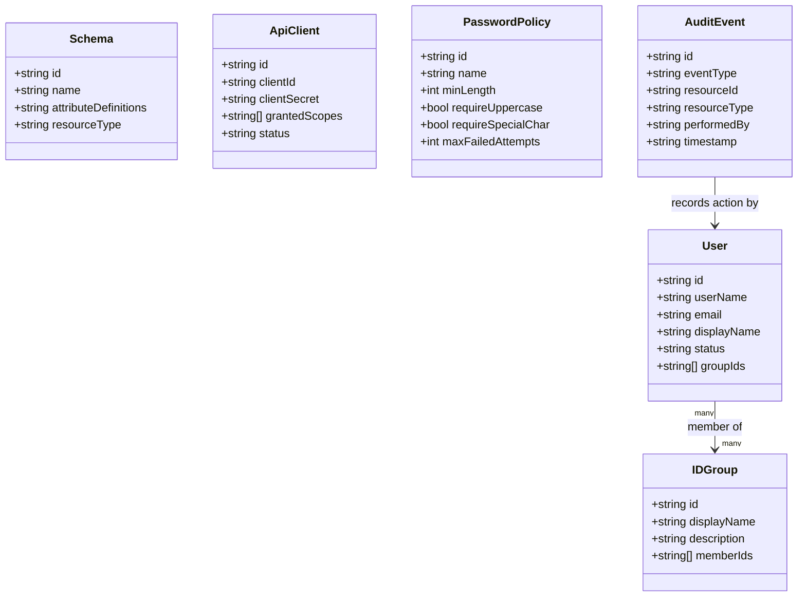
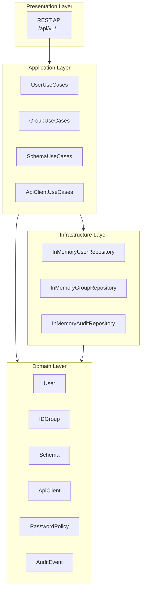
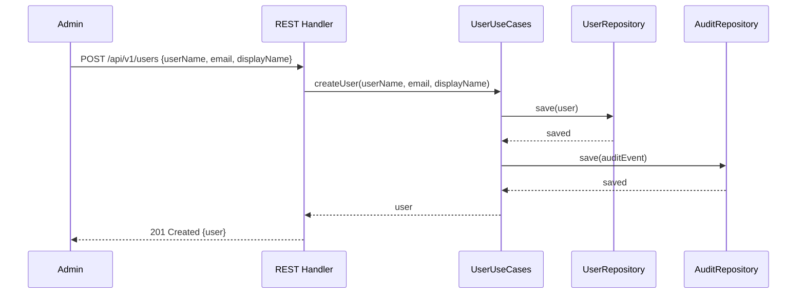

# UML Diagrams — Identity Directory Service

## Class Diagram

```mermaid
classDiagram
    class User {
        +string id
        +string userName
        +string email
        +string displayName
        +string status
        +string[] groupIds
    }
    class IDGroup {
        +string id
        +string displayName
        +string description
        +string[] memberIds
    }
    class Schema {
        +string id
        +string name
        +string attributeDefinitions
        +string resourceType
    }
    class ApiClient {
        +string id
        +string clientId
        +string clientSecret
        +string[] grantedScopes
        +string status
    }
    class PasswordPolicy {
        +string id
        +string name
        +int minLength
        +bool requireUppercase
        +bool requireSpecialChar
        +int maxFailedAttempts
    }
    class AuditEvent {
        +string id
        +string eventType
        +string resourceId
        +string resourceType
        +string performedBy
        +string timestamp
    }

    User "many" --> "many" IDGroup : member of
    AuditEvent --> User : records action by
```

## Component Diagram

```mermaid
flowchart TB
    subgraph Presentation["Presentation Layer"]
        REST["REST API\n/api/v1/..."]
    end
    subgraph Application["Application Layer"]
        USER_UC["UserUseCases"]
        GROUP_UC["GroupUseCases"]
        SCHEMA_UC["SchemaUseCases"]
        CLIENT_UC["ApiClientUseCases"]
    end
    subgraph Domain["Domain Layer"]
        USER["User"]
        GROUP["IDGroup"]
        SCHEMA["Schema"]
        CLIENT["ApiClient"]
        POLICY["PasswordPolicy"]
        AUDIT["AuditEvent"]
    end
    subgraph Infrastructure["Infrastructure Layer"]
        USER_REPO["InMemoryUserRepository"]
        GROUP_REPO["InMemoryGroupRepository"]
        AUDIT_REPO["InMemoryAuditRepository"]
    end

    REST --> Application
    Application --> Domain
    Infrastructure --> Domain
    Application --> Infrastructure
```

## Sequence Diagram — Create User

```mermaid
sequenceDiagram
    participant A as Admin
    participant R as REST Handler
    participant UC as UserUseCases
    participant UR as UserRepository
    participant AR as AuditRepository

    A->>R: POST /api/v1/users {userName, email, displayName}
    R->>UC: createUser(userName, email, displayName)
    UC->>UR: save(user)
    UR-->>UC: saved
    UC->>AR: save(auditEvent)
    AR-->>UC: saved
    UC-->>R: user
    R-->>A: 201 Created {user}
```
