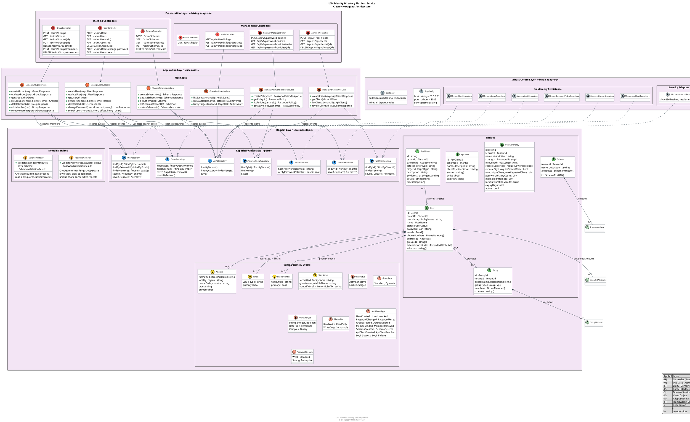

# Identity Directory – Architecture (PlantUML)

```plantuml
@startuml Identity Directory – Hexagonal Architecture

!define PRESENTATION_COLOR #E3F2FD
!define APPLICATION_COLOR  #FFF3E0
!define DOMAIN_COLOR       #E8F5E9
!define INFRA_COLOR        #F3E5F5
!define PORT_COLOR         #E1F5FE
!define SERVICE_COLOR      #FFF8E1
!define VALUE_COLOR        #FFFDE7

skinparam class {
  BackgroundColor    WHITE
  BorderColor        #37474F
  ArrowColor         #37474F
  FontSize           11
}

skinparam package {
  FontSize          12
  FontStyle         bold
  BorderThickness   2
}

title UIM Identity Directory Platform Service\nClean + Hexagonal Architecture

' ============================================================
' PRESENTATION LAYER (Driving Adapters)
' ============================================================

package "Presentation Layer  «driving adapters»" as PRES <<Rectangle>> {
  skinparam packageBackgroundColor PRESENTATION_COLOR

  package "SCIM 2.0 Controllers" as SCIM_HANDLERS <<Rectangle>> {
    class UserController << (H,#EF5350) >> {
      POST   /scim/Users
      GET    /scim/Users
      GET    /scim/Users/{id}
      PUT    /scim/Users/{id}
      DELETE /scim/Users/{id}
      POST   /scim/Users/change-password
      GET    /scim/Users/.search
    }

    class GroupController << (H,#EF5350) >> {
      POST   /scim/Groups
      GET    /scim/Groups
      GET    /scim/Groups/{id}
      PUT    /scim/Groups/{id}
      DELETE /scim/Groups/{id}
      POST   /scim/Groups/members
      DELETE /scim/Groups/members
    }

    class SchemaController << (H,#EF5350) >> {
      POST   /scim/Schemas
      GET    /scim/Schemas
      GET    /scim/Schemas/{id}
      PUT    /scim/Schemas/{id}
      DELETE /scim/Schemas/{id}
    }
  }

  package "Management Controllers" as MGMT_HANDLERS <<Rectangle>> {
    class PasswordPolicyController << (H,#EF5350) >> {
      POST /api/v1/password-policies
      GET  /api/v1/password-policies
      GET  /api/v1/password-policies/active
      GET  /api/v1/password-policies/{id}
    }

    class ApiClientController << (H,#EF5350) >> {
      POST   /api/v1/api-clients
      GET    /api/v1/api-clients
      GET    /api/v1/api-clients/{id}
      DELETE /api/v1/api-clients/{id}
    }

    class AuditController << (H,#EF5350) >> {
      GET /api/v1/audit-logs
      GET /api/v1/audit-logs/actor/{id}
      GET /api/v1/audit-logs/target/{id}
    }

    class HealthController << (H,#EF5350) >> {
      GET /api/v1/health
    }
  }
}

' ============================================================
' APPLICATION LAYER (Use Cases)
' ============================================================

package "Application Layer  «use cases»" as APP <<Rectangle>> {
  skinparam packageBackgroundColor APPLICATION_COLOR

  package "Use Cases" as USECASES <<Rectangle>> {
    class ManageUsersUseCase << (U,#FF7043) >> {
      + createUser(req) : UserResponse
      + updateUser(req) : UserResponse
      + getUser(id) : User
      + listUsers(tenantId, offset, limit) : User[]
      + deleteUser(id) : UserResponse
      + changePassword(userId, current, new_) : UserResponse
      + searchUsers(tenantId, filter, offset, limit) : User[]
    }

    class ManageGroupsUseCase << (U,#FF7043) >> {
      + createGroup(req) : GroupResponse
      + updateGroup(req) : GroupResponse
      + getGroup(id) : Group
      + listGroups(tenantId, offset, limit) : Group[]
      + deleteGroup(id) : GroupResponse
      + addMember(req) : GroupResponse
      + removeMember(req) : GroupResponse
    }

    class ManageSchemasUseCase << (U,#FF7043) >> {
      + createSchema(req) : SchemaResponse
      + updateSchema(req) : SchemaResponse
      + getSchema(id) : Schema
      + listSchemas(tenantId) : Schema[]
      + deleteSchema(id) : SchemaResponse
    }

    class ManagePasswordPoliciesUseCase << (U,#FF7043) >> {
      + createPolicy(req) : PasswordPolicyResponse
      + getPolicy(id) : PasswordPolicy
      + listPolicies(tenantId) : PasswordPolicy[]
      + getActivePolicy(tenantId) : PasswordPolicy
    }

    class ManageApiClientsUseCase << (U,#FF7043) >> {
      + createClient(req) : ApiClientResponse
      + getClient(id) : ApiClient
      + listClients(tenantId) : ApiClient[]
      + revokeClient(id) : ApiClientResponse
    }

    class QueryAuditLogUseCase << (U,#FF7043) >> {
      + listEvents(tenantId) : AuditEvent[]
      + listByActor(tenantId, actorId) : AuditEvent[]
      + listByTarget(tenantId, targetId) : AuditEvent[]
    }
  }
}

' ============================================================
' DOMAIN LAYER
' ============================================================

package "Domain Layer  «business logic»" as DOMAIN <<Rectangle>> {
  skinparam packageBackgroundColor DOMAIN_COLOR

  package "Entities" as ENTITIES <<Rectangle>> {
    class User << (E,#66BB6A) >> {
      id : UserId
      tenantId : TenantId
      userName, displayName : string
      name : UserName
      status : UserStatus
      passwordHash : string
      emails : Email[]
      phoneNumbers : PhoneNumber[]
      addresses : Address[]
      groupIds : string[]
      extendedAttributes : ExtendedAttribute[]
      schemas : string[]
    }

    class Group << (E,#66BB6A) >> {
      id : GroupId
      tenantId : TenantId
      displayName, description : string
      groupType : GroupType
      members : GroupMember[]
      schemas : string[]
    }

    class Schema << (E,#66BB6A) >> {
      id : SchemaId  (URN)
      tenantId : TenantId
      name, description : string
      attributes : SchemaAttribute[]
    }

    class PasswordPolicy << (E,#66BB6A) >> {
      id : string
      tenantId : TenantId
      name, description : string
      strength : PasswordStrength
      minLength, maxLength : uint
      requireUppercase, requireLowercase : bool
      requireDigit, requireSpecialChar : bool
      minUniqueChars, maxRepeatedChars : uint
      passwordHistoryCount : uint
      maxFailedAttempts : uint
      lockoutDurationMinutes : uint
      expiryDays : uint
      active : bool
    }

    class ApiClient << (E,#66BB6A) >> {
      id : ApiClientId
      tenantId : TenantId
      name, description : string
      clientId, clientSecret : string
      scopes : string[]
      active : bool
      expiresAt : long
    }

    class AuditEvent << (E,#66BB6A) >> {
      id : string
      tenantId : TenantId
      eventType : AuditEventType
      actorId, actorType : string
      targetId, targetType : string
      description : string
      ipAddress, userAgent : string
      details : string[string]
      timestamp : long
    }
  }

  package "Repository Interfaces  «ports»" as REPOS <<Rectangle>> {
    skinparam packageBackgroundColor PORT_COLOR

    interface UserRepository << (P,#42A5F5) >> {
      findById() / findByUserName()
      findByExternalId() / findByEmail()
      findByTenant() / findByGroupId()
      search() / countByTenant()
      save() / update() / remove()
    }

    interface GroupRepository << (P,#42A5F5) >> {
      findById() / findByDisplayName()
      findByTenant() / findByMember()
      save() / update() / remove()
      countByTenant()
    }

    interface SchemaRepository << (P,#42A5F5) >> {
      findById() / findByTenant()
      save() / update() / remove()
    }

    interface PasswordPolicyRepository << (P,#42A5F5) >> {
      findById() / findByTenant()
      findActive()
      save()
    }

    interface ApiClientRepository << (P,#42A5F5) >> {
      findById() / findByClientId()
      findByTenant()
      save() / update() / remove()
    }

    interface AuditRepository << (P,#42A5F5) >> {
      findByTenant()
      findByActor() / findByTarget()
      save()
    }

    interface PasswordService << (P,#42A5F5) >> {
      hashPassword(plaintext) : string
      verifyPassword(plaintext, hash) : bool
    }
  }

  package "Domain Services" as DSVC <<Rectangle>> {
    skinparam packageBackgroundColor SERVICE_COLOR

    class PasswordValidator << (S,#FFB74D) >> {
      {static} + validatePassword(password, policy)
           : PasswordValidationResult
      --
      Checks: min/max length, uppercase,
      lowercase, digit, special char,
      unique chars, consecutive repeats
    }

    class SchemaValidator << (S,#FFB74D) >> {
      {static} + validateExtendedAttributes(
           attrs, schema)
           : SchemaValidationResult
      --
      Checks: required attrs present,
      read-only guards, unknown attrs
    }
  }

  package "Value Objects & Enums" as VALS <<Rectangle>> {
    skinparam packageBackgroundColor VALUE_COLOR

    class UserName << (V,#FDD835) >> {
      formatted, familyName : string
      givenName, middleName : string
      honorificPrefix, honorificSuffix : string
    }

    class Email << (V,#FDD835) >> {
      value, type : string
      primary : bool
    }

    class PhoneNumber << (V,#FDD835) >> {
      value, type : string
      primary : bool
    }

    class Address << (V,#FDD835) >> {
      formatted, streetAddress : string
      locality, region : string
      postalCode, country : string
      type : string
      primary : bool
    }

    enum UserStatus {
      Active, Inactive
      Locked, Staged
    }

    enum GroupType {
      Standard, Dynamic
    }

    enum AttributeType {
      String, Integer, Boolean
      DateTime, Reference
      Complex, Binary
    }

    enum Mutability {
      ReadWrite, ReadOnly
      WriteOnly, Immutable
    }

    enum AuditEventType {
      UserCreated .. UserUnlocked
      PasswordChanged, PasswordReset
      GroupCreated .. GroupDeleted
      MemberAdded, MemberRemoved
      SchemaCreated .. SchemaDeleted
      ApiClientCreated, ApiClientRevoked
      LoginSuccess, LoginFailure
    }

    enum PasswordStrength {
      Weak, Standard
      Strong, Enterprise
    }
  }
}

' ============================================================
' INFRASTRUCTURE LAYER (Driven Adapters)
' ============================================================

package "Infrastructure Layer  «driven adapters»" as INFRA <<Rectangle>> {
  skinparam packageBackgroundColor INFRA_COLOR

  class AppConfig << (F,#90A4AE) >> {
    host : string = "0.0.0.0"
    port : ushort = 8082
    serviceName : string
  }

  class Container << (F,#90A4AE) >> {
    buildContainer(config) : Container
    --
    Wires all dependencies
  }

  package "In-Memory Persistence" as PERSIST <<Rectangle>> {
    class MemoryUserRepository << (A,#B0BEC5) >>
    class MemoryGroupRepository << (A,#B0BEC5) >>
    class MemorySchemaRepository << (A,#B0BEC5) >>
    class MemoryPasswordPolicyRepository << (A,#B0BEC5) >>
    class MemoryApiClientRepository << (A,#B0BEC5) >>
    class MemoryAuditRepository << (A,#B0BEC5) >>
  }

  package "Security Adapters" as SEC_ADAPT <<Rectangle>> {
    class Sha256PasswordService << (A,#B0BEC5) >> {
      SHA-256 hashing implementation
    }
  }
}

' ============================================================
' RELATIONSHIPS – Controller → Use Case
' ============================================================

UserController             --> ManageUsersUseCase
GroupController            --> ManageGroupsUseCase
SchemaController           --> ManageSchemasUseCase
PasswordPolicyController   --> ManagePasswordPoliciesUseCase
ApiClientController        --> ManageApiClientsUseCase
AuditController            --> QueryAuditLogUseCase

' ============================================================
' RELATIONSHIPS – Use Case → Repository Port
' ============================================================

ManageUsersUseCase              --> UserRepository
ManageUsersUseCase              --> PasswordService : hashes passwords
ManageUsersUseCase              --> PasswordPolicyRepository : validates against policy
ManageUsersUseCase              --> AuditRepository : records events
ManageGroupsUseCase             --> GroupRepository
ManageGroupsUseCase             --> UserRepository : validates members
ManageGroupsUseCase             --> AuditRepository : records events
ManageSchemasUseCase            --> SchemaRepository
ManageSchemasUseCase            --> AuditRepository : records events
ManagePasswordPoliciesUseCase   --> PasswordPolicyRepository
ManagePasswordPoliciesUseCase   --> AuditRepository : records events
ManageApiClientsUseCase         --> ApiClientRepository
ManageApiClientsUseCase         --> AuditRepository : records events
QueryAuditLogUseCase            --> AuditRepository

' ============================================================
' RELATIONSHIPS – Adapter implements Port
' ============================================================

MemoryUserRepository           ..|> UserRepository
MemoryGroupRepository          ..|> GroupRepository
MemorySchemaRepository         ..|> SchemaRepository
MemoryPasswordPolicyRepository ..|> PasswordPolicyRepository
MemoryApiClientRepository      ..|> ApiClientRepository
MemoryAuditRepository          ..|> AuditRepository
Sha256PasswordService            ..|> PasswordService

' ============================================================
' ENTITY ASSOCIATIONS
' ============================================================

User "0..*" --> "0..*" Group : groupIds
User "1" *-- "0..*" Email : emails
User "1" *-- "0..*" PhoneNumber : phoneNumbers
User "1" *-- "0..*" Address : addresses
User "1" *-- "0..*" ExtendedAttribute : extendedAttributes
Group "1" *-- "0..*" GroupMember : members
Schema "1" *-- "1..*" SchemaAttribute : attributes
AuditEvent "0..*" --> "1" User : actorId / targetId

' ============================================================
' LEGEND
' ============================================================

legend bottom right
  | Symbol | Layer |
  | (H) | Controller (Presentation) |
  | (U) | Use Case (Application) |
  | (E) | Entity (Domain) |
  | (P) | Port / Interface |
  | (S) | Domain Service |
  | (V) | Value Object |
  | (A) | Adapter (Infrastructure) |
  | (F) | Framework / Config |
  |→| depends on |
  |..|>| implements |
  |*--| composition |
endlegend

footer UIM Platform – Identity Directory Service\n© 2018-2026 UIM Platform Team
@enduml
```
