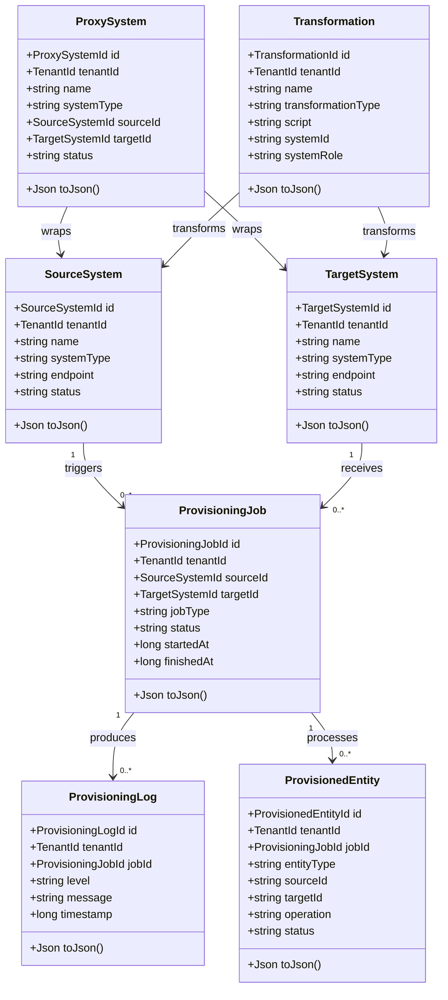
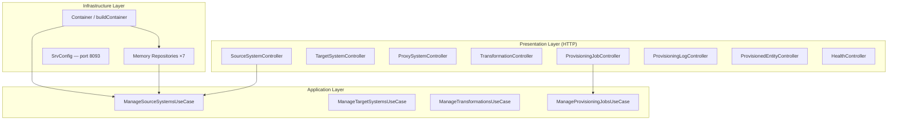
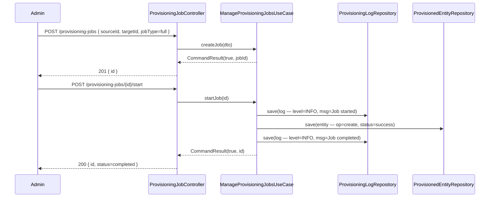

# UML — Identity Provisioning Service

## Class Diagram — Domain Entities

```mermaid
classDiagram
    class SourceSystem {
        +SourceSystemId id
        +TenantId tenantId
        +string name
        +string systemType
        +string endpoint
        +string status
        +Json toJson()
    }
    class TargetSystem {
        +TargetSystemId id
        +TenantId tenantId
        +string name
        +string systemType
        +string endpoint
        +string status
        +Json toJson()
    }
    class ProxySystem {
        +ProxySystemId id
        +TenantId tenantId
        +string name
        +string systemType
        +SourceSystemId sourceId
        +TargetSystemId targetId
        +string status
        +Json toJson()
    }
    class Transformation {
        +TransformationId id
        +TenantId tenantId
        +string name
        +string transformationType
        +string script
        +string systemId
        +string systemRole
        +Json toJson()
    }
    class ProvisioningJob {
        +ProvisioningJobId id
        +TenantId tenantId
        +SourceSystemId sourceId
        +TargetSystemId targetId
        +string jobType
        +string status
        +long startedAt
        +long finishedAt
        +Json toJson()
    }
    class ProvisioningLog {
        +ProvisioningLogId id
        +TenantId tenantId
        +ProvisioningJobId jobId
        +string level
        +string message
        +long timestamp
        +Json toJson()
    }
    class ProvisionedEntity {
        +ProvisionedEntityId id
        +TenantId tenantId
        +ProvisioningJobId jobId
        +string entityType
        +string sourceId
        +string targetId
        +string operation
        +string status
        +Json toJson()
    }

    SourceSystem "1" --> "0..*" ProvisioningJob : triggers
    TargetSystem "1" --> "0..*" ProvisioningJob : receives
    ProvisioningJob "1" --> "0..*" ProvisioningLog : produces
    ProvisioningJob "1" --> "0..*" ProvisionedEntity : processes
    ProxySystem --> SourceSystem : wraps
    ProxySystem --> TargetSystem : wraps
    Transformation --> SourceSystem : transforms
    Transformation --> TargetSystem : transforms
```

---

## Component Diagram

```mermaid
flowchart TB
    subgraph Presentation["Presentation Layer (HTTP)"]
        C1[SourceSystemController]
        C2[TargetSystemController]
        C3[ProxySystemController]
        C4[TransformationController]
        C5[ProvisioningJobController]
        C6[ProvisioningLogController]
        C7[ProvisionedEntityController]
        HC[HealthController]
    end
    subgraph Application["Application Layer"]
        UC1[ManageSourceSystemsUseCase]
        UC2[ManageTargetSystemsUseCase]
        UC3[ManageTransformationsUseCase]
        UC4[ManageProvisioningJobsUseCase]
    end
    subgraph Infrastructure["Infrastructure Layer"]
        MEM[Memory Repositories ×7]
        CFG[SrvConfig — port 8093]
        CTR[Container / buildContainer]
    end
    C1 --> UC1
    C5 --> UC4
    MEM --> UC1
    CTR --> UC1
    CTR --> MEM
```

---

## Sequence Diagram — Run Provisioning Job

```mermaid
sequenceDiagram
    participant Admin
    participant JC as ProvisioningJobController
    participant JUC as ManageProvisioningJobsUseCase
    participant LR as ProvisioningLogRepository
    participant ER as ProvisionedEntityRepository

    Admin->>JC: POST /provisioning-jobs { sourceId, targetId, jobType=full }
    JC->>JUC: createJob(dto)
    JUC-->>JC: CommandResult(true, jobId)
    JC-->>Admin: 201 { id }

    Admin->>JC: POST /provisioning-jobs/{id}/start
    JC->>JUC: startJob(id)
    JUC->>LR: save(log — level=INFO, msg=Job started)
    JUC->>ER: save(entity — op=create, status=success)
    JUC->>LR: save(log — level=INFO, msg=Job completed)
    JUC-->>JC: CommandResult(true, id)
    JC-->>Admin: 200 { id, status=completed }
```
