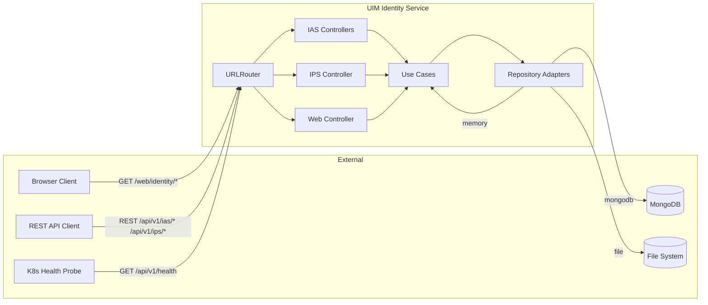
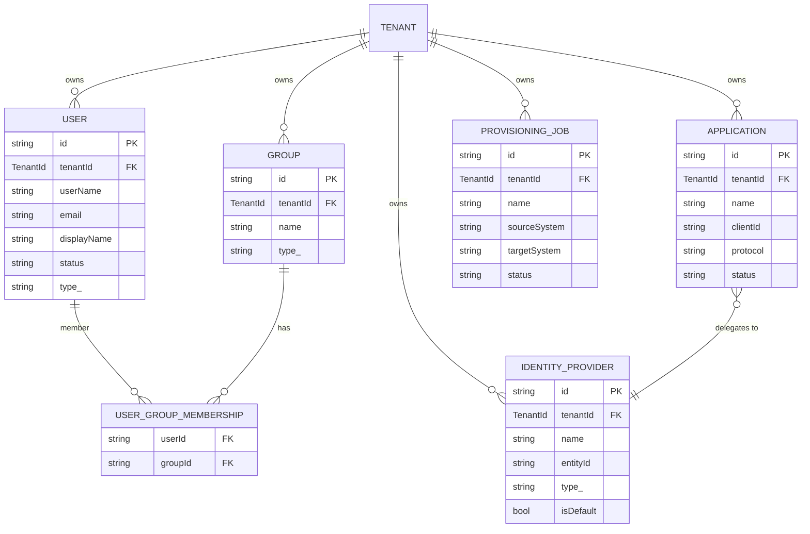
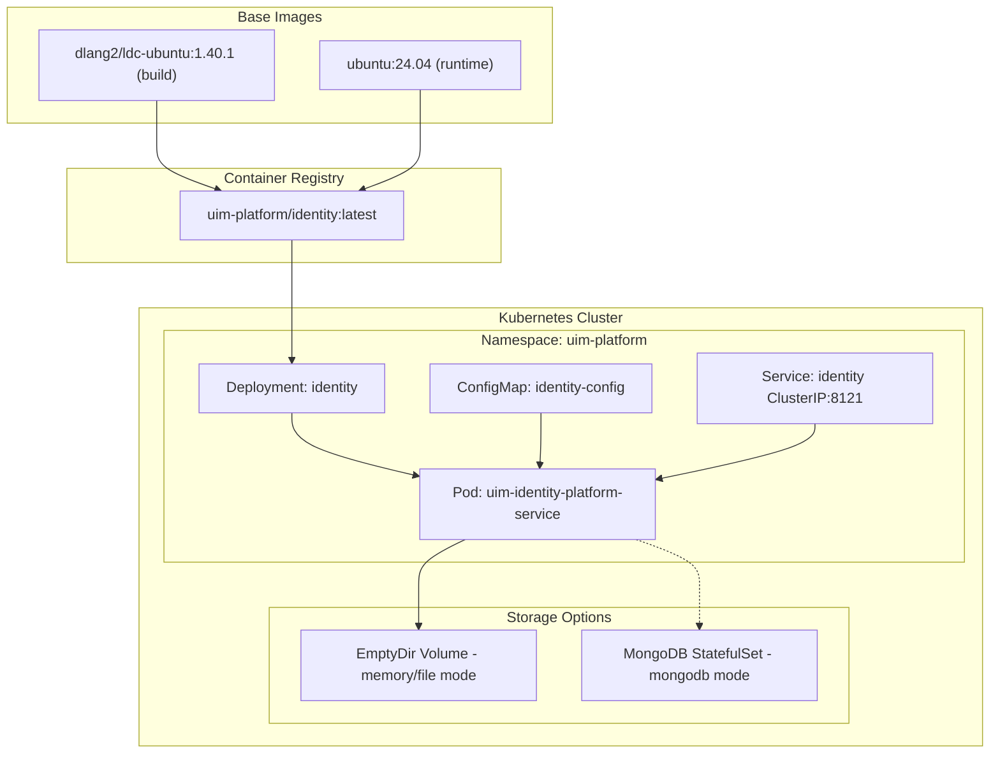

# NAFv4 Architecture — UIM Identity Platform Service

Aligned with NATO Architecture Framework v4 (NAFv4) viewpoints.

---

## NCV — Capability Taxonomy

| Capability | Sub-Capability | Description |
|---|---|---|
| **Identity Management** | User Lifecycle | Create, update, delete, and query users across tenants |
| | Group Management | Manage user groups and authorization groups |
| | User Authentication | Support for form, basic, certificate, token, and SPNEGO auth |
| **Application Management** | Application Registration | Register OIDC/SAML applications with client credentials |
| | Auth Scheme Configuration | Configure per-application authentication schemes |
| | Risk-Based Auth | Enable/disable risk-based authentication per application |
| **Federation** | Identity Provider Configuration | Configure corporate OIDC/SAML identity providers |
| | Default IdP | Designate a default identity provider per tenant |
| | Domain Restrictions | Restrict IdP usage by email domain |
| **Provisioning** | Job Orchestration | Create and lifecycle-manage provisioning jobs |
| | Source/Target System Mapping | Map source to target systems for data sync |
| | Job Lifecycle Control | Start, cancel, and monitor provisioning jobs |
| **Multi-Tenancy** | Tenant Isolation | All entities scoped to TenantId |
| **Persistence** | Memory Backend | Stateless in-process storage |
| | File Backend | JSON file persistence with hot-load on startup |
| | MongoDB Backend | Document-store persistence via vibe.db.mongo |

---

## NSV — Service View

| Service | Interface | Protocol | Consumer |
|---|---|---|---|
| User Management API | REST JSON | HTTP/1.1 | Service consumers, admin tools |
| Group Management API | REST JSON | HTTP/1.1 | Service consumers |
| Application Registry API | REST JSON | HTTP/1.1 | App developers, platform services |
| Identity Provider API | REST JSON | HTTP/1.1 | Platform administrators |
| Provisioning Job API | REST JSON | HTTP/1.1 | IPS schedulers, admin tools |
| Web UI | HTML | HTTP/1.1 | Browser clients |
| Health Endpoint | REST JSON | HTTP/1.1 | Kubernetes, load balancers |

---

## NOV — Operational Node Connectivity

---

## NLV — Logical Data Model

---

## NPV — Physical Deployment

---

## Summary

| NAFv4 View | Coverage |
|---|---|
| NCV (Capability) | 6 capability areas, 14 sub-capabilities |
| NSV (Service) | 7 REST/HTML services mapped |
| NOV (Operational) | Node connectivity with all consumers and backends |
| NLV (Logical Data) | Full ER diagram with 5 entity types |
| NPV (Physical) | Kubernetes deployment topology with 3 storage backends |
