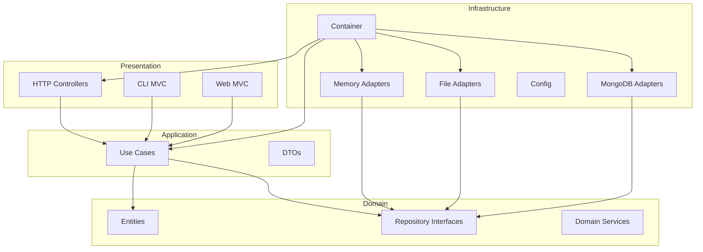
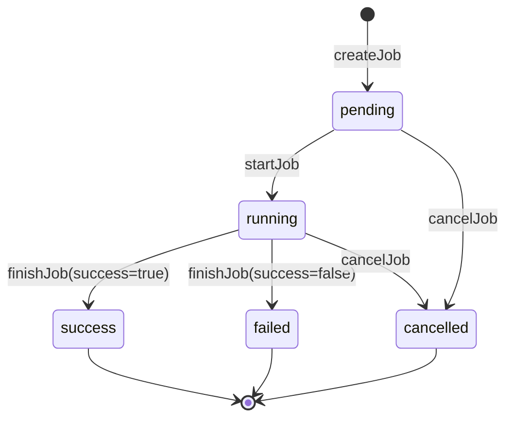

# UML — Identity Platform Service

## Class Diagram

```mermaid
classDiagram
    %% Domain Entities
    class User {
        +UserId id
        +TenantId tenantId
        +string userName
        +string email
        +string displayName
        +string firstName
        +string lastName
        +UserStatus status
        +UserType type_
        +string[] groups
        +string[] roles
        +toJson() Json
    }

    class Group {
        +GroupId id
        +TenantId tenantId
        +string name
        +string description
        +GroupType type_
        +string[] memberIds
        +toJson() Json
    }

    class Application {
        +ApplicationId id
        +TenantId tenantId
        +string name
        +AppProtocol protocol
        +AppStatus status
        +string clientId
        +string[] redirectUris
        +AuthScheme authScheme
        +toJson() Json
    }

    class IdentityProvider {
        +IdentityProviderId id
        +TenantId tenantId
        +string name
        +IdpType type_
        +IdpStatus status
        +string entityId
        +string ssoUrl
        +bool isDefault
        +toJson() Json
    }

    class ProvisioningJob {
        +ProvisioningJobId id
        +TenantId tenantId
        +string name
        +string sourceSystem
        +string targetSystem
        +JobType type_
        +JobStatus status
        +toJson() Json
    }

    %% Repository Interfaces (Ports)
    class UserRepository {
        <<interface>>
        +save(User)
        +findById(TenantId, UserId) User
        +findByTenant(TenantId) User[]
        +findByEmail(TenantId, string) User
        +findByStatus(TenantId, UserStatus) User[]
    }

    class GroupRepository {
        <<interface>>
        +save(Group)
        +findById(TenantId, GroupId) Group
        +findByMember(TenantId, UserId) Group[]
    }

    class ApplicationRepository {
        <<interface>>
        +save(Application)
        +findByClient(TenantId, string) Application
        +findByProtocol(TenantId, AppProtocol) Application[]
    }

    class IdentityProviderRepository {
        <<interface>>
        +save(IdentityProvider)
        +findByEntityId(TenantId, string) IdentityProvider
        +findDefault(TenantId) IdentityProvider
    }

    class ProvisioningJobRepository {
        <<interface>>
        +save(ProvisioningJob)
        +findByStatus(TenantId, JobStatus) ProvisioningJob[]
        +findByTargetSystem(TenantId, string) ProvisioningJob[]
    }

    %% Use Cases
    class ManageUsersUseCase {
        -UserRepository repo
        +createUser(UserDTO) UseCaseResult
        +updateUser(UserDTO) UseCaseResult
        +deleteUser(TenantId, UserId) UseCaseResult
        +getUser(TenantId, UserId) User
        +listUsers(TenantId) User[]
        +findByEmail(TenantId, string) User
    }

    class ManageGroupsUseCase {
        -GroupRepository repo
        +createGroup(GroupDTO) UseCaseResult
        +addMember(TenantId, GroupId, UserId) UseCaseResult
        +removeMember(TenantId, GroupId, UserId) UseCaseResult
    }

    class ManageApplicationsUseCase {
        -ApplicationRepository repo
        +createApplication(ApplicationDTO) UseCaseResult
    }

    class ManageIdentityProvidersUseCase {
        -IdentityProviderRepository repo
        +createIdentityProvider(IdentityProviderDTO) UseCaseResult
        +findDefault(TenantId) IdentityProvider
    }

    class ManageProvisioningJobsUseCase {
        -ProvisioningJobRepository repo
        +createJob(ProvisioningJobDTO) UseCaseResult
        +startJob(TenantId, ProvisioningJobId) UseCaseResult
        +finishJob(TenantId, ProvisioningJobId, bool) UseCaseResult
        +cancelJob(TenantId, ProvisioningJobId) UseCaseResult
    }

    %% Controllers
    class UserController {
        -ManageUsersUseCase usecase
        +registerRoutes(URLRouter)
    }

    class GroupController {
        -ManageGroupsUseCase usecase
        +registerRoutes(URLRouter)
    }

    class ApplicationController {
        -ManageApplicationsUseCase usecase
        +registerRoutes(URLRouter)
    }

    class IdentityProviderController {
        -ManageIdentityProvidersUseCase usecase
        +registerRoutes(URLRouter)
    }

    class ProvisioningJobController {
        -ManageProvisioningJobsUseCase usecase
        +registerRoutes(URLRouter)
        +handleStart(req, res)
        +handleCancel(req, res)
    }

    %% Persistence Adapters
    class MemoryUserRepository {
        -User[string] store
    }
    class FileUserRepository {
        -string dataDir
        -User[string] store
    }
    class MongoUserRepository {
        -MongoCollection collection
    }

    %% Relationships
    User --> Group : "member of"
    Application --> IdentityProvider : "delegates auth to"
    ProvisioningJob --> User : "provisions"

    ManageUsersUseCase --> UserRepository
    ManageGroupsUseCase --> GroupRepository
    ManageApplicationsUseCase --> ApplicationRepository
    ManageIdentityProvidersUseCase --> IdentityProviderRepository
    ManageProvisioningJobsUseCase --> ProvisioningJobRepository

    MemoryUserRepository ..|> UserRepository
    FileUserRepository ..|> UserRepository
    MongoUserRepository ..|> UserRepository

    UserController --> ManageUsersUseCase
    GroupController --> ManageGroupsUseCase
    ApplicationController --> ManageApplicationsUseCase
    IdentityProviderController --> ManageIdentityProvidersUseCase
    ProvisioningJobController --> ManageProvisioningJobsUseCase
```

---

## Layer Dependency Diagram

```mermaid
graph TD
    subgraph Presentation
        HTTP[HTTP Controllers]
        CLI[CLI MVC]
        WEB[Web MVC]
    end
    subgraph Application
        UC[Use Cases]
        DTO[DTOs]
    end
    subgraph Domain
        ENT[Entities]
        REP[Repository Interfaces]
        SVC[Domain Services]
    end
    subgraph Infrastructure
        MEM[Memory Adapters]
        FILE[File Adapters]
        MONGO[MongoDB Adapters]
        CFG[Config]
        CONT[Container]
    end

    HTTP --> UC
    CLI --> UC
    WEB --> UC
    UC --> REP
    UC --> ENT
    MEM --> REP
    FILE --> REP
    MONGO --> REP
    CONT --> MEM
    CONT --> FILE
    CONT --> MONGO
    CONT --> UC
    CONT --> HTTP
```

---

## Provisioning Job Lifecycle

```mermaid
stateDiagram-v2
    [*] --> pending : createJob
    pending --> running : startJob
    running --> success : finishJob(success=true)
    running --> failed : finishJob(success=false)
    pending --> cancelled : cancelJob
    running --> cancelled : cancelJob
    success --> [*]
    failed --> [*]
    cancelled --> [*]
```
