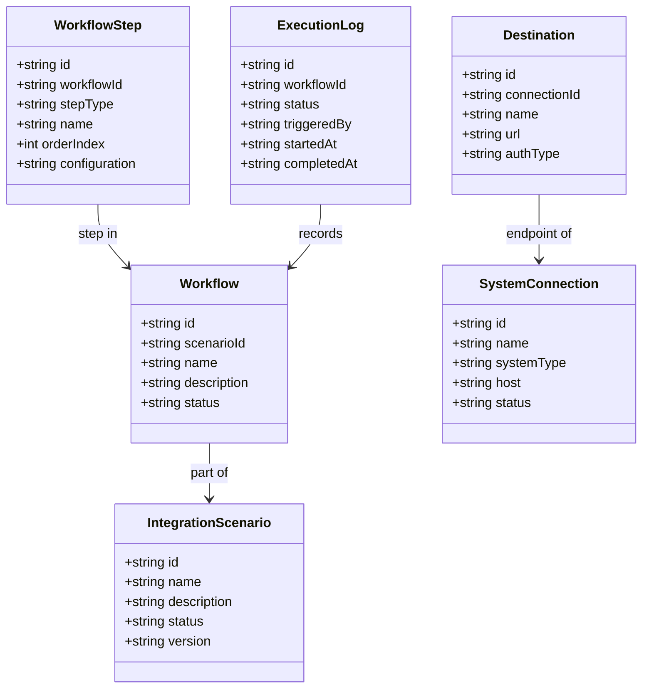
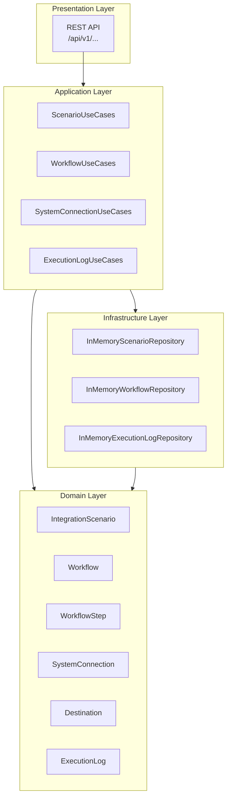
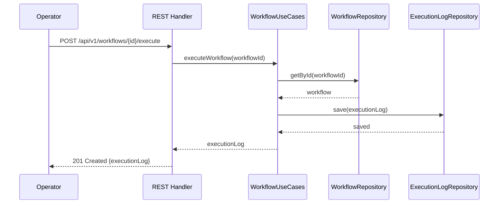

# UML Diagrams — Integration Automation Service

## Class Diagram

```mermaid
classDiagram
    class IntegrationScenario {
        +string id
        +string name
        +string description
        +string status
        +string version
    }
    class Workflow {
        +string id
        +string scenarioId
        +string name
        +string description
        +string status
    }
    class WorkflowStep {
        +string id
        +string workflowId
        +string stepType
        +string name
        +int orderIndex
        +string configuration
    }
    class SystemConnection {
        +string id
        +string name
        +string systemType
        +string host
        +string status
    }
    class Destination {
        +string id
        +string connectionId
        +string name
        +string url
        +string authType
    }
    class ExecutionLog {
        +string id
        +string workflowId
        +string status
        +string triggeredBy
        +string startedAt
        +string completedAt
    }

    Workflow --> IntegrationScenario : part of
    WorkflowStep --> Workflow : step in
    Destination --> SystemConnection : endpoint of
    ExecutionLog --> Workflow : records
```

## Component Diagram

```mermaid
flowchart TB
    subgraph Presentation["Presentation Layer"]
        REST["REST API\n/api/v1/..."]
    end
    subgraph Application["Application Layer"]
        SCEN_UC["ScenarioUseCases"]
        WF_UC["WorkflowUseCases"]
        CONN_UC["SystemConnectionUseCases"]
        LOG_UC["ExecutionLogUseCases"]
    end
    subgraph Domain["Domain Layer"]
        SCEN["IntegrationScenario"]
        WF["Workflow"]
        STEP["WorkflowStep"]
        CONN["SystemConnection"]
        DEST["Destination"]
        LOG["ExecutionLog"]
    end
    subgraph Infrastructure["Infrastructure Layer"]
        SCEN_REPO["InMemoryScenarioRepository"]
        WF_REPO["InMemoryWorkflowRepository"]
        LOG_REPO["InMemoryExecutionLogRepository"]
    end

    REST --> Application
    Application --> Domain
    Infrastructure --> Domain
    Application --> Infrastructure
```

## Sequence Diagram — Execute Workflow

```mermaid
sequenceDiagram
    participant O as Operator
    participant R as REST Handler
    participant UC as WorkflowUseCases
    participant WFR as WorkflowRepository
    participant LR as ExecutionLogRepository

    O->>R: POST /api/v1/workflows/{id}/execute
    R->>UC: executeWorkflow(workflowId)
    UC->>WFR: getById(workflowId)
    WFR-->>UC: workflow
    UC->>LR: save(executionLog)
    LR-->>UC: saved
    UC-->>R: executionLog
    R-->>O: 201 Created {executionLog}
```
