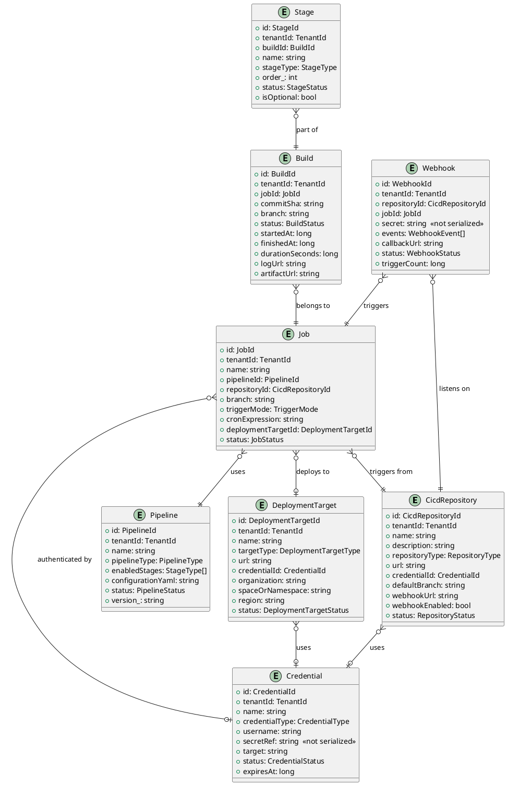
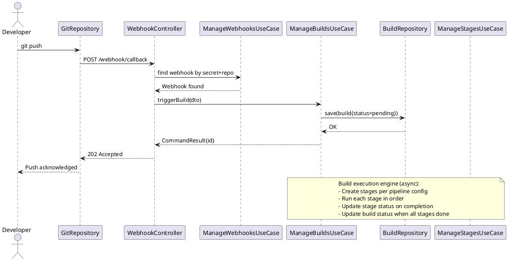
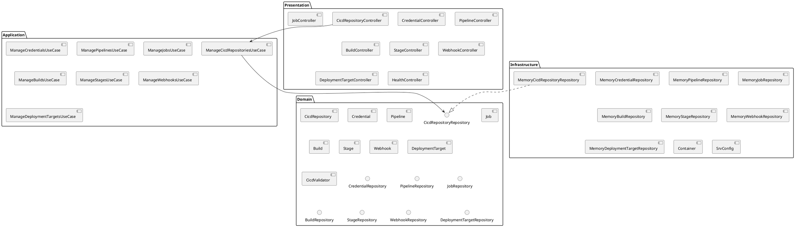

# UML — SAP Continuous Integration and Delivery Service

## Domain Entity Class Diagram

```plantuml
@startuml Domain Entities

entity CicdRepository {
  + id: CicdRepositoryId
  + tenantId: TenantId
  + name: string
  + description: string
  + repositoryType: RepositoryType
  + url: string
  + credentialId: CredentialId
  + defaultBranch: string
  + webhookUrl: string
  + webhookEnabled: bool
  + status: RepositoryStatus
}

entity Credential {
  + id: CredentialId
  + tenantId: TenantId
  + name: string
  + credentialType: CredentialType
  + username: string
  + secretRef: string  <<not serialized>>
  + target: string
  + status: CredentialStatus
  + expiresAt: long
}

entity Pipeline {
  + id: PipelineId
  + tenantId: TenantId
  + name: string
  + pipelineType: PipelineType
  + enabledStages: StageType[]
  + configurationYaml: string
  + status: PipelineStatus
  + version_: string
}

entity Job {
  + id: JobId
  + tenantId: TenantId
  + name: string
  + pipelineId: PipelineId
  + repositoryId: CicdRepositoryId
  + branch: string
  + triggerMode: TriggerMode
  + cronExpression: string
  + deploymentTargetId: DeploymentTargetId
  + status: JobStatus
}

entity Build {
  + id: BuildId
  + tenantId: TenantId
  + jobId: JobId
  + commitSha: string
  + branch: string
  + status: BuildStatus
  + startedAt: long
  + finishedAt: long
  + durationSeconds: long
  + logUrl: string
  + artifactUrl: string
}

entity Stage {
  + id: StageId
  + tenantId: TenantId
  + buildId: BuildId
  + name: string
  + stageType: StageType
  + order_: int
  + status: StageStatus
  + isOptional: bool
}

entity Webhook {
  + id: WebhookId
  + tenantId: TenantId
  + repositoryId: CicdRepositoryId
  + jobId: JobId
  + secret: string  <<not serialized>>
  + events: WebhookEvent[]
  + callbackUrl: string
  + status: WebhookStatus
  + triggerCount: long
}

entity DeploymentTarget {
  + id: DeploymentTargetId
  + tenantId: TenantId
  + name: string
  + targetType: DeploymentTargetType
  + url: string
  + credentialId: CredentialId
  + organization: string
  + spaceOrNamespace: string
  + region: string
  + status: DeploymentTargetStatus
}

Job }o--|| Pipeline : uses
Job }o--|| CicdRepository : triggers from
Job }o--o| DeploymentTarget : deploys to
Job }o--o| Credential : authenticated by
Build }o--|| Job : belongs to
Stage }o--|| Build : part of
Webhook }o--|| CicdRepository : listens on
Webhook }o--|| Job : triggers
CicdRepository }o--o| Credential : uses
DeploymentTarget }o--o| Credential : uses

@enduml
```

## Build Trigger Sequence Diagram

```plantuml
@startuml Build Trigger Flow

actor Developer
participant GitRepository
participant WebhookController
participant ManageWebhooksUseCase
participant ManageBuildsUseCase
participant BuildRepository
participant ManageStagesUseCase

Developer -> GitRepository: git push

GitRepository -> WebhookController: POST /webhook/callback
WebhookController -> ManageWebhooksUseCase: find webhook by secret+repo
ManageWebhooksUseCase --> WebhookController: Webhook found

WebhookController -> ManageBuildsUseCase: triggerBuild(dto)
ManageBuildsUseCase -> BuildRepository: save(build{status=pending})
BuildRepository --> ManageBuildsUseCase: OK
ManageBuildsUseCase --> WebhookController: CommandResult{id}

WebhookController --> GitRepository: 202 Accepted
GitRepository --> Developer: Push acknowledged

note over ManageBuildsUseCase, ManageStagesUseCase
  Build execution engine (async):
  - Create stages per pipeline config
  - Run each stage in order
  - Update stage status on completion
  - Update build status when all stages done
end note

@enduml
```

## Layered Architecture Diagram

```plantuml
@startuml Hexagonal Architecture

package "Presentation" {
  [CicdRepositoryController]
  [CredentialController]
  [PipelineController]
  [JobController]
  [BuildController]
  [StageController]
  [WebhookController]
  [DeploymentTargetController]
  [HealthController]
}

package "Application" {
  [ManageCicdRepositoriesUseCase]
  [ManageCredentialsUseCase]
  [ManagePipelinesUseCase]
  [ManageJobsUseCase]
  [ManageBuildsUseCase]
  [ManageStagesUseCase]
  [ManageWebhooksUseCase]
  [ManageDeploymentTargetsUseCase]
}

package "Domain" {
  [CicdRepository]
  [Credential]
  [Pipeline]
  [Job]
  [Build]
  [Stage]
  [Webhook]
  [DeploymentTarget]
  [CicdValidator]
  interface CicdRepositoryRepository
  interface CredentialRepository
  interface PipelineRepository
  interface JobRepository
  interface BuildRepository
  interface StageRepository
  interface WebhookRepository
  interface DeploymentTargetRepository
}

package "Infrastructure" {
  [MemoryCicdRepositoryRepository]
  [MemoryCredentialRepository]
  [MemoryPipelineRepository]
  [MemoryJobRepository]
  [MemoryBuildRepository]
  [MemoryStageRepository]
  [MemoryWebhookRepository]
  [MemoryDeploymentTargetRepository]
  [Container]
  [SrvConfig]
}

[CicdRepositoryController] --> [ManageCicdRepositoriesUseCase]
[ManageCicdRepositoriesUseCase] --> CicdRepositoryRepository
[MemoryCicdRepositoryRepository] ..|> CicdRepositoryRepository

@enduml
```
