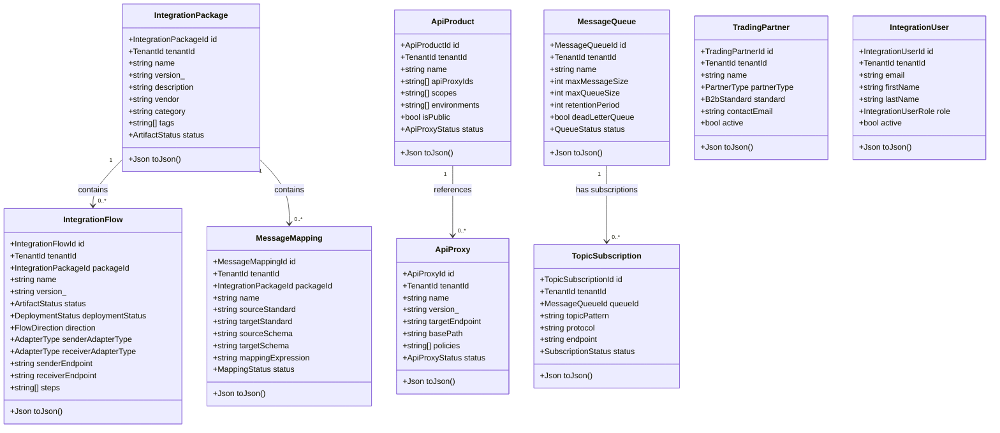
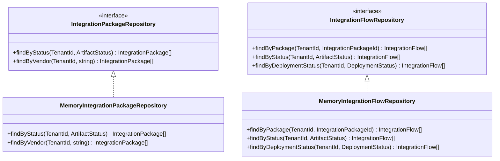
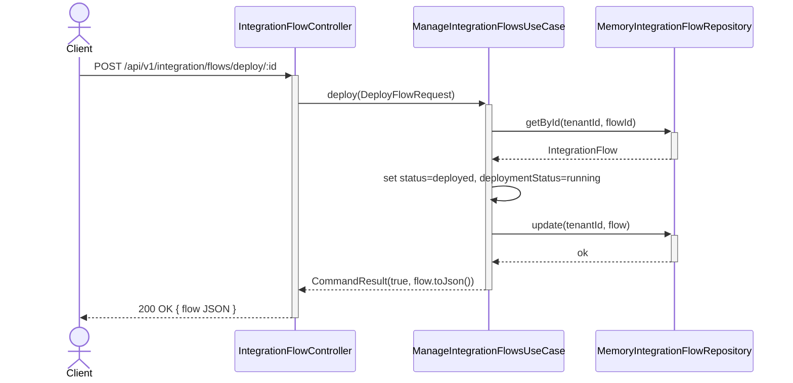
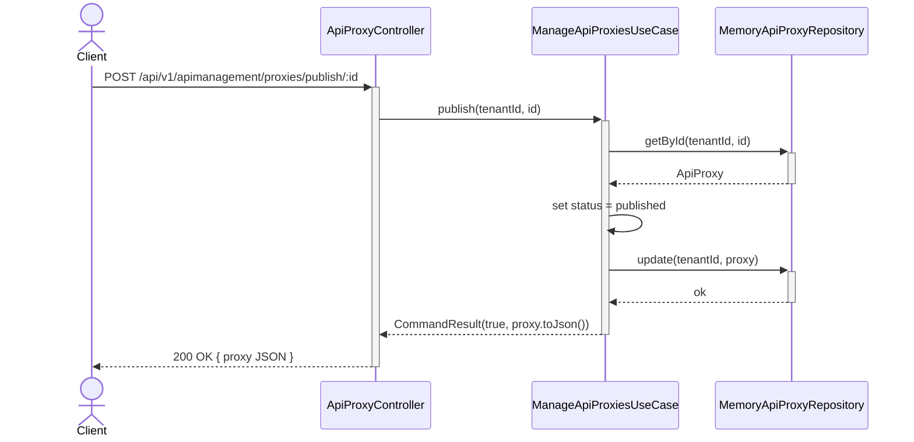

# UML — Integration Suite Service

## Class Diagram — Domain Entities



---

## Class Diagram — Application Layer

```mermaid
classDiagram
    class ManageIntegrationPackagesUseCase {
        -IntegrationPackageRepository _repo
        +create(CreatePackageRequest) CommandResult
        +getAll(tenantId) CommandResult
        +getById(tenantId, id) CommandResult
        +update(UpdatePackageRequest) CommandResult
        +remove(tenantId, id) CommandResult
    }
    class ManageIntegrationFlowsUseCase {
        -IntegrationFlowRepository _repo
        +create(CreateFlowRequest) CommandResult
        +getAll(tenantId) CommandResult
        +getById(tenantId, id) CommandResult
        +update(UpdateFlowRequest) CommandResult
        +deploy(DeployFlowRequest) CommandResult
        +remove(tenantId, id) CommandResult
    }
    class ManageApiProxiesUseCase {
        -ApiProxyRepository _repo
        +create(CreateApiProxyRequest) CommandResult
        +getAll(tenantId) CommandResult
        +getById(tenantId, id) CommandResult
        +update(UpdateApiProxyRequest) CommandResult
        +publish(tenantId, id) CommandResult
        +remove(tenantId, id) CommandResult
    }
    class ManageApiProductsUseCase {
        -ApiProductRepository _repo
        +create(CreateApiProductRequest) CommandResult
        +getAll(tenantId) CommandResult
        +publish(tenantId, id) CommandResult
        +remove(tenantId, id) CommandResult
    }
    class ManageMessageQueuesUseCase {
        -MessageQueueRepository _repo
        +create(CreateQueueRequest) CommandResult
        +update(UpdateQueueRequest) CommandResult
        +remove(tenantId, id) CommandResult
    }
    class ManageTopicSubscriptionsUseCase {
        -TopicSubscriptionRepository _repo
        +create(CreateSubscriptionRequest) CommandResult
        +listByQueue(tenantId, queueId) CommandResult
        +update(UpdateSubscriptionRequest) CommandResult
        +remove(tenantId, id) CommandResult
    }
```



---

## Class Diagram — Infrastructure Layer



---

## Sequence Diagram — Deploy Integration Flow



---

## Sequence Diagram — Publish API Proxy



---

## Component Diagram

```mermaid
graph TB
    subgraph Presentation
        HTTP["HTTP Controllers<br/>(REST/JSON)"]
        CLI["CLI Controller<br/>(MVC)"]
        WEB["Web Controller<br/>(MVC / Diet)"]
        GUI["GUI Controller<br/>(MVC / DlangUI)"]
    end

    subgraph Application
        UC_PKG["ManageIntegrationPackagesUseCase"]
        UC_FLOW["ManageIntegrationFlowsUseCase"]
        UC_PROXY["ManageApiProxiesUseCase"]
        UC_PROD["ManageApiProductsUseCase"]
        UC_QUEUE["ManageMessageQueuesUseCase"]
        UC_SUB["ManageTopicSubscriptionsUseCase"]
        UC_PARTNER["ManageTradingPartnersUseCase"]
        UC_MAPPING["ManageMessageMappingsUseCase"]
    end

    subgraph Domain
        ENTITIES["Entities"]
        PORTS["Repository Interfaces (Ports)"]
        VALIDATORS["IntegrationValidator"]
    end

    subgraph Infrastructure
        MEM["Memory Repositories"]
        FILES["File Repositories (planned)"]
        MONGO["MongoDB Repositories (planned)"]
        CONFIG["SrvConfig / loadConfig()"]
        CONTAINER["Container / buildContainer()"]
    end

    HTTP --> UC_PKG & UC_FLOW & UC_PROXY & UC_PROD & UC_QUEUE & UC_SUB & UC_PARTNER & UC_MAPPING
    CLI --> UC_PKG & UC_FLOW
    WEB --> UC_PKG & UC_FLOW & UC_PROXY
    GUI --> UC_PKG & UC_FLOW

    UC_PKG & UC_FLOW & UC_PROXY & UC_PROD & UC_QUEUE & UC_SUB & UC_PARTNER & UC_MAPPING --> PORTS
    UC_PKG & UC_FLOW --> VALIDATORS

    PORTS <|-- MEM
    PORTS <|-- FILES
    PORTS <|-- MONGO

    CONTAINER --> MEM & UC_PKG & UC_FLOW & HTTP
    CONFIG --> CONTAINER
```
