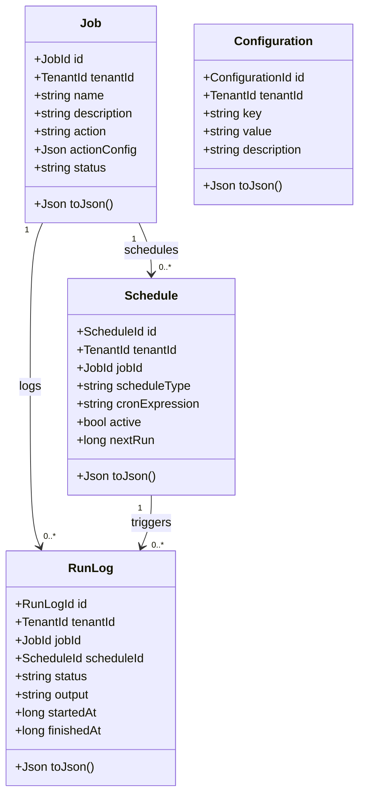
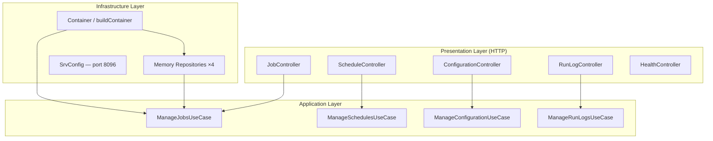
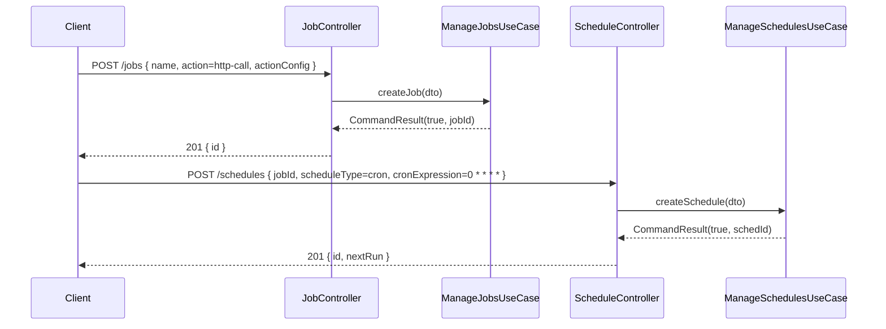

# UML — Job Scheduling Service

## Class Diagram — Domain Entities

```mermaid
classDiagram
    class Job {
        +JobId id
        +TenantId tenantId
        +string name
        +string description
        +string action
        +Json actionConfig
        +string status
        +Json toJson()
    }
    class Schedule {
        +ScheduleId id
        +TenantId tenantId
        +JobId jobId
        +string scheduleType
        +string cronExpression
        +bool active
        +long nextRun
        +Json toJson()
    }
    class Configuration {
        +ConfigurationId id
        +TenantId tenantId
        +string key
        +string value
        +string description
        +Json toJson()
    }
    class RunLog {
        +RunLogId id
        +TenantId tenantId
        +JobId jobId
        +ScheduleId scheduleId
        +string status
        +string output
        +long startedAt
        +long finishedAt
        +Json toJson()
    }

    Job "1" --> "0..*" Schedule : schedules
    Job "1" --> "0..*" RunLog : logs
    Schedule "1" --> "0..*" RunLog : triggers
```

---

## Component Diagram

```mermaid
flowchart TB
    subgraph Presentation["Presentation Layer (HTTP)"]
        C1[JobController]
        C2[ScheduleController]
        C3[ConfigurationController]
        C4[RunLogController]
        HC[HealthController]
    end
    subgraph Application["Application Layer"]
        UC1[ManageJobsUseCase]
        UC2[ManageSchedulesUseCase]
        UC3[ManageRunLogsUseCase]
        UC4[ManageConfigurationUseCase]
    end
    subgraph Infrastructure["Infrastructure Layer"]
        MEM[Memory Repositories ×4]
        CFG[SrvConfig — port 8096]
        CTR[Container / buildContainer]
    end
    C1 --> UC1
    C2 --> UC2
    C4 --> UC3
    C3 --> UC4
    MEM --> UC1
    CTR --> UC1
    CTR --> MEM
```

---

## Sequence Diagram — Schedule Job Execution

```mermaid
sequenceDiagram
    participant Client
    participant JC as JobController
    participant JUC as ManageJobsUseCase
    participant SC as ScheduleController
    participant SUC as ManageSchedulesUseCase

    Client->>JC: POST /jobs { name, action=http-call, actionConfig }
    JC->>JUC: createJob(dto)
    JUC-->>JC: CommandResult(true, jobId)
    JC-->>Client: 201 { id }

    Client->>SC: POST /schedules { jobId, scheduleType=cron, cronExpression=0 * * * * }
    SC->>SUC: createSchedule(dto)
    SUC-->>SC: CommandResult(true, schedId)
    SC-->>Client: 201 { id, nextRun }
```
