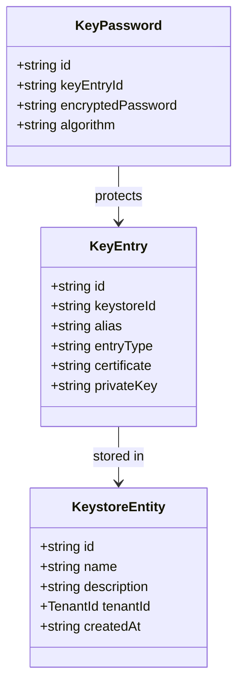
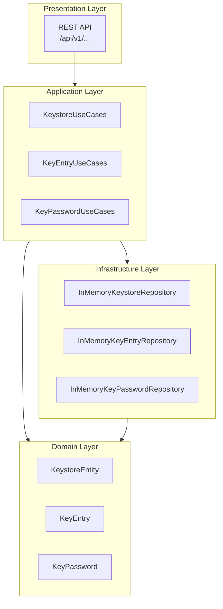
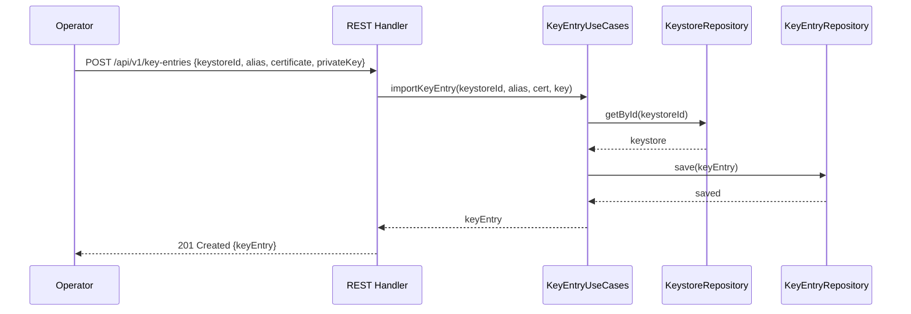

# UML Diagrams — Keystore Service

## Class Diagram

```mermaid
classDiagram
    class KeystoreEntity {
        +string id
        +string name
        +string description
        +TenantId tenantId
        +string createdAt
    }
    class KeyEntry {
        +string id
        +string keystoreId
        +string alias
        +string entryType
        +string certificate
        +string privateKey
    }
    class KeyPassword {
        +string id
        +string keyEntryId
        +string encryptedPassword
        +string algorithm
    }

    KeyEntry --> KeystoreEntity : stored in
    KeyPassword --> KeyEntry : protects
```

## Component Diagram

```mermaid
flowchart TB
    subgraph Presentation["Presentation Layer"]
        REST["REST API\n/api/v1/..."]
    end
    subgraph Application["Application Layer"]
        KS_UC["KeystoreUseCases"]
        KE_UC["KeyEntryUseCases"]
        KP_UC["KeyPasswordUseCases"]
    end
    subgraph Domain["Domain Layer"]
        KS["KeystoreEntity"]
        KE["KeyEntry"]
        KP["KeyPassword"]
    end
    subgraph Infrastructure["Infrastructure Layer"]
        KS_REPO["InMemoryKeystoreRepository"]
        KE_REPO["InMemoryKeyEntryRepository"]
        KP_REPO["InMemoryKeyPasswordRepository"]
    end

    REST --> Application
    Application --> Domain
    Infrastructure --> Domain
    Application --> Infrastructure
```

## Sequence Diagram — Import Key Entry

```mermaid
sequenceDiagram
    participant O as Operator
    participant R as REST Handler
    participant UC as KeyEntryUseCases
    participant KSR as KeystoreRepository
    participant KER as KeyEntryRepository

    O->>R: POST /api/v1/key-entries {keystoreId, alias, certificate, privateKey}
    R->>UC: importKeyEntry(keystoreId, alias, cert, key)
    UC->>KSR: getById(keystoreId)
    KSR-->>UC: keystore
    UC->>KER: save(keyEntry)
    KER-->>UC: saved
    UC-->>R: keyEntry
    R-->>O: 201 Created {keyEntry}
```
