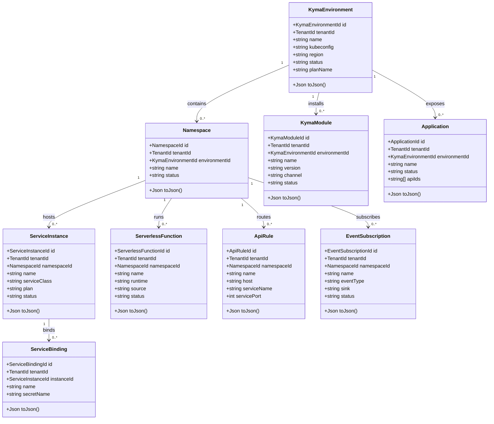
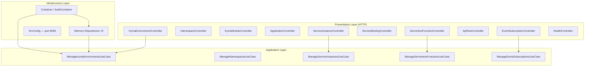
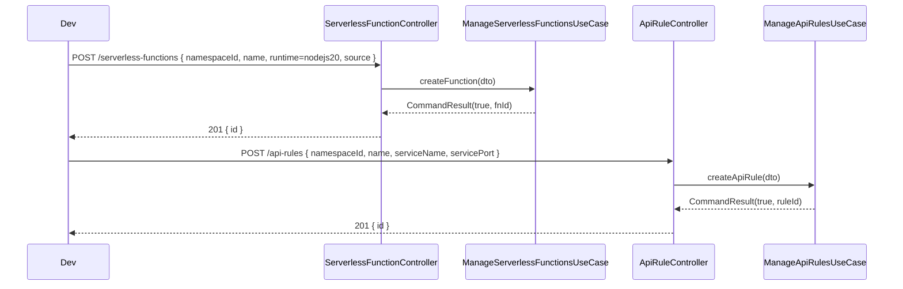

# UML — Kyma Runtime Service

## Class Diagram — Domain Entities

```mermaid
classDiagram
    class KymaEnvironment {
        +KymaEnvironmentId id
        +TenantId tenantId
        +string name
        +string kubeconfig
        +string region
        +string status
        +string planName
        +Json toJson()
    }
    class Namespace {
        +NamespaceId id
        +TenantId tenantId
        +KymaEnvironmentId environmentId
        +string name
        +string status
        +Json toJson()
    }
    class KymaModule {
        +KymaModuleId id
        +TenantId tenantId
        +KymaEnvironmentId environmentId
        +string name
        +string version
        +string channel
        +string status
        +Json toJson()
    }
    class Application {
        +ApplicationId id
        +TenantId tenantId
        +KymaEnvironmentId environmentId
        +string name
        +string status
        +string[] apiIds
        +Json toJson()
    }
    class ServiceInstance {
        +ServiceInstanceId id
        +TenantId tenantId
        +NamespaceId namespaceId
        +string name
        +string serviceClass
        +string plan
        +string status
        +Json toJson()
    }
    class ServiceBinding {
        +ServiceBindingId id
        +TenantId tenantId
        +ServiceInstanceId instanceId
        +string name
        +string secretName
        +Json toJson()
    }
    class ServerlessFunction {
        +ServerlessFunctionId id
        +TenantId tenantId
        +NamespaceId namespaceId
        +string name
        +string runtime
        +string source
        +string status
        +Json toJson()
    }
    class ApiRule {
        +ApiRuleId id
        +TenantId tenantId
        +NamespaceId namespaceId
        +string name
        +string host
        +string serviceName
        +int servicePort
        +Json toJson()
    }
    class EventSubscription {
        +EventSubscriptionId id
        +TenantId tenantId
        +NamespaceId namespaceId
        +string name
        +string eventType
        +string sink
        +string status
        +Json toJson()
    }

    KymaEnvironment "1" --> "0..*" Namespace : contains
    KymaEnvironment "1" --> "0..*" KymaModule : installs
    KymaEnvironment "1" --> "0..*" Application : exposes
    Namespace "1" --> "0..*" ServiceInstance : hosts
    Namespace "1" --> "0..*" ServerlessFunction : runs
    Namespace "1" --> "0..*" ApiRule : routes
    Namespace "1" --> "0..*" EventSubscription : subscribes
    ServiceInstance "1" --> "0..*" ServiceBinding : binds
```

---

## Component Diagram

```mermaid
flowchart TB
    subgraph Presentation["Presentation Layer (HTTP)"]
        C1[KymaEnvironmentController]
        C2[NamespaceController]
        C3[KymaModuleController]
        C4[ApplicationController]
        C5[ServiceInstanceController]
        C6[ServiceBindingController]
        C7[ServerlessFunctionController]
        C8[ApiRuleController]
        C9[EventSubscriptionController]
        HC[HealthController]
    end
    subgraph Application["Application Layer"]
        UC1[ManageKymaEnvironmentsUseCase]
        UC2[ManageNamespacesUseCase]
        UC3[ManageServiceInstancesUseCase]
        UC4[ManageServerlessFunctionsUseCase]
        UC5[ManageEventSubscriptionsUseCase]
    end
    subgraph Infrastructure["Infrastructure Layer"]
        MEM[Memory Repositories ×9]
        CFG[SrvConfig — port 8095]
        CTR[Container / buildContainer]
    end
    C1 --> UC1
    C5 --> UC3
    C7 --> UC4
    C9 --> UC5
    MEM --> UC1
    CTR --> UC1
    CTR --> MEM
```

---

## Sequence Diagram — Deploy Serverless Function

```mermaid
sequenceDiagram
    participant Dev
    participant FnC as ServerlessFunctionController
    participant FnUC as ManageServerlessFunctionsUseCase
    participant ARC as ApiRuleController
    participant ARUC as ManageApiRulesUseCase

    Dev->>FnC: POST /serverless-functions { namespaceId, name, runtime=nodejs20, source }
    FnC->>FnUC: createFunction(dto)
    FnUC-->>FnC: CommandResult(true, fnId)
    FnC-->>Dev: 201 { id }

    Dev->>ARC: POST /api-rules { namespaceId, name, serviceName, servicePort }
    ARC->>ARUC: createApiRule(dto)
    ARUC-->>ARC: CommandResult(true, ruleId)
    ARC-->>Dev: 201 { id }
```
