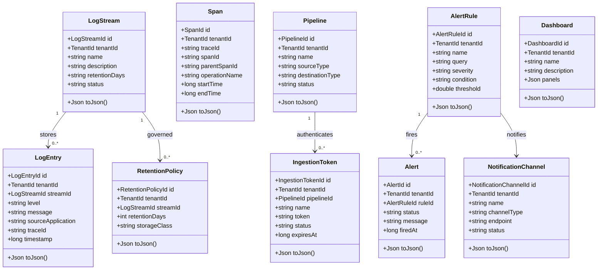
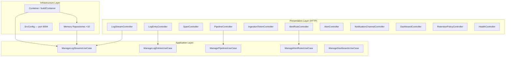
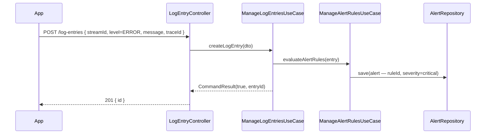

# UML — Logging Service

## Class Diagram — Domain Entities

```mermaid
classDiagram
    class LogStream {
        +LogStreamId id
        +TenantId tenantId
        +string name
        +string description
        +string retentionDays
        +string status
        +Json toJson()
    }
    class LogEntry {
        +LogEntryId id
        +TenantId tenantId
        +LogStreamId streamId
        +string level
        +string message
        +string sourceApplication
        +string traceId
        +long timestamp
        +Json toJson()
    }
    class Span {
        +SpanId id
        +TenantId tenantId
        +string traceId
        +string spanId
        +string parentSpanId
        +string operationName
        +long startTime
        +long endTime
        +Json toJson()
    }
    class Pipeline {
        +PipelineId id
        +TenantId tenantId
        +string name
        +string sourceType
        +string destinationType
        +string status
        +Json toJson()
    }
    class IngestionToken {
        +IngestionTokenId id
        +TenantId tenantId
        +PipelineId pipelineId
        +string name
        +string token
        +string status
        +long expiresAt
        +Json toJson()
    }
    class AlertRule {
        +AlertRuleId id
        +TenantId tenantId
        +string name
        +string query
        +string severity
        +string condition
        +double threshold
        +Json toJson()
    }
    class Alert {
        +AlertId id
        +TenantId tenantId
        +AlertRuleId ruleId
        +string status
        +string message
        +long firedAt
        +Json toJson()
    }
    class NotificationChannel {
        +NotificationChannelId id
        +TenantId tenantId
        +string name
        +string channelType
        +string endpoint
        +string status
        +Json toJson()
    }
    class Dashboard {
        +DashboardId id
        +TenantId tenantId
        +string name
        +string description
        +Json panels
        +Json toJson()
    }
    class RetentionPolicy {
        +RetentionPolicyId id
        +TenantId tenantId
        +LogStreamId streamId
        +int retentionDays
        +string storageClass
        +Json toJson()
    }

    LogStream "1" --> "0..*" LogEntry : stores
    LogStream "1" --> "0..*" RetentionPolicy : governed
    Pipeline "1" --> "0..*" IngestionToken : authenticates
    AlertRule "1" --> "0..*" Alert : fires
    AlertRule --> NotificationChannel : notifies
```

---

## Component Diagram

```mermaid
flowchart TB
    subgraph Presentation["Presentation Layer (HTTP)"]
        C1[LogStreamController]
        C2[LogEntryController]
        C3[SpanController]
        C4[PipelineController]
        C5[IngestionTokenController]
        C6[AlertRuleController]
        C7[AlertController]
        C8[NotificationChannelController]
        C9[DashboardController]
        C10[RetentionPolicyController]
        HC[HealthController]
    end
    subgraph Application["Application Layer"]
        UC1[ManageLogStreamsUseCase]
        UC2[ManageLogEntriesUseCase]
        UC3[ManagePipelinesUseCase]
        UC4[ManageAlertRulesUseCase]
        UC5[ManageDashboardsUseCase]
    end
    subgraph Infrastructure["Infrastructure Layer"]
        MEM[Memory Repositories ×10]
        CFG[SrvConfig — port 8094]
        CTR[Container / buildContainer]
    end
    C1 --> UC1
    C2 --> UC2
    C4 --> UC3
    C6 --> UC4
    MEM --> UC1
    CTR --> UC1
    CTR --> MEM
```

---

## Sequence Diagram — Ingest Log and Fire Alert

```mermaid
sequenceDiagram
    participant App
    participant LEC as LogEntryController
    participant LEUC as ManageLogEntriesUseCase
    participant ARUC as ManageAlertRulesUseCase
    participant AR as AlertRepository

    App->>LEC: POST /log-entries { streamId, level=ERROR, message, traceId }
    LEC->>LEUC: createLogEntry(dto)
    LEUC->>ARUC: evaluateAlertRules(entry)
    ARUC->>AR: save(alert — ruleId, severity=critical)
    LEUC-->>LEC: CommandResult(true, entryId)
    LEC-->>App: 201 { id }
```
