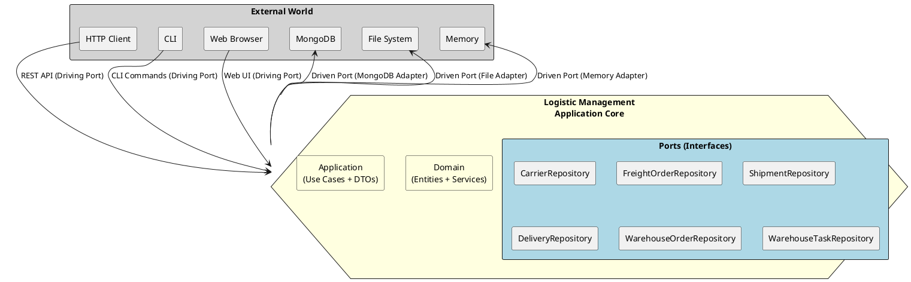
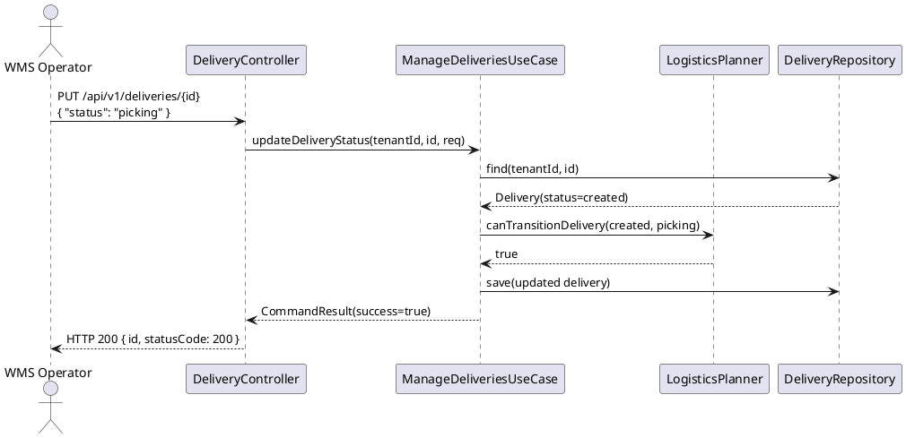
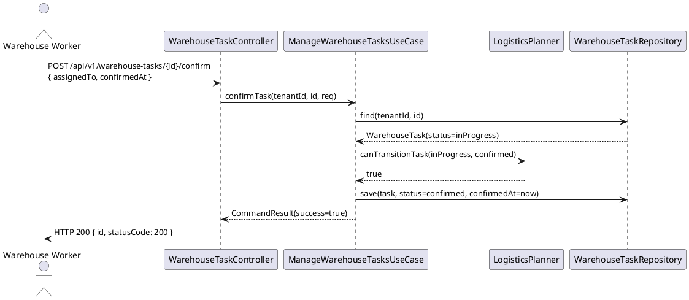
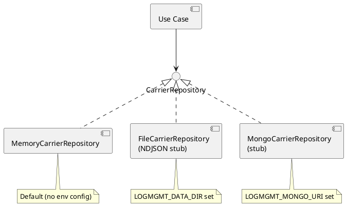

# UML — Logistics Management Service

## 1. Domain Class Diagram

```plantuml
@startuml domain-class-diagram
skinparam classAttributeIconSize 0
skinparam shadowing false

package "Domain" {

  enum CarrierStatus { active, inactive, suspended }
  enum TransportMode { road, rail, sea, air, multimodal }
  enum FreightOrderStatus { draft, planned, inTransit, delivered, cancelled }
  enum ShipmentStatus { created, inProgress, shipped, delivered, cancelled }
  enum DeliveryStatus { created, picking, packed, shipped, delivered, cancelled }
  enum WarehouseTaskType { picking, packing, putaway, transfer, counting }
  enum WarehouseTaskStatus { created, queued, inProgress, confirmed, cancelled }
  enum WarehouseOrderStatus { created, released, inProgress, completed, cancelled }
  enum LogisticsDirection { outbound, inbound }

  class Carrier {
    +CarrierId id
    +TenantId tenantId
    +String name
    +String contactEmail
    +String contactPhone
    +String addressCountry
    +CarrierStatus status
    +TransportMode[] supportedModes
  }

  class FreightOrder {
    +FreightOrderId id
    +TenantId tenantId
    +String orderNumber
    +String originName
    +String destinationName
    +CarrierId carrierId
    +TransportMode transportMode
    +FreightOrderStatus status
    +Double weightKg
    +Double volumeM3
  }

  class Shipment {
    +ShipmentId id
    +TenantId tenantId
    +String shipmentNumber
    +LogisticsDirection direction
    +ShipmentStatus status
    +FreightOrderId freightOrderId
    +String warehouseId
    +String partnerId
  }

  class Delivery {
    +DeliveryId id
    +TenantId tenantId
    +String deliveryNumber
    +LogisticsDirection direction
    +DeliveryStatus status
    +ShipmentId shipmentId
    +DeliveryItem[] items
  }

  class DeliveryItem {
    +String productId
    +Double quantity
    +String unit
  }

  class WarehouseOrder {
    +WarehouseOrderId id
    +TenantId tenantId
    +String orderNumber
    +WarehouseOrderStatus status
    +DeliveryId deliveryId
    +String warehouseId
    +String assignedTo
  }

  class WarehouseTask {
    +WarehouseTaskId id
    +TenantId tenantId
    +String taskNumber
    +WarehouseTaskType taskType
    +WarehouseTaskStatus status
    +WarehouseOrderId warehouseOrderId
    +String productId
    +Double quantity
    +String assignedTo
  }

  class LogisticsPlanner {
    +isCarrierAvailable(tenantId, carrierId): bool
    +canTransitionDelivery(current, next): bool
    +canTransitionFreightOrder(current, next): bool
    +canTransitionTask(current, next): bool
  }

  FreightOrder "1" --> "1" Carrier : uses
  Shipment "0..*" --> "1" FreightOrder : belongs to
  Delivery "0..*" --> "1" Shipment : belongs to
  Delivery "1" *-- "0..*" DeliveryItem : contains
  WarehouseOrder "0..*" --> "1" Delivery : for delivery
  WarehouseTask "0..*" --> "1" WarehouseOrder : part of
  LogisticsPlanner ..> Carrier : validates
}
@enduml
```

---

## 2. Hexagonal Architecture (Ports & Adapters)



---

## 3. Delivery Status Transition Sequence



---

## 4. Warehouse Task Confirm Sequence



---

## 5. Persistence Strategy Component Diagram


