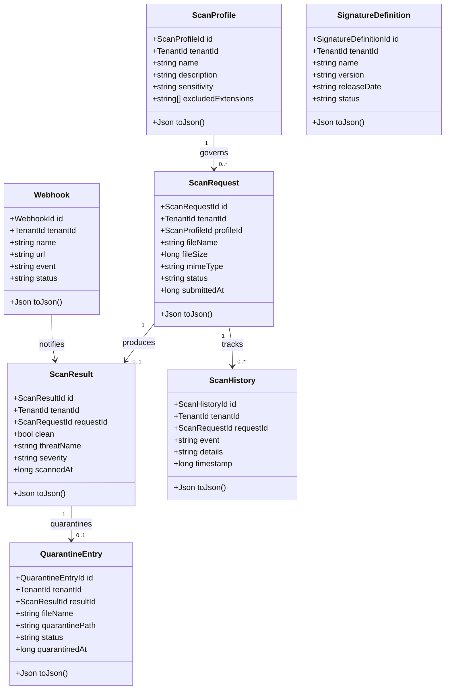
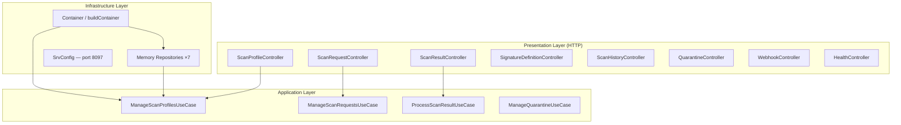
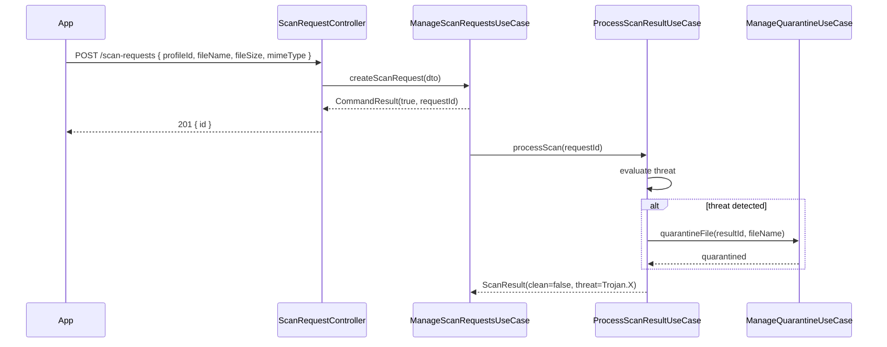

# UML — Malware Scanning Service

## Class Diagram — Domain Entities

```mermaid
classDiagram
    class ScanProfile {
        +ScanProfileId id
        +TenantId tenantId
        +string name
        +string description
        +string sensitivity
        +string[] excludedExtensions
        +Json toJson()
    }
    class ScanRequest {
        +ScanRequestId id
        +TenantId tenantId
        +ScanProfileId profileId
        +string fileName
        +long fileSize
        +string mimeType
        +string status
        +long submittedAt
        +Json toJson()
    }
    class ScanResult {
        +ScanResultId id
        +TenantId tenantId
        +ScanRequestId requestId
        +bool clean
        +string threatName
        +string severity
        +long scannedAt
        +Json toJson()
    }
    class SignatureDefinition {
        +SignatureDefinitionId id
        +TenantId tenantId
        +string name
        +string version
        +string releaseDate
        +string status
        +Json toJson()
    }
    class ScanHistory {
        +ScanHistoryId id
        +TenantId tenantId
        +ScanRequestId requestId
        +string event
        +string details
        +long timestamp
        +Json toJson()
    }
    class QuarantineEntry {
        +QuarantineEntryId id
        +TenantId tenantId
        +ScanResultId resultId
        +string fileName
        +string quarantinePath
        +string status
        +long quarantinedAt
        +Json toJson()
    }
    class Webhook {
        +WebhookId id
        +TenantId tenantId
        +string name
        +string url
        +string event
        +string status
        +Json toJson()
    }

    ScanProfile "1" --> "0..*" ScanRequest : governs
    ScanRequest "1" --> "0..1" ScanResult : produces
    ScanRequest "1" --> "0..*" ScanHistory : tracks
    ScanResult "1" --> "0..1" QuarantineEntry : quarantines
    Webhook --> ScanResult : notifies
```

---

## Component Diagram

```mermaid
flowchart TB
    subgraph Presentation["Presentation Layer (HTTP)"]
        C1[ScanProfileController]
        C2[ScanRequestController]
        C3[ScanResultController]
        C4[SignatureDefinitionController]
        C5[ScanHistoryController]
        C6[QuarantineController]
        C7[WebhookController]
        HC[HealthController]
    end
    subgraph Application["Application Layer"]
        UC1[ManageScanProfilesUseCase]
        UC2[ManageScanRequestsUseCase]
        UC3[ProcessScanResultUseCase]
        UC4[ManageQuarantineUseCase]
    end
    subgraph Infrastructure["Infrastructure Layer"]
        MEM[Memory Repositories ×7]
        CFG[SrvConfig — port 8097]
        CTR[Container / buildContainer]
    end
    C1 --> UC1
    C2 --> UC2
    C3 --> UC3
    MEM --> UC1
    CTR --> UC1
    CTR --> MEM
```

---

## Sequence Diagram — Scan File and Quarantine

```mermaid
sequenceDiagram
    participant App
    participant SRC as ScanRequestController
    participant SRUC as ManageScanRequestsUseCase
    participant PRUC as ProcessScanResultUseCase
    participant QUC as ManageQuarantineUseCase

    App->>SRC: POST /scan-requests { profileId, fileName, fileSize, mimeType }
    SRC->>SRUC: createScanRequest(dto)
    SRUC-->>SRC: CommandResult(true, requestId)
    SRC-->>App: 201 { id }

    SRUC->>PRUC: processScan(requestId)
    PRUC->>PRUC: evaluate threat
    alt threat detected
        PRUC->>QUC: quarantineFile(resultId, fileName)
        QUC-->>PRUC: quarantined
    end
    PRUC-->>SRUC: ScanResult(clean=false, threat=Trojan.X)
```
