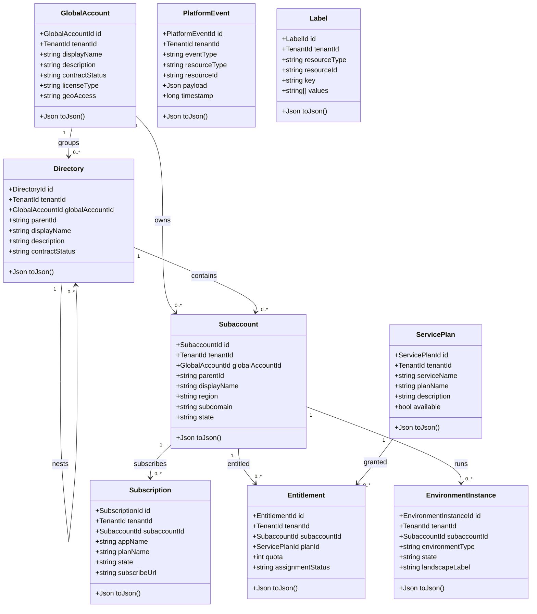
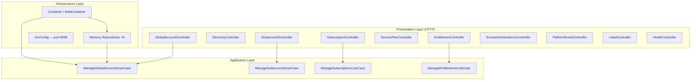
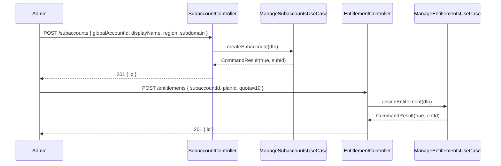

# UML — Account Management Service

## Class Diagram — Domain Entities

```mermaid
classDiagram
    class GlobalAccount {
        +GlobalAccountId id
        +TenantId tenantId
        +string displayName
        +string description
        +string contractStatus
        +string licenseType
        +string geoAccess
        +Json toJson()
    }
    class Directory {
        +DirectoryId id
        +TenantId tenantId
        +GlobalAccountId globalAccountId
        +string parentId
        +string displayName
        +string description
        +string contractStatus
        +Json toJson()
    }
    class Subaccount {
        +SubaccountId id
        +TenantId tenantId
        +GlobalAccountId globalAccountId
        +string parentId
        +string displayName
        +string region
        +string subdomain
        +string state
        +Json toJson()
    }
    class Subscription {
        +SubscriptionId id
        +TenantId tenantId
        +SubaccountId subaccountId
        +string appName
        +string planName
        +string state
        +string subscribeUrl
        +Json toJson()
    }
    class ServicePlan {
        +ServicePlanId id
        +TenantId tenantId
        +string serviceName
        +string planName
        +string description
        +bool available
        +Json toJson()
    }
    class Entitlement {
        +EntitlementId id
        +TenantId tenantId
        +SubaccountId subaccountId
        +ServicePlanId planId
        +int quota
        +string assignmentStatus
        +Json toJson()
    }
    class EnvironmentInstance {
        +EnvironmentInstanceId id
        +TenantId tenantId
        +SubaccountId subaccountId
        +string environmentType
        +string state
        +string landscapeLabel
        +Json toJson()
    }
    class PlatformEvent {
        +PlatformEventId id
        +TenantId tenantId
        +string eventType
        +string resourceType
        +string resourceId
        +Json payload
        +long timestamp
        +Json toJson()
    }
    class Label {
        +LabelId id
        +TenantId tenantId
        +string resourceType
        +string resourceId
        +string key
        +string[] values
        +Json toJson()
    }

    GlobalAccount "1" --> "0..*" Directory : groups
    GlobalAccount "1" --> "0..*" Subaccount : owns
    Directory "1" --> "0..*" Directory : nests
    Directory "1" --> "0..*" Subaccount : contains
    Subaccount "1" --> "0..*" Subscription : subscribes
    Subaccount "1" --> "0..*" Entitlement : entitled
    Subaccount "1" --> "0..*" EnvironmentInstance : runs
    ServicePlan "1" --> "0..*" Entitlement : granted
```

---

## Component Diagram

```mermaid
flowchart TB
    subgraph Presentation["Presentation Layer (HTTP)"]
        C1[GlobalAccountController]
        C2[DirectoryController]
        C3[SubaccountController]
        C4[SubscriptionController]
        C5[ServicePlanController]
        C6[EntitlementController]
        C7[EnvironmentInstanceController]
        C8[PlatformEventController]
        C9[LabelController]
        HC[HealthController]
    end
    subgraph Application["Application Layer"]
        UC1[ManageGlobalAccountsUseCase]
        UC2[ManageSubaccountsUseCase]
        UC3[ManageSubscriptionsUseCase]
        UC4[ManageEntitlementsUseCase]
    end
    subgraph Infrastructure["Infrastructure Layer"]
        MEM[Memory Repositories ×9]
        CFG[SrvConfig — port 8098]
        CTR[Container / buildContainer]
    end
    C1 --> UC1
    C3 --> UC2
    C4 --> UC3
    C6 --> UC4
    MEM --> UC1
    CTR --> UC1
    CTR --> MEM
```

---

## Sequence Diagram — Create Subaccount and Assign Entitlement

```mermaid
sequenceDiagram
    participant Admin
    participant SC as SubaccountController
    participant SUC as ManageSubaccountsUseCase
    participant EC as EntitlementController
    participant EUC as ManageEntitlementsUseCase

    Admin->>SC: POST /subaccounts { globalAccountId, displayName, region, subdomain }
    SC->>SUC: createSubaccount(dto)
    SUC-->>SC: CommandResult(true, subId)
    SC-->>Admin: 201 { id }

    Admin->>EC: POST /entitlements { subaccountId, planId, quota=10 }
    EC->>EUC: assignEntitlement(dto)
    EUC-->>EC: CommandResult(true, entId)
    EC-->>Admin: 201 { id }
```
