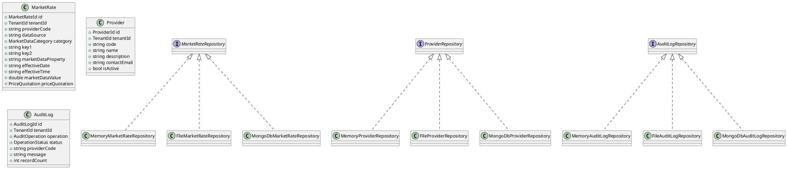
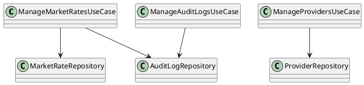
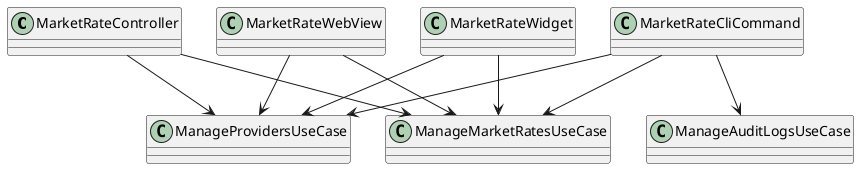

# UML - Market Refinitiv Service

## Domain Model

```plantuml
@startuml

class MarketRate {
  +MarketRateId id
  +TenantId tenantId
  +string providerCode
  +string dataSource
  +MarketDataCategory category
  +string key1
  +string key2
  +string marketDataProperty
  +string effectiveDate
  +string effectiveTime
  +double marketDataValue
  +PriceQuotation priceQuotation
}

class Provider {
  +ProviderId id
  +TenantId tenantId
  +string code
  +string name
  +string description
  +string contactEmail
  +bool isActive
}

class AuditLog {
  +AuditLogId id
  +TenantId tenantId
  +AuditOperation operation
  +OperationStatus status
  +string providerCode
  +string message
  +int recordCount
}

interface MarketRateRepository
interface ProviderRepository
interface AuditLogRepository

MarketRateRepository <|.. MemoryMarketRateRepository
MarketRateRepository <|.. FileMarketRateRepository
MarketRateRepository <|.. MongoDbMarketRateRepository

ProviderRepository <|.. MemoryProviderRepository
ProviderRepository <|.. FileProviderRepository
ProviderRepository <|.. MongoDbProviderRepository

AuditLogRepository <|.. MemoryAuditLogRepository
AuditLogRepository <|.. FileAuditLogRepository
AuditLogRepository <|.. MongoDbAuditLogRepository

@enduml
```

## Application Use Cases

```plantuml
@startuml

class ManageMarketRatesUseCase
class ManageProvidersUseCase
class ManageAuditLogsUseCase

ManageMarketRatesUseCase --> MarketRateRepository
ManageMarketRatesUseCase --> AuditLogRepository
ManageProvidersUseCase --> ProviderRepository
ManageAuditLogsUseCase --> AuditLogRepository

@enduml
```

## Presentation MVC

```plantuml
@startuml

class MarketRateController
class MarketRateCliCommand
class MarketRateWebView
class MarketRateWidget

MarketRateController --> ManageMarketRatesUseCase
MarketRateController --> ManageProvidersUseCase

MarketRateCliCommand --> ManageMarketRatesUseCase
MarketRateCliCommand --> ManageProvidersUseCase
MarketRateCliCommand --> ManageAuditLogsUseCase

MarketRateWebView --> ManageMarketRatesUseCase
MarketRateWebView --> ManageProvidersUseCase

MarketRateWidget --> ManageMarketRatesUseCase
MarketRateWidget --> ManageProvidersUseCase

@enduml
```
