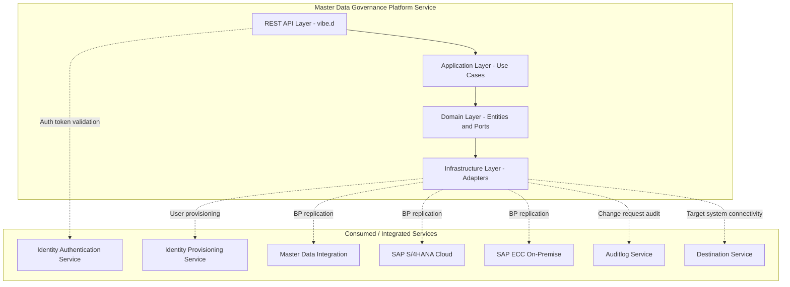
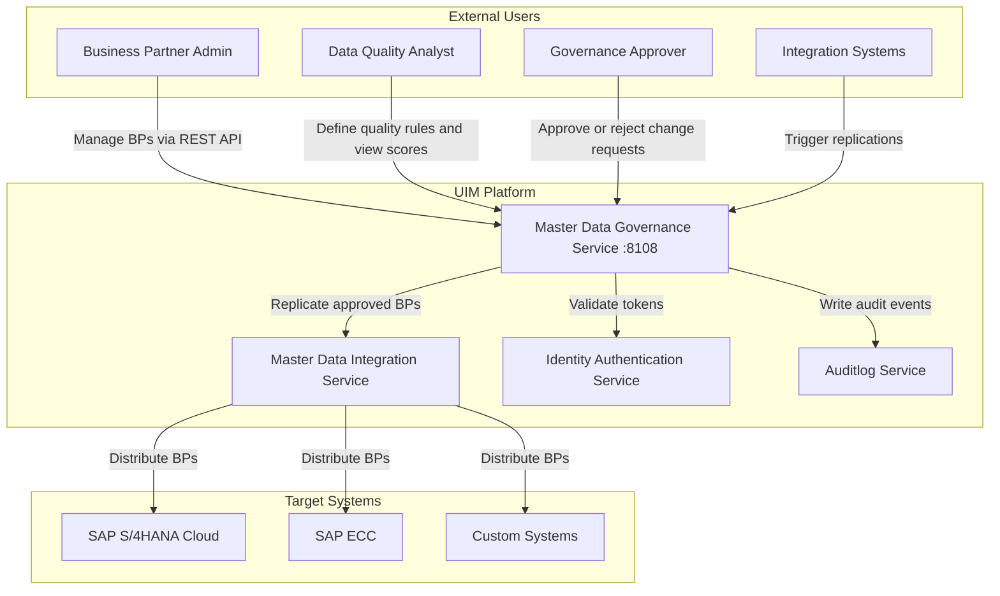
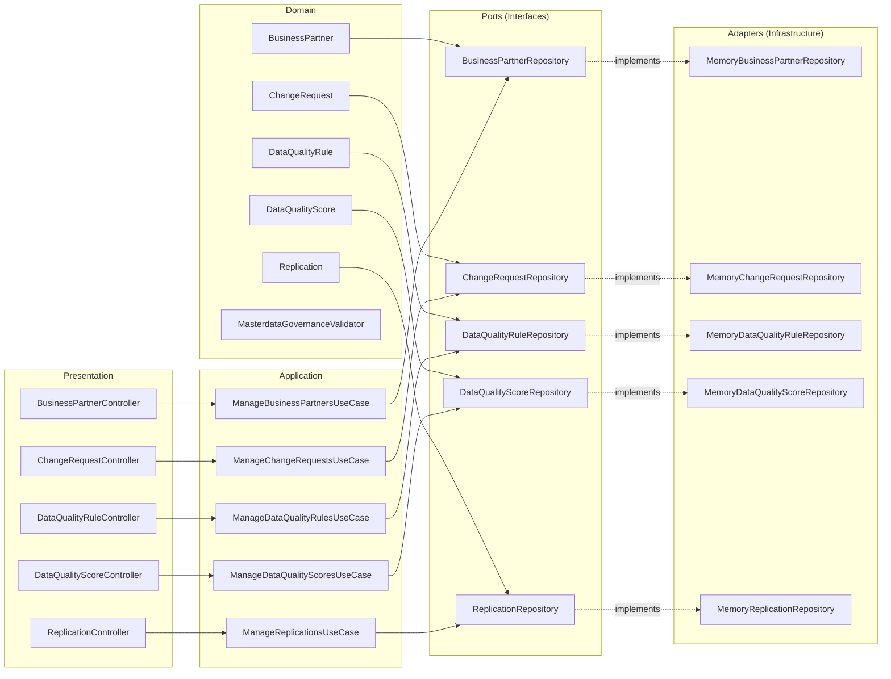
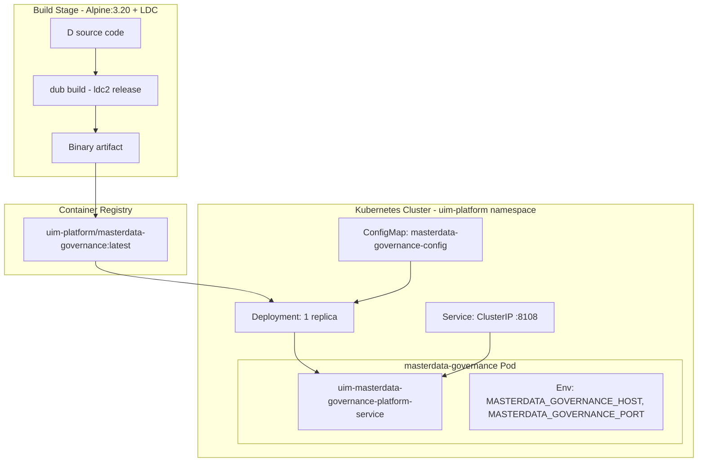

# Master Data Governance — NAFv4 Architecture Views

## C1 — Capability Taxonomy

```mermaid
graph TB
    MDG[Master Data Governance Service]

    MDG --> BPM[Business Partner Management]
    MDG --> CRW[Change Request Workflow]
    MDG --> DQM[Data Quality Management]
    MDG --> REP[Replication Management]
    MDG --> HLT[Health Monitoring]

    BPM --> BPM1[Create Business Partner]
    BPM --> BPM2[Update BP Attributes]
    BPM --> BPM3[BP Category Classification]
    BPM --> BPM4[BP Role Assignment]
    BPM --> BPM5[Address Management]
    BPM --> BPM6[Tax Information]
    BPM --> BPM7[Bank Details]
    BPM --> BPM8[Search and Filter]
    BPM --> BPM9[Block / Mark for Deletion]

    CRW --> CRW1[Draft Change Request]
    CRW --> CRW2[Submit for Review]
    CRW --> CRW3[Review and Approve]
    CRW --> CRW4[Reject with Comments]
    CRW --> CRW5[Request Revision]
    CRW --> CRW6[Withdraw Request]
    CRW --> CRW7[Audit Trail]

    DQM --> DQM1[Define Quality Rules]
    DQM --> DQM2[Field-Level Validation]
    DQM --> DQM3[Rule Severity Levels]
    DQM --> DQM4[BP Category Scoping]
    DQM --> DQM5[Score Calculation]
    DQM --> DQM6[Completeness Scoring]
    DQM --> DQM7[Consistency Scoring]
    DQM --> DQM8[Accuracy Scoring]
    DQM --> DQM9[Quality Status Classification]

    REP --> REP1[Trigger Replication]
    REP --> REP2[Full Replication]
    REP --> REP3[Delta Replication]
    REP --> REP4[Selective Replication]
    REP --> REP5[Batch Processing]
    REP --> REP6[Retry Management]
    REP --> REP7[Cancel Replication]
    REP --> REP8[Correlation Tracking]

    HLT --> HLT1[Health Check Endpoint]
    HLT --> HLT2[Service Status]
```

## C2 — Service Taxonomy

## C3 — System Context

## L1 — Logical Architecture

## L2 — Physical Deployment View

## S1 — Standards and Compliance

| Standard | Application |
|----------|-------------|
| **REST / HTTP 1.1** | All API endpoints follow REST conventions |
| **JSON** | Request and response payloads |
| **SAP BP Data Model** | BusinessPartner entity aligns with SAP BP core attributes (category, roles, address, tax, bank) |
| **SAP MDG Change Request** | Workflow states aligned with SAP MDG CR lifecycle (draft, submitted, inReview, approved, rejected, revisionRequested, withdrawn) |
| **Apache 2.0 License** | Open source license |
| **D Language (dlang)** | Implementation language |
| **vibe.d 0.10.x** | HTTP server framework |
| **Hexagonal Architecture** | Ports and adapters separation |
| **Clean Architecture** | Dependency inversion, layer isolation |
| **Kubernetes** | Container orchestration |
| **OCI-compatible containers** | Docker and Podman compatible |

## S2 — Quality Attributes

| Attribute | Design Decision |
|-----------|----------------|
| **Modularity** | 4 architectural layers with strict dependency direction |
| **Testability** | Repository interfaces allow mock injection |
| **Scalability** | Stateless design — horizontal scaling via Kubernetes replicas |
| **Observability** | `/health` endpoint for liveness/readiness probes |
| **Security** | Tenant isolation via TenantId on all entities and queries |
| **Portability** | Container-based deployment via Docker/Podman/Kubernetes |
| **Maintainability** | DI container wires all dependencies, single responsibility per class |
