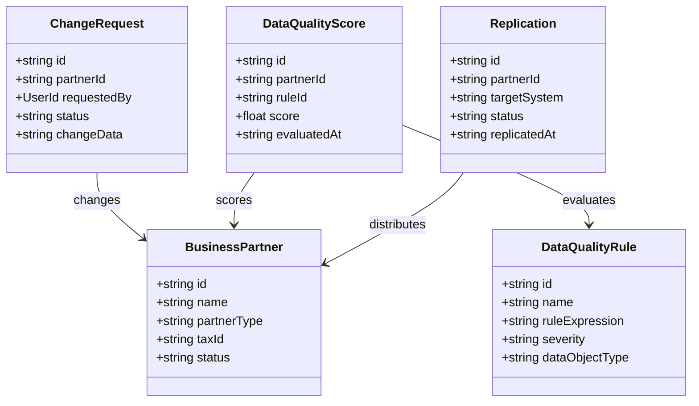
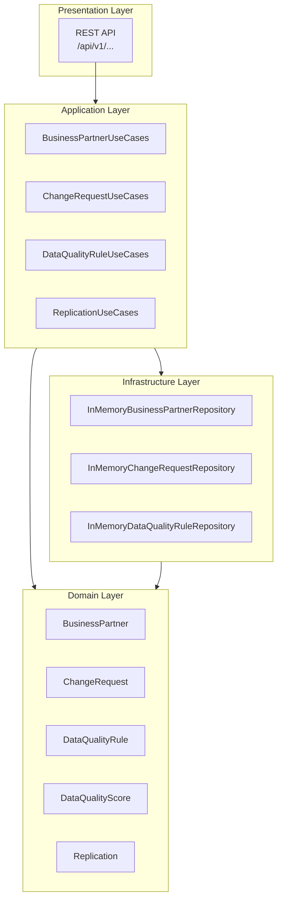
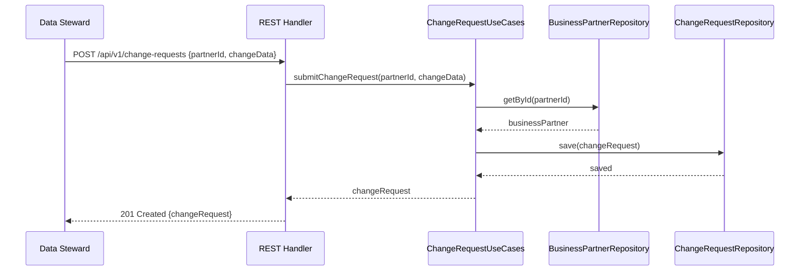

# UML Diagrams — Master Data Governance Service

## Class Diagram

```mermaid
classDiagram
    class BusinessPartner {
        +string id
        +string name
        +string partnerType
        +string taxId
        +string status
    }
    class ChangeRequest {
        +string id
        +string partnerId
        +UserId requestedBy
        +string status
        +string changeData
    }
    class DataQualityRule {
        +string id
        +string name
        +string ruleExpression
        +string severity
        +string dataObjectType
    }
    class DataQualityScore {
        +string id
        +string partnerId
        +string ruleId
        +float score
        +string evaluatedAt
    }
    class Replication {
        +string id
        +string partnerId
        +string targetSystem
        +string status
        +string replicatedAt
    }

    ChangeRequest --> BusinessPartner : changes
    DataQualityScore --> BusinessPartner : scores
    DataQualityScore --> DataQualityRule : evaluates
    Replication --> BusinessPartner : distributes
```

## Component Diagram

```mermaid
flowchart TB
    subgraph Presentation["Presentation Layer"]
        REST["REST API\n/api/v1/..."]
    end
    subgraph Application["Application Layer"]
        BP_UC["BusinessPartnerUseCases"]
        CR_UC["ChangeRequestUseCases"]
        DQR_UC["DataQualityRuleUseCases"]
        REP_UC["ReplicationUseCases"]
    end
    subgraph Domain["Domain Layer"]
        BP["BusinessPartner"]
        CR["ChangeRequest"]
        DQR["DataQualityRule"]
        DQS["DataQualityScore"]
        REP["Replication"]
    end
    subgraph Infrastructure["Infrastructure Layer"]
        BP_REPO["InMemoryBusinessPartnerRepository"]
        CR_REPO["InMemoryChangeRequestRepository"]
        DQR_REPO["InMemoryDataQualityRuleRepository"]
    end

    REST --> Application
    Application --> Domain
    Infrastructure --> Domain
    Application --> Infrastructure
```

## Sequence Diagram — Submit Change Request

```mermaid
sequenceDiagram
    participant S as Data Steward
    participant R as REST Handler
    participant UC as ChangeRequestUseCases
    participant BPR as BusinessPartnerRepository
    participant CRR as ChangeRequestRepository

    S->>R: POST /api/v1/change-requests {partnerId, changeData}
    R->>UC: submitChangeRequest(partnerId, changeData)
    UC->>BPR: getById(partnerId)
    BPR-->>UC: businessPartner
    UC->>CRR: save(changeRequest)
    CRR-->>UC: saved
    UC-->>R: changeRequest
    R-->>S: 201 Created {changeRequest}
```
