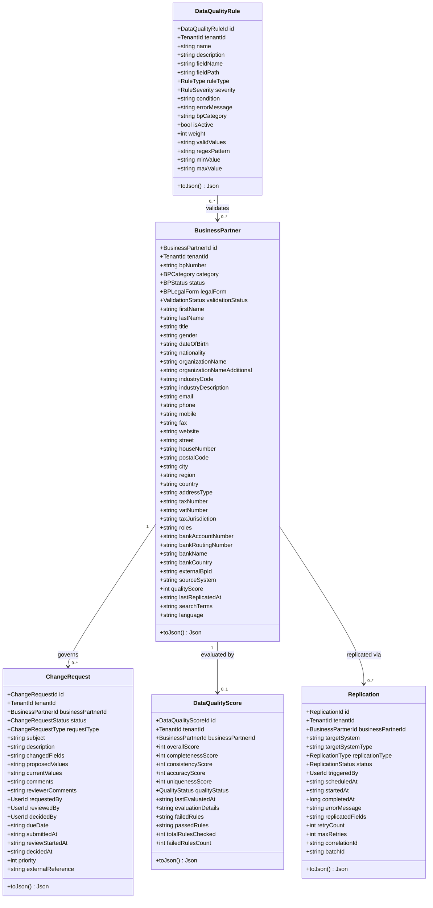
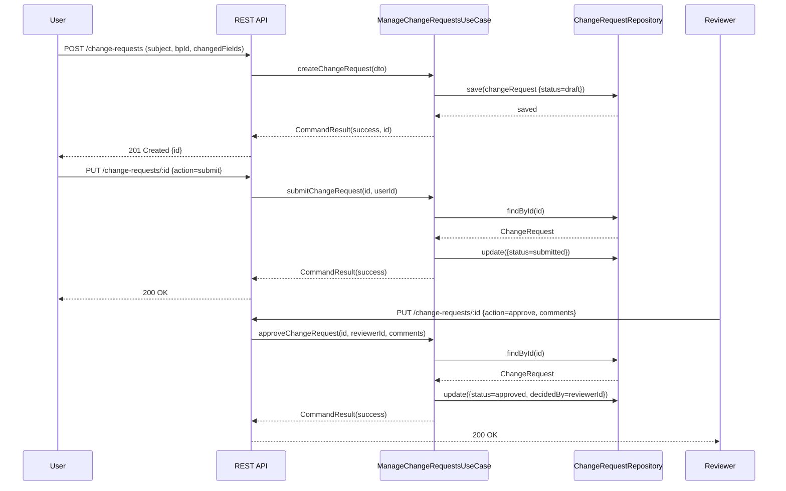
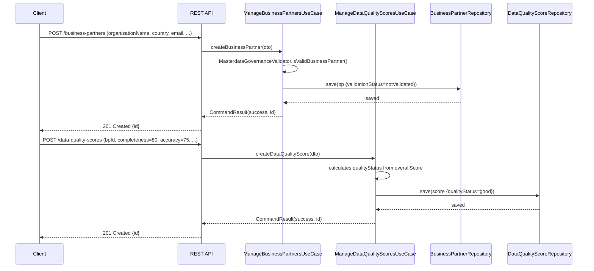
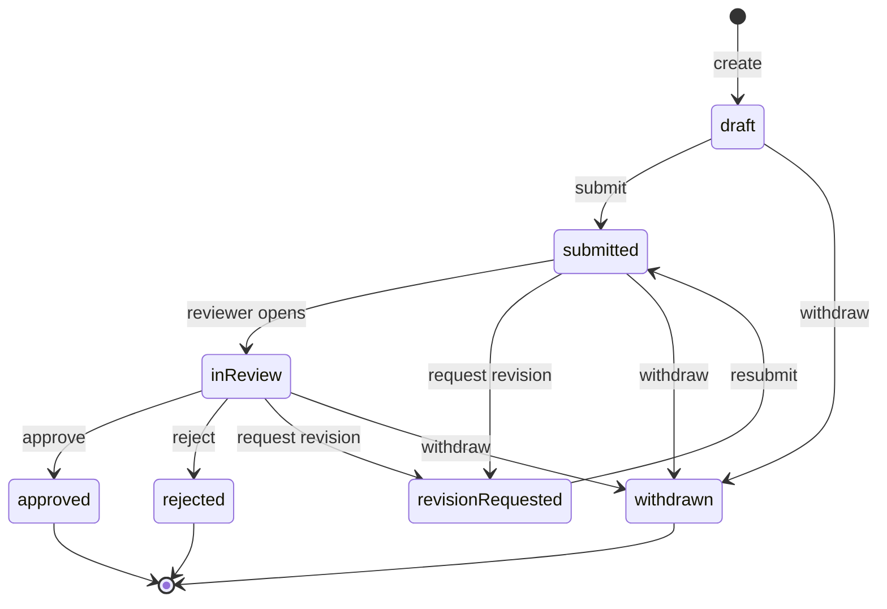
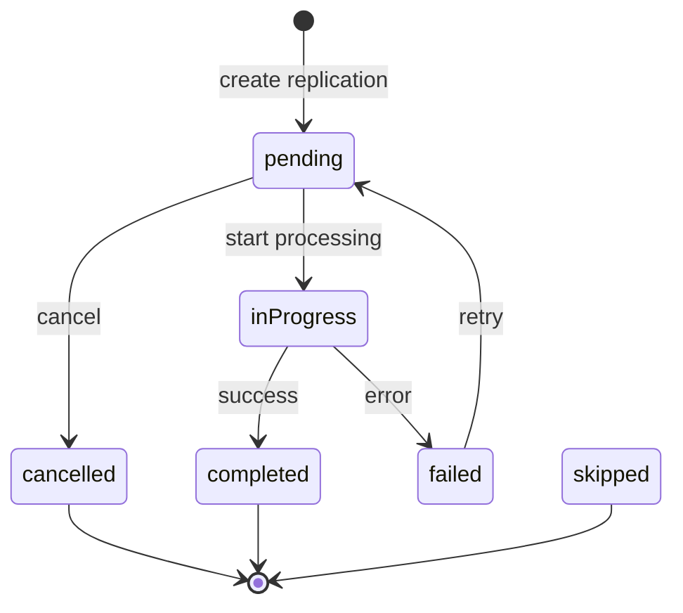

# Master Data Governance — UML Diagrams

## Class Diagram — Domain Entities

## Sequence Diagram — Change Request Approval Workflow

## Sequence Diagram — Business Partner Creation with Quality Evaluation

## State Diagram — Change Request Lifecycle

## State Diagram — Replication Lifecycle

## Component Diagram

```mermaid
graph TB
    subgraph "Presentation Layer"
        BPC[BusinessPartnerController]
        CRC[ChangeRequestController]
        DQRC[DataQualityRuleController]
        DQSC[DataQualityScoreController]
        RC[ReplicationController]
        HC[HealthController]
    end

    subgraph "Application Layer"
        BPUC[ManageBusinessPartnersUseCase]
        CRUC[ManageChangeRequestsUseCase]
        DQRUC[ManageDataQualityRulesUseCase]
        DQSUC[ManageDataQualityScoresUseCase]
        RUC[ManageReplicationsUseCase]
    end

    subgraph "Domain Layer"
        BPE[BusinessPartner entity]
        CRE[ChangeRequest entity]
        DQRE[DataQualityRule entity]
        DQSE[DataQualityScore entity]
        RE[Replication entity]
        VAL[MasterdataGovernanceValidator]
    end

    subgraph "Infrastructure Layer"
        MBPR[MemoryBusinessPartnerRepository]
        MCRR[MemoryChangeRequestRepository]
        MDQRR[MemoryDataQualityRuleRepository]
        MDQSR[MemoryDataQualityScoreRepository]
        MRR[MemoryReplicationRepository]
        CFG[SrvConfig]
        CON[Container]
    end

    BPC --> BPUC
    CRC --> CRUC
    DQRC --> DQRUC
    DQSC --> DQSUC
    RC --> RUC

    BPUC --> BPE
    BPUC --> VAL
    CRUC --> CRE
    CRUC --> VAL
    DQRUC --> DQRE
    DQSUC --> DQSE
    RUC --> RE
    RUC --> VAL

    BPUC --> MBPR
    CRUC --> MCRR
    DQRUC --> MDQRR
    DQSUC --> MDQSR
    RUC --> MRR
```

