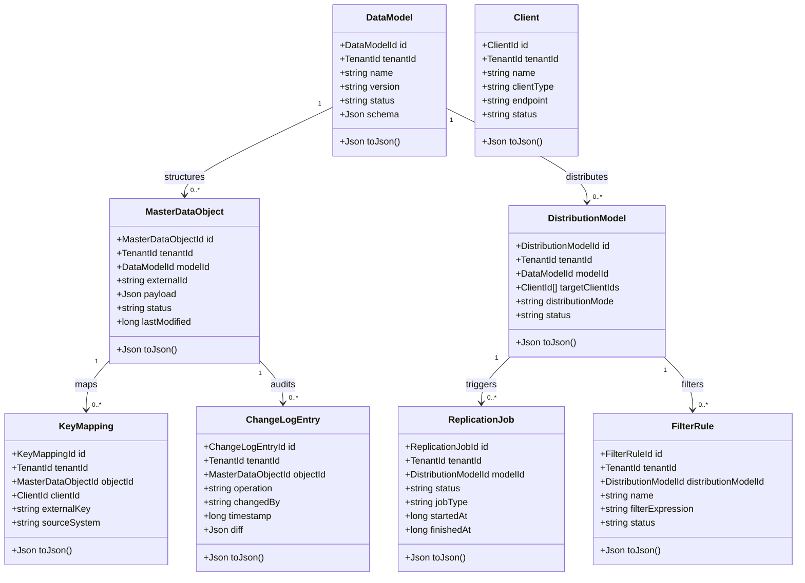
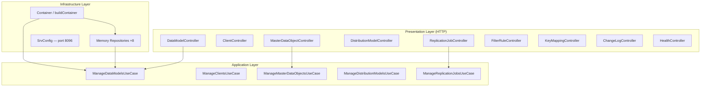
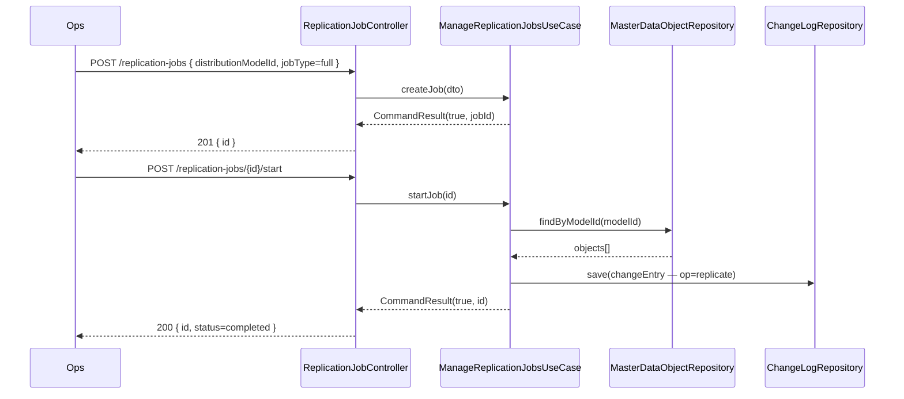

# UML — Master Data Integration Service

## Class Diagram — Domain Entities

```mermaid
classDiagram
    class DataModel {
        +DataModelId id
        +TenantId tenantId
        +string name
        +string version
        +string status
        +Json schema
        +Json toJson()
    }
    class Client {
        +ClientId id
        +TenantId tenantId
        +string name
        +string clientType
        +string endpoint
        +string status
        +Json toJson()
    }
    class MasterDataObject {
        +MasterDataObjectId id
        +TenantId tenantId
        +DataModelId modelId
        +string externalId
        +Json payload
        +string status
        +long lastModified
        +Json toJson()
    }
    class DistributionModel {
        +DistributionModelId id
        +TenantId tenantId
        +DataModelId modelId
        +ClientId[] targetClientIds
        +string distributionMode
        +string status
        +Json toJson()
    }
    class ReplicationJob {
        +ReplicationJobId id
        +TenantId tenantId
        +DistributionModelId modelId
        +string status
        +string jobType
        +long startedAt
        +long finishedAt
        +Json toJson()
    }
    class FilterRule {
        +FilterRuleId id
        +TenantId tenantId
        +DistributionModelId distributionModelId
        +string name
        +string filterExpression
        +string status
        +Json toJson()
    }
    class KeyMapping {
        +KeyMappingId id
        +TenantId tenantId
        +MasterDataObjectId objectId
        +ClientId clientId
        +string externalKey
        +string sourceSystem
        +Json toJson()
    }
    class ChangeLogEntry {
        +ChangeLogEntryId id
        +TenantId tenantId
        +MasterDataObjectId objectId
        +string operation
        +string changedBy
        +long timestamp
        +Json diff
        +Json toJson()
    }

    DataModel "1" --> "0..*" MasterDataObject : structures
    DataModel "1" --> "0..*" DistributionModel : distributes
    DistributionModel "1" --> "0..*" ReplicationJob : triggers
    DistributionModel "1" --> "0..*" FilterRule : filters
    MasterDataObject "1" --> "0..*" KeyMapping : maps
    MasterDataObject "1" --> "0..*" ChangeLogEntry : audits
```

---

## Component Diagram

```mermaid
flowchart TB
    subgraph Presentation["Presentation Layer (HTTP)"]
        C1[DataModelController]
        C2[ClientController]
        C3[MasterDataObjectController]
        C4[DistributionModelController]
        C5[ReplicationJobController]
        C6[FilterRuleController]
        C7[KeyMappingController]
        C8[ChangeLogController]
        HC[HealthController]
    end
    subgraph Application["Application Layer"]
        UC1[ManageDataModelsUseCase]
        UC2[ManageClientsUseCase]
        UC3[ManageMasterDataObjectsUseCase]
        UC4[ManageDistributionModelsUseCase]
        UC5[ManageReplicationJobsUseCase]
    end
    subgraph Infrastructure["Infrastructure Layer"]
        MEM[Memory Repositories ×8]
        CFG[SrvConfig — port 8096]
        CTR[Container / buildContainer]
    end
    C1 --> UC1
    C3 --> UC3
    C5 --> UC5
    MEM --> UC1
    CTR --> UC1
    CTR --> MEM
```

---

## Sequence Diagram — Replicate Master Data Object

```mermaid
sequenceDiagram
    participant Ops
    participant RJC as ReplicationJobController
    participant RJUC as ManageReplicationJobsUseCase
    participant MDOR as MasterDataObjectRepository
    participant CLR as ChangeLogRepository

    Ops->>RJC: POST /replication-jobs { distributionModelId, jobType=full }
    RJC->>RJUC: createJob(dto)
    RJUC-->>RJC: CommandResult(true, jobId)
    RJC-->>Ops: 201 { id }

    Ops->>RJC: POST /replication-jobs/{id}/start
    RJC->>RJUC: startJob(id)
    RJUC->>MDOR: findByModelId(modelId)
    MDOR-->>RJUC: objects[]
    RJUC->>CLR: save(changeEntry — op=replicate)
    RJUC-->>RJC: CommandResult(true, id)
    RJC-->>Ops: 200 { id, status=completed }
```
