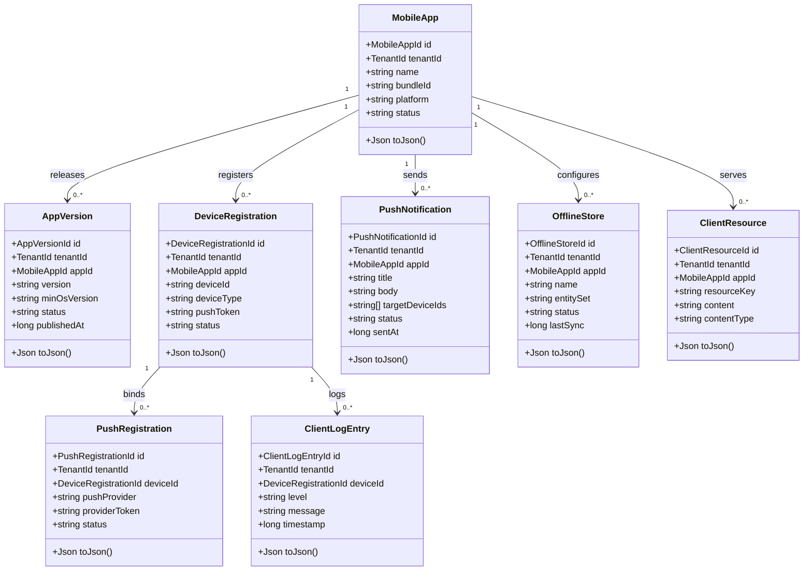
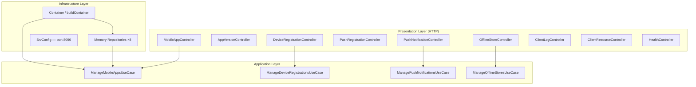
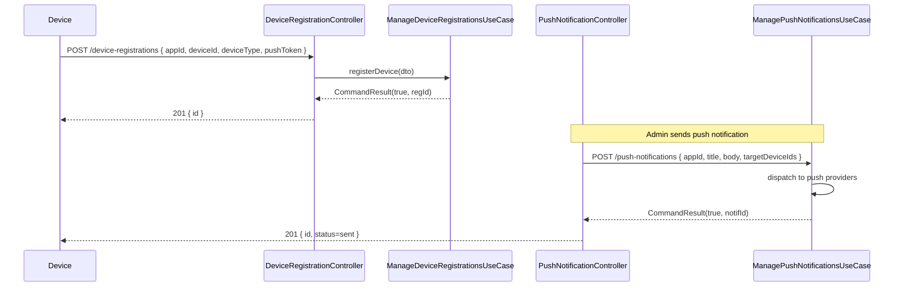

# UML — Mobile Services

## Class Diagram — Domain Entities

```mermaid
classDiagram
    class MobileApp {
        +MobileAppId id
        +TenantId tenantId
        +string name
        +string bundleId
        +string platform
        +string status
        +Json toJson()
    }
    class AppVersion {
        +AppVersionId id
        +TenantId tenantId
        +MobileAppId appId
        +string version
        +string minOsVersion
        +string status
        +long publishedAt
        +Json toJson()
    }
    class DeviceRegistration {
        +DeviceRegistrationId id
        +TenantId tenantId
        +MobileAppId appId
        +string deviceId
        +string deviceType
        +string pushToken
        +string status
        +Json toJson()
    }
    class PushRegistration {
        +PushRegistrationId id
        +TenantId tenantId
        +DeviceRegistrationId deviceId
        +string pushProvider
        +string providerToken
        +string status
        +Json toJson()
    }
    class PushNotification {
        +PushNotificationId id
        +TenantId tenantId
        +MobileAppId appId
        +string title
        +string body
        +string[] targetDeviceIds
        +string status
        +long sentAt
        +Json toJson()
    }
    class OfflineStore {
        +OfflineStoreId id
        +TenantId tenantId
        +MobileAppId appId
        +string name
        +string entitySet
        +string status
        +long lastSync
        +Json toJson()
    }
    class ClientLogEntry {
        +ClientLogEntryId id
        +TenantId tenantId
        +DeviceRegistrationId deviceId
        +string level
        +string message
        +long timestamp
        +Json toJson()
    }
    class ClientResource {
        +ClientResourceId id
        +TenantId tenantId
        +MobileAppId appId
        +string resourceKey
        +string content
        +string contentType
        +Json toJson()
    }

    MobileApp "1" --> "0..*" AppVersion : releases
    MobileApp "1" --> "0..*" DeviceRegistration : registers
    MobileApp "1" --> "0..*" OfflineStore : configures
    MobileApp "1" --> "0..*" ClientResource : serves
    DeviceRegistration "1" --> "0..*" PushRegistration : binds
    DeviceRegistration "1" --> "0..*" ClientLogEntry : logs
    MobileApp "1" --> "0..*" PushNotification : sends
```

---

## Component Diagram

```mermaid
flowchart TB
    subgraph Presentation["Presentation Layer (HTTP)"]
        C1[MobileAppController]
        C2[AppVersionController]
        C3[DeviceRegistrationController]
        C4[PushRegistrationController]
        C5[PushNotificationController]
        C6[OfflineStoreController]
        C7[ClientLogController]
        C8[ClientResourceController]
        HC[HealthController]
    end
    subgraph Application["Application Layer"]
        UC1[ManageMobileAppsUseCase]
        UC2[ManageDeviceRegistrationsUseCase]
        UC3[ManagePushNotificationsUseCase]
        UC4[ManageOfflineStoresUseCase]
    end
    subgraph Infrastructure["Infrastructure Layer"]
        MEM[Memory Repositories ×8]
        CFG[SrvConfig — port 8096]
        CTR[Container / buildContainer]
    end
    C1 --> UC1
    C3 --> UC2
    C5 --> UC3
    C6 --> UC4
    MEM --> UC1
    CTR --> UC1
    CTR --> MEM
```

---

## Sequence Diagram — Device Register and Push Notification

```mermaid
sequenceDiagram
    participant Device
    participant DRC as DeviceRegistrationController
    participant DRUC as ManageDeviceRegistrationsUseCase
    participant PNC as PushNotificationController
    participant PNUC as ManagePushNotificationsUseCase

    Device->>DRC: POST /device-registrations { appId, deviceId, deviceType, pushToken }
    DRC->>DRUC: registerDevice(dto)
    DRUC-->>DRC: CommandResult(true, regId)
    DRC-->>Device: 201 { id }

    Note over PNC,PNUC: Admin sends push notification
    PNC->>PNUC: POST /push-notifications { appId, title, body, targetDeviceIds }
    PNUC->>PNUC: dispatch to push providers
    PNUC-->>PNC: CommandResult(true, notifId)
    PNC-->>Device: 201 { id, status=sent }
```
