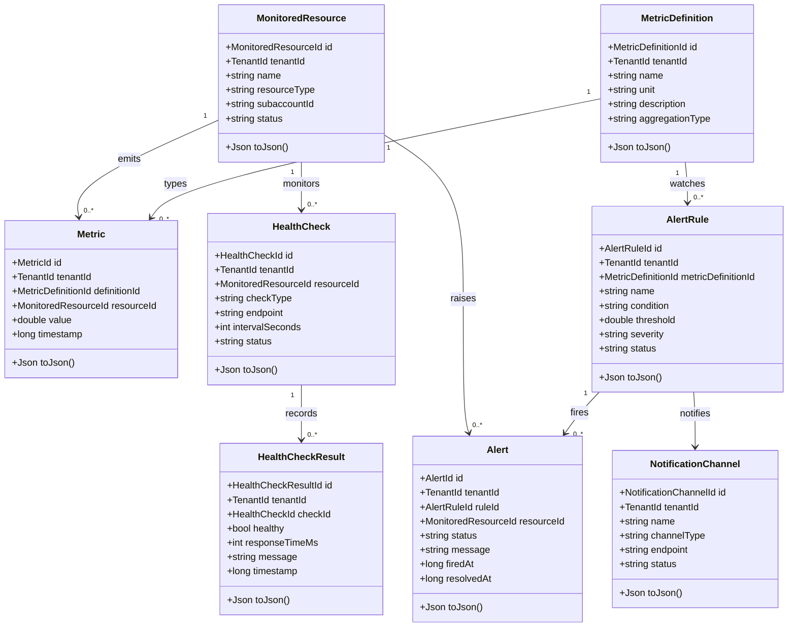
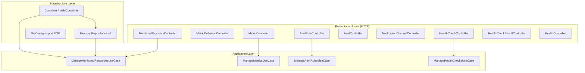
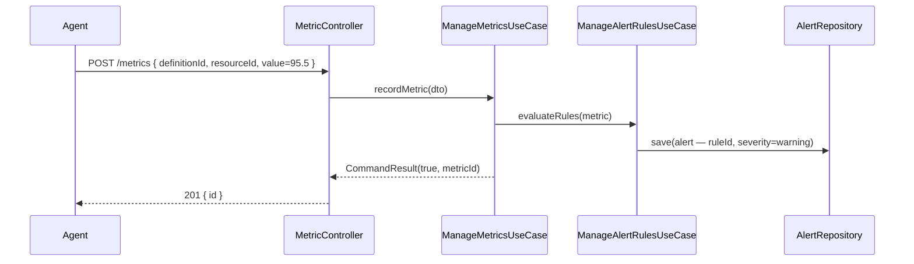

# UML — Monitoring Service

## Class Diagram — Domain Entities

```mermaid
classDiagram
    class MonitoredResource {
        +MonitoredResourceId id
        +TenantId tenantId
        +string name
        +string resourceType
        +string subaccountId
        +string status
        +Json toJson()
    }
    class MetricDefinition {
        +MetricDefinitionId id
        +TenantId tenantId
        +string name
        +string unit
        +string description
        +string aggregationType
        +Json toJson()
    }
    class Metric {
        +MetricId id
        +TenantId tenantId
        +MetricDefinitionId definitionId
        +MonitoredResourceId resourceId
        +double value
        +long timestamp
        +Json toJson()
    }
    class AlertRule {
        +AlertRuleId id
        +TenantId tenantId
        +MetricDefinitionId metricDefinitionId
        +string name
        +string condition
        +double threshold
        +string severity
        +string status
        +Json toJson()
    }
    class Alert {
        +AlertId id
        +TenantId tenantId
        +AlertRuleId ruleId
        +MonitoredResourceId resourceId
        +string status
        +string message
        +long firedAt
        +long resolvedAt
        +Json toJson()
    }
    class NotificationChannel {
        +NotificationChannelId id
        +TenantId tenantId
        +string name
        +string channelType
        +string endpoint
        +string status
        +Json toJson()
    }
    class HealthCheck {
        +HealthCheckId id
        +TenantId tenantId
        +MonitoredResourceId resourceId
        +string checkType
        +string endpoint
        +int intervalSeconds
        +string status
        +Json toJson()
    }
    class HealthCheckResult {
        +HealthCheckResultId id
        +TenantId tenantId
        +HealthCheckId checkId
        +bool healthy
        +int responseTimeMs
        +string message
        +long timestamp
        +Json toJson()
    }

    MonitoredResource "1" --> "0..*" Metric : emits
    MonitoredResource "1" --> "0..*" HealthCheck : monitors
    MonitoredResource "1" --> "0..*" Alert : raises
    MetricDefinition "1" --> "0..*" Metric : types
    MetricDefinition "1" --> "0..*" AlertRule : watches
    AlertRule "1" --> "0..*" Alert : fires
    AlertRule --> NotificationChannel : notifies
    HealthCheck "1" --> "0..*" HealthCheckResult : records
```

---

## Component Diagram

```mermaid
flowchart TB
    subgraph Presentation["Presentation Layer (HTTP)"]
        C1[MonitoredResourceController]
        C2[MetricDefinitionController]
        C3[MetricController]
        C4[AlertRuleController]
        C5[AlertController]
        C6[NotificationChannelController]
        C7[HealthCheckController]
        C8[HealthCheckResultController]
        HC[HealthController]
    end
    subgraph Application["Application Layer"]
        UC1[ManageMonitoredResourcesUseCase]
        UC2[ManageMetricsUseCase]
        UC3[ManageAlertRulesUseCase]
        UC4[ManageHealthChecksUseCase]
    end
    subgraph Infrastructure["Infrastructure Layer"]
        MEM[Memory Repositories ×8]
        CFG[SrvConfig — port 8093]
        CTR[Container / buildContainer]
    end
    C1 --> UC1
    C3 --> UC2
    C4 --> UC3
    C7 --> UC4
    MEM --> UC1
    CTR --> UC1
    CTR --> MEM
```

---

## Sequence Diagram — Ingest Metric and Fire Alert

```mermaid
sequenceDiagram
    participant Agent
    participant MC as MetricController
    participant MUC as ManageMetricsUseCase
    participant ARUC as ManageAlertRulesUseCase
    participant AR as AlertRepository

    Agent->>MC: POST /metrics { definitionId, resourceId, value=95.5 }
    MC->>MUC: recordMetric(dto)
    MUC->>ARUC: evaluateRules(metric)
    ARUC->>AR: save(alert — ruleId, severity=warning)
    MUC-->>MC: CommandResult(true, metricId)
    MC-->>Agent: 201 { id }
```
