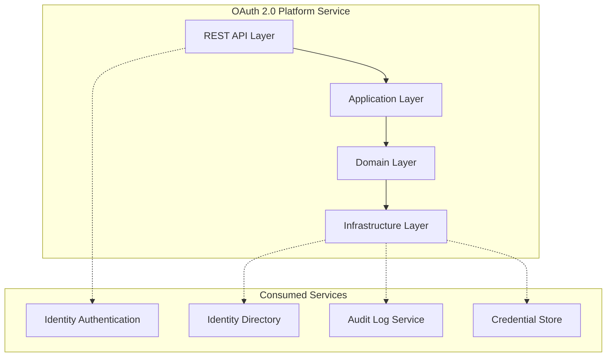
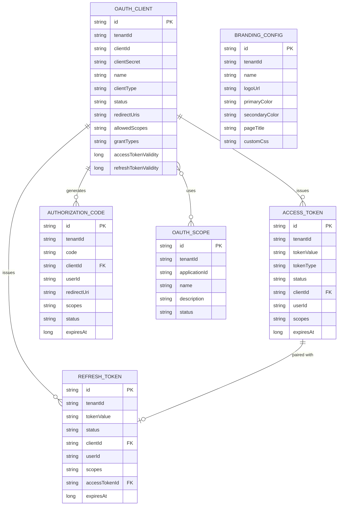
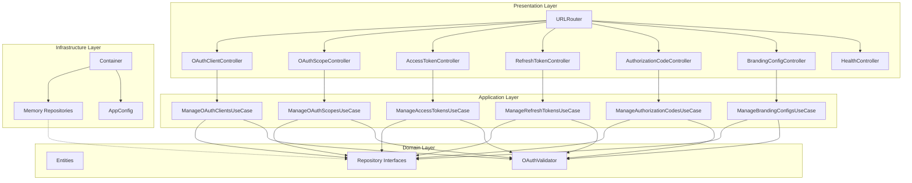
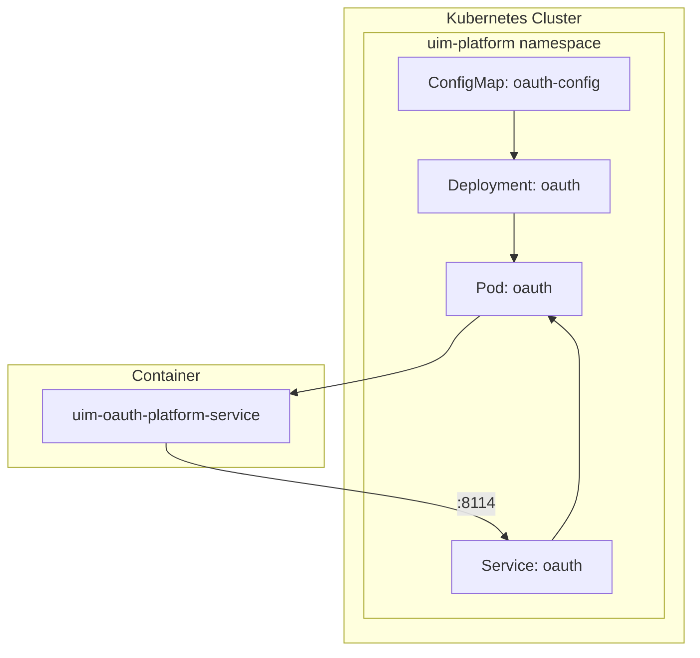
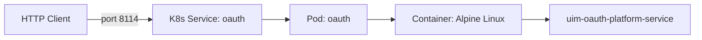
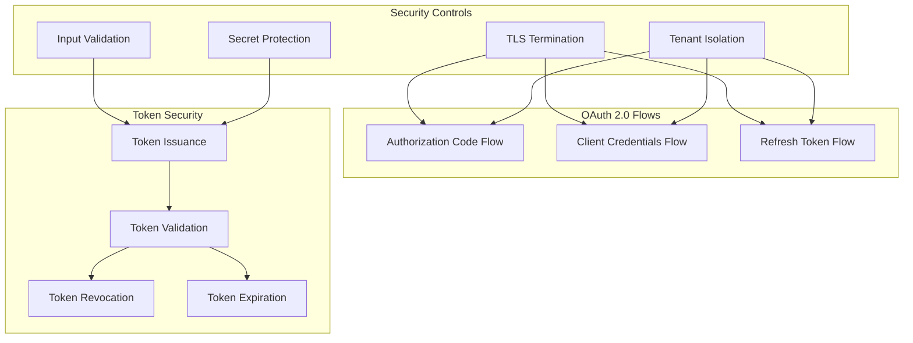
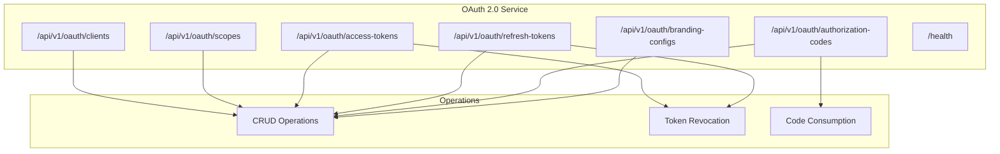

# OAuth 2.0 Service — NAFv4 Architecture Views

## C1 — Capability Taxonomy

```mermaid
graph TB
    OA[OAuth 2.0 Service]
    OA --> OCM[OAuth Client Management]
    OA --> OSM[OAuth Scope Management]
    OA --> ATM[Access Token Management]
    OA --> RTM[Refresh Token Management]
    OA --> ACM[Authorization Code Management]
    OA --> BCM[Branding Configuration]

    OCM --> OCM1[Client Registration]
    OCM --> OCM2[Client Types - Confidential/Public]
    OCM --> OCM3[Redirect URI Management]
    OCM --> OCM4[Grant Type Configuration]

    OSM --> OSM1[Scope Definition]
    OSM --> OSM2[Application Scope Binding]
    OSM --> OSM3[Scope Status Management]
    OSM --> OSM4[Tenant Scope Isolation]

    ATM --> ATM1[Token Issuance]
    ATM --> ATM2[Token Validation]
    ATM --> ATM3[Token Revocation]
    ATM --> ATM4[Token Expiration]

    RTM --> RTM1[Refresh Token Issuance]
    RTM --> RTM2[Token Rotation]
    RTM --> RTM3[Refresh Token Revocation]
    RTM --> RTM4[Access Token Association]

    ACM --> ACM1[Code Generation]
    ACM --> ACM2[Single-Use Enforcement]
    ACM --> ACM3[Redirect URI Binding]
    ACM --> ACM4[Code Expiration]

    BCM --> BCM1[Logo Configuration]
    BCM --> BCM2[Color Theming]
    BCM --> BCM3[Page Title and Footer]
    BCM --> BCM4[Custom CSS]
```

## C2 — Service Taxonomy

## L1 — Logical Data Model

## L2 — Service Architecture

## L4 — Deployment View

## P1 — Physical Network

## S1 — Security Architecture

## Sv1 — Service View

