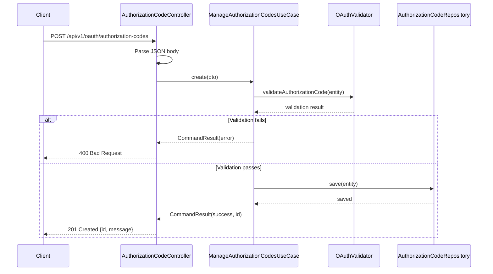
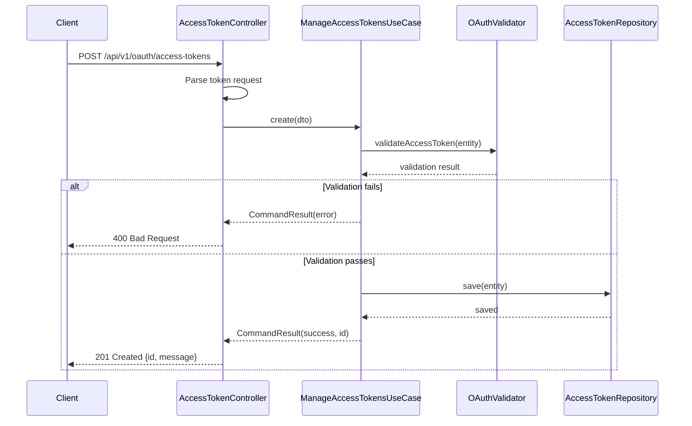
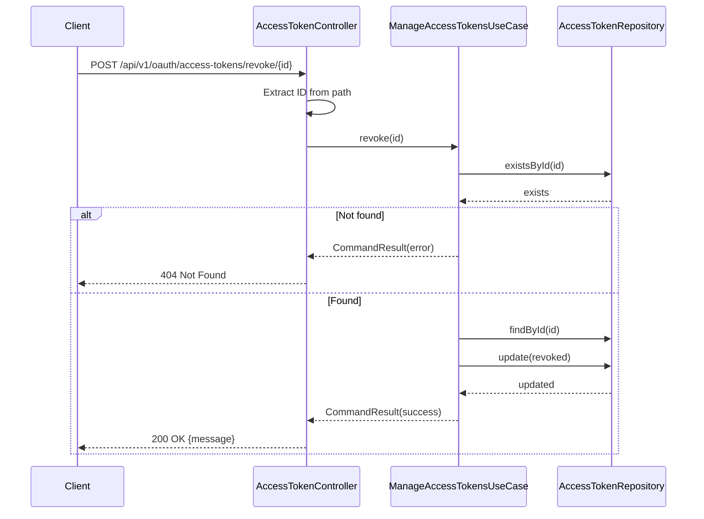
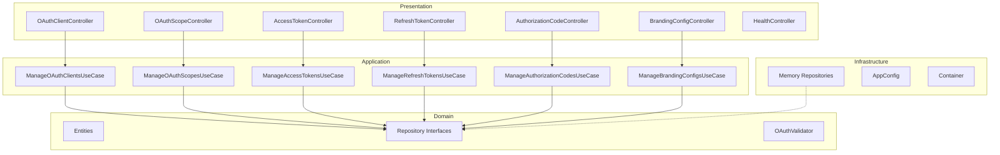

# OAuth 2.0 Service — UML Diagrams

## Class Diagram — Domain Entities

```mermaid
classDiagram
    class OAuthClient {
        +OAuthClientId id
        +TenantId tenantId
        +string clientId
        +string clientSecret
        +string name
        +string description
        +ClientType clientType
        +ClientStatus status
        +string redirectUris
        +string allowedScopes
        +string grantTypes
        +long accessTokenValidity
        +long refreshTokenValidity
        +string contacts
        +string createdAt
        +string updatedAt
        +UserId createdBy
        +UserId modifiedBy
        +oauthClientToJson() Json
    }

    class OAuthScope {
        +OAuthScopeId id
        +TenantId tenantId
        +string applicationId
        +string name
        +string description
        +ScopeStatus status
        +string createdAt
        +string updatedAt
        +UserId createdBy
        +UserId modifiedBy
        +oauthScopeToJson() Json
    }

    class AccessToken {
        +AccessTokenId id
        +TenantId tenantId
        +string tokenValue
        +TokenType tokenType
        +TokenStatus status
        +string clientId
        +string userId
        +string scopes
        +long expiresAt
        +string issuedAt
        +string createdAt
        +accessTokenToJson() Json
    }

    class RefreshToken {
        +RefreshTokenId id
        +TenantId tenantId
        +string tokenValue
        +TokenStatus status
        +string clientId
        +string userId
        +string scopes
        +string accessTokenId
        +long expiresAt
        +string issuedAt
        +string createdAt
        +refreshTokenToJson() Json
    }

    class AuthorizationCode {
        +AuthorizationCodeId id
        +TenantId tenantId
        +string code
        +string clientId
        +string userId
        +string redirectUri
        +string scopes
        +AuthCodeStatus status
        +long expiresAt
        +string issuedAt
        +string createdAt
        +authorizationCodeToJson() Json
    }

    class BrandingConfig {
        +BrandingConfigId id
        +TenantId tenantId
        +string name
        +string description
        +string logoUrl
        +string backgroundUrl
        +string primaryColor
        +string secondaryColor
        +string pageTitle
        +string footerText
        +string customCss
        +string createdAt
        +string updatedAt
        +UserId createdBy
        +UserId modifiedBy
        +brandingConfigToJson() Json
    }

    OAuthClient "1" --> "*" AccessToken : issues
    OAuthClient "1" --> "*" RefreshToken : issues
    OAuthClient "1" --> "*" AuthorizationCode : generates
    OAuthClient "*" --> "*" OAuthScope : uses
    AccessToken "1" --> "0..1" RefreshToken : paired with
```

## Class Diagram — Repository Interfaces

```mermaid
classDiagram
    class OAuthClientRepository {
        <<interface>>
        +existsById(OAuthClientId) bool
        +findById(OAuthClientId) OAuthClient
        +findByClientId(string) OAuthClient
        +findAll() OAuthClient[]
        +findByTenant(TenantId) OAuthClient[]
        +findByStatus(ClientStatus) OAuthClient[]
        +save(OAuthClient)
        +update(OAuthClient)
        +remove(OAuthClientId)
    }

    class OAuthScopeRepository {
        <<interface>>
        +existsById(OAuthScopeId) bool
        +findById(OAuthScopeId) OAuthScope
        +findAll() OAuthScope[]
        +findByTenant(TenantId) OAuthScope[]
        +findByApplication(string) OAuthScope[]
        +findByStatus(ScopeStatus) OAuthScope[]
        +save(OAuthScope)
        +update(OAuthScope)
        +remove(OAuthScopeId)
    }

    class AccessTokenRepository {
        <<interface>>
        +existsById(AccessTokenId) bool
        +findById(AccessTokenId) AccessToken
        +findByTokenValue(string) AccessToken
        +findAll() AccessToken[]
        +findByTenant(TenantId) AccessToken[]
        +findByClientId(string) AccessToken[]
        +findByUserId(string) AccessToken[]
        +findByStatus(TokenStatus) AccessToken[]
        +save(AccessToken)
        +update(AccessToken)
        +remove(AccessTokenId)
    }

    class RefreshTokenRepository {
        <<interface>>
        +existsById(RefreshTokenId) bool
        +findById(RefreshTokenId) RefreshToken
        +findByTokenValue(string) RefreshToken
        +findAll() RefreshToken[]
        +findByTenant(TenantId) RefreshToken[]
        +findByClientId(string) RefreshToken[]
        +findByStatus(TokenStatus) RefreshToken[]
        +save(RefreshToken)
        +update(RefreshToken)
        +remove(RefreshTokenId)
    }

    class AuthorizationCodeRepository {
        <<interface>>
        +existsById(AuthorizationCodeId) bool
        +findById(AuthorizationCodeId) AuthorizationCode
        +findByCode(string) AuthorizationCode
        +findAll() AuthorizationCode[]
        +findByTenant(TenantId) AuthorizationCode[]
        +findByClientId(string) AuthorizationCode[]
        +findByStatus(AuthCodeStatus) AuthorizationCode[]
        +save(AuthorizationCode)
        +update(AuthorizationCode)
        +remove(AuthorizationCodeId)
    }

    class BrandingConfigRepository {
        <<interface>>
        +existsById(BrandingConfigId) bool
        +findById(BrandingConfigId) BrandingConfig
        +findAll() BrandingConfig[]
        +findByTenant(TenantId) BrandingConfig[]
        +save(BrandingConfig)
        +update(BrandingConfig)
        +remove(BrandingConfigId)
    }

    class MemoryOAuthClientRepository {
        -OAuthClient[] store
    }
    class MemoryOAuthScopeRepository {
        -OAuthScope[] store
    }
    class MemoryAccessTokenRepository {
        -AccessToken[] store
    }
    class MemoryRefreshTokenRepository {
        -RefreshToken[] store
    }
    class MemoryAuthorizationCodeRepository {
        -AuthorizationCode[] store
    }
    class MemoryBrandingConfigRepository {
        -BrandingConfig[] store
    }

    OAuthClientRepository <|.. MemoryOAuthClientRepository
    OAuthScopeRepository <|.. MemoryOAuthScopeRepository
    AccessTokenRepository <|.. MemoryAccessTokenRepository
    RefreshTokenRepository <|.. MemoryRefreshTokenRepository
    AuthorizationCodeRepository <|.. MemoryAuthorizationCodeRepository
    BrandingConfigRepository <|.. MemoryBrandingConfigRepository
```

## Sequence Diagram — Authorization Code Grant Flow

## Sequence Diagram — Token Issuance

## Sequence Diagram — Token Revocation

## Component Diagram

