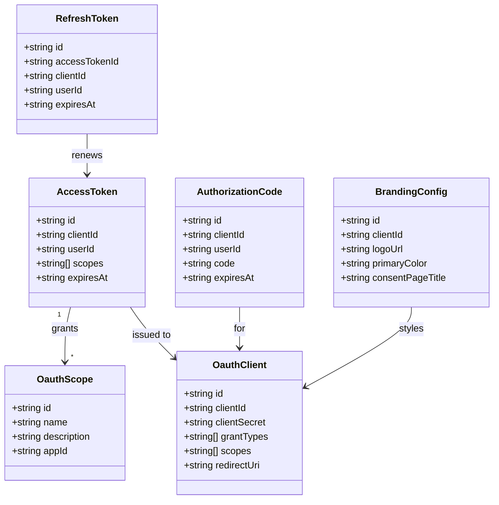
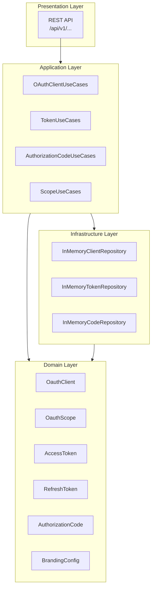
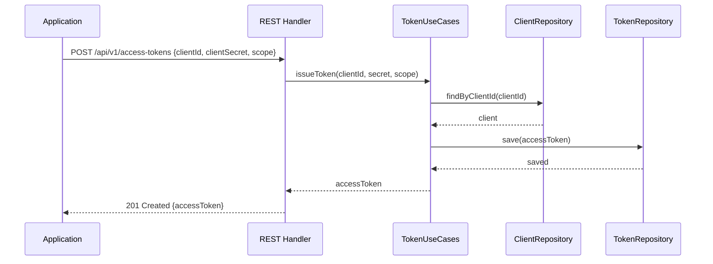

# UML Diagrams — OAuth Service

## Class Diagram

```mermaid
classDiagram
    class OauthClient {
        +string id
        +string clientId
        +string clientSecret
        +string[] grantTypes
        +string[] scopes
        +string redirectUri
    }
    class OauthScope {
        +string id
        +string name
        +string description
        +string appId
    }
    class AccessToken {
        +string id
        +string clientId
        +string userId
        +string[] scopes
        +string expiresAt
    }
    class RefreshToken {
        +string id
        +string accessTokenId
        +string clientId
        +string userId
        +string expiresAt
    }
    class AuthorizationCode {
        +string id
        +string clientId
        +string userId
        +string code
        +string expiresAt
    }
    class BrandingConfig {
        +string id
        +string clientId
        +string logoUrl
        +string primaryColor
        +string consentPageTitle
    }

    AccessToken --> OauthClient : issued to
    AccessToken "1" --> "*" OauthScope : grants
    RefreshToken --> AccessToken : renews
    AuthorizationCode --> OauthClient : for
    BrandingConfig --> OauthClient : styles
```

## Component Diagram

```mermaid
flowchart TB
    subgraph Presentation["Presentation Layer"]
        REST["REST API\n/api/v1/..."]
    end
    subgraph Application["Application Layer"]
        CLIENT_UC["OAuthClientUseCases"]
        TOKEN_UC["TokenUseCases"]
        CODE_UC["AuthorizationCodeUseCases"]
        SCOPE_UC["ScopeUseCases"]
    end
    subgraph Domain["Domain Layer"]
        CLIENT["OauthClient"]
        SCOPE["OauthScope"]
        AT["AccessToken"]
        RT["RefreshToken"]
        CODE["AuthorizationCode"]
        BRAND["BrandingConfig"]
    end
    subgraph Infrastructure["Infrastructure Layer"]
        CLIENT_REPO["InMemoryClientRepository"]
        TOKEN_REPO["InMemoryTokenRepository"]
        CODE_REPO["InMemoryCodeRepository"]
    end

    REST --> Application
    Application --> Domain
    Infrastructure --> Domain
    Application --> Infrastructure
```

## Sequence Diagram — Issue Access Token (Client Credentials)

```mermaid
sequenceDiagram
    participant A as Application
    participant R as REST Handler
    participant UC as TokenUseCases
    participant CR as ClientRepository
    participant TR as TokenRepository

    A->>R: POST /api/v1/access-tokens {clientId, clientSecret, scope}
    R->>UC: issueToken(clientId, secret, scope)
    UC->>CR: findByClientId(clientId)
    CR-->>UC: client
    UC->>TR: save(accessToken)
    TR-->>UC: saved
    UC-->>R: accessToken
    R-->>A: 201 Created {accessToken}
```
