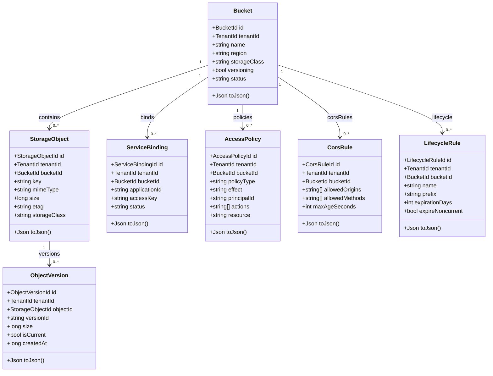
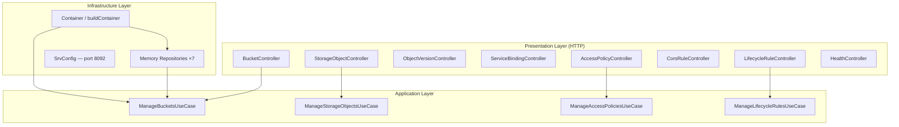
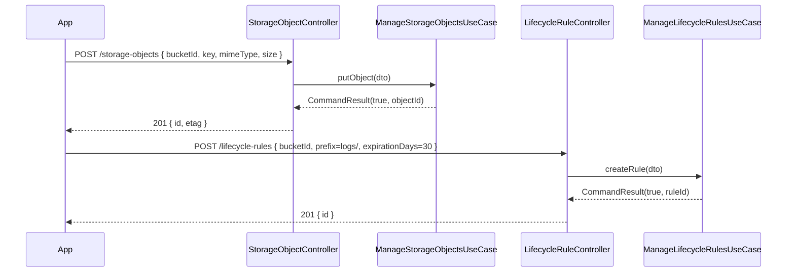

# UML — Object Store Service

## Class Diagram — Domain Entities

```mermaid
classDiagram
    class Bucket {
        +BucketId id
        +TenantId tenantId
        +string name
        +string region
        +string storageClass
        +bool versioning
        +string status
        +Json toJson()
    }
    class StorageObject {
        +StorageObjectId id
        +TenantId tenantId
        +BucketId bucketId
        +string key
        +string mimeType
        +long size
        +string etag
        +string storageClass
        +Json toJson()
    }
    class ObjectVersion {
        +ObjectVersionId id
        +TenantId tenantId
        +StorageObjectId objectId
        +string versionId
        +long size
        +bool isCurrent
        +long createdAt
        +Json toJson()
    }
    class ServiceBinding {
        +ServiceBindingId id
        +TenantId tenantId
        +BucketId bucketId
        +string applicationId
        +string accessKey
        +string status
        +Json toJson()
    }
    class AccessPolicy {
        +AccessPolicyId id
        +TenantId tenantId
        +BucketId bucketId
        +string policyType
        +string effect
        +string principalId
        +string[] actions
        +string resource
        +Json toJson()
    }
    class CorsRule {
        +CorsRuleId id
        +TenantId tenantId
        +BucketId bucketId
        +string[] allowedOrigins
        +string[] allowedMethods
        +int maxAgeSeconds
        +Json toJson()
    }
    class LifecycleRule {
        +LifecycleRuleId id
        +TenantId tenantId
        +BucketId bucketId
        +string name
        +string prefix
        +int expirationDays
        +bool expireNoncurrent
        +Json toJson()
    }

    Bucket "1" --> "0..*" StorageObject : contains
    Bucket "1" --> "0..*" ServiceBinding : binds
    Bucket "1" --> "0..*" AccessPolicy : policies
    Bucket "1" --> "0..*" CorsRule : corsRules
    Bucket "1" --> "0..*" LifecycleRule : lifecycle
    StorageObject "1" --> "0..*" ObjectVersion : versions
```

---

## Component Diagram

```mermaid
flowchart TB
    subgraph Presentation["Presentation Layer (HTTP)"]
        C1[BucketController]
        C2[StorageObjectController]
        C3[ObjectVersionController]
        C4[ServiceBindingController]
        C5[AccessPolicyController]
        C6[CorsRuleController]
        C7[LifecycleRuleController]
        HC[HealthController]
    end
    subgraph Application["Application Layer"]
        UC1[ManageBucketsUseCase]
        UC2[ManageStorageObjectsUseCase]
        UC3[ManageAccessPoliciesUseCase]
        UC4[ManageLifecycleRulesUseCase]
    end
    subgraph Infrastructure["Infrastructure Layer"]
        MEM[Memory Repositories ×7]
        CFG[SrvConfig — port 8092]
        CTR[Container / buildContainer]
    end
    C1 --> UC1
    C2 --> UC2
    C5 --> UC3
    C7 --> UC4
    MEM --> UC1
    CTR --> UC1
    CTR --> MEM
```

---

## Sequence Diagram — Upload Object and Set Lifecycle

```mermaid
sequenceDiagram
    participant App
    participant OC as StorageObjectController
    participant OUC as ManageStorageObjectsUseCase
    participant LC as LifecycleRuleController
    participant LUC as ManageLifecycleRulesUseCase

    App->>OC: POST /storage-objects { bucketId, key, mimeType, size }
    OC->>OUC: putObject(dto)
    OUC-->>OC: CommandResult(true, objectId)
    OC-->>App: 201 { id, etag }

    App->>LC: POST /lifecycle-rules { bucketId, prefix=logs/, expirationDays=30 }
    LC->>LUC: createRule(dto)
    LUC-->>LC: CommandResult(true, ruleId)
    LC-->>App: 201 { id }
```
