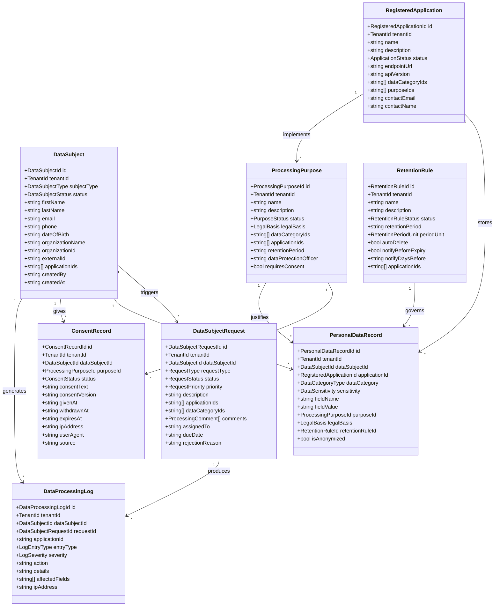
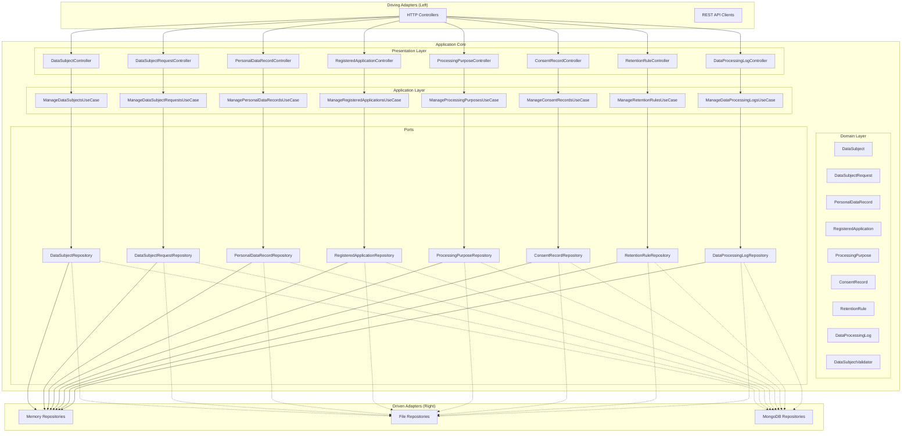
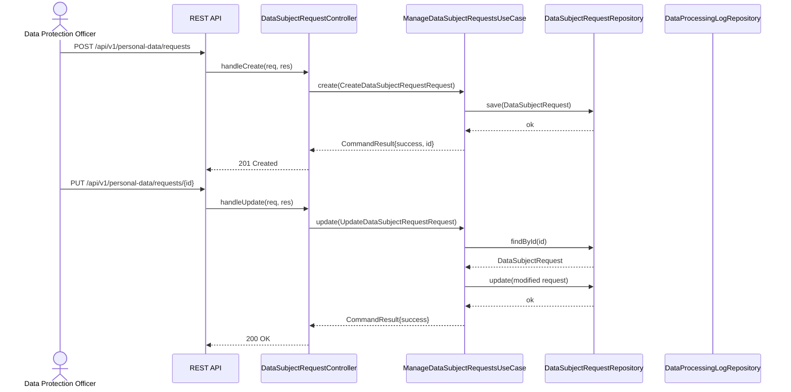
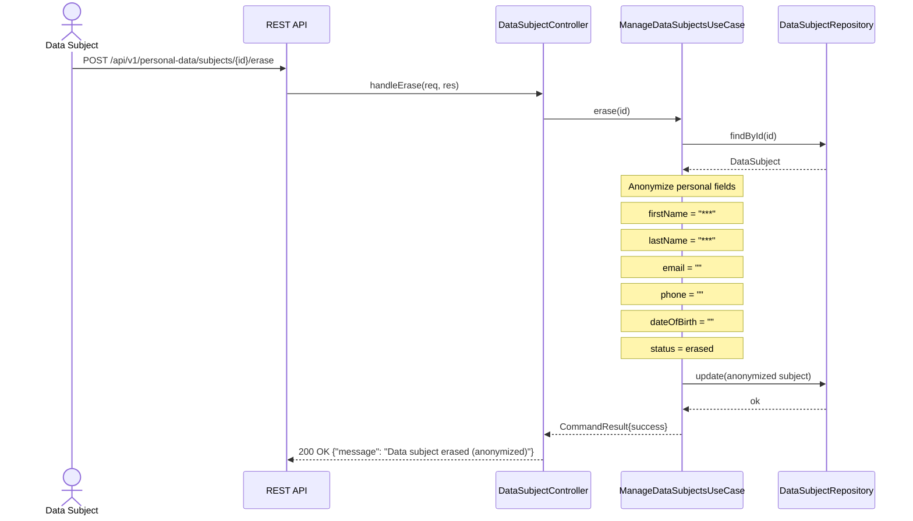
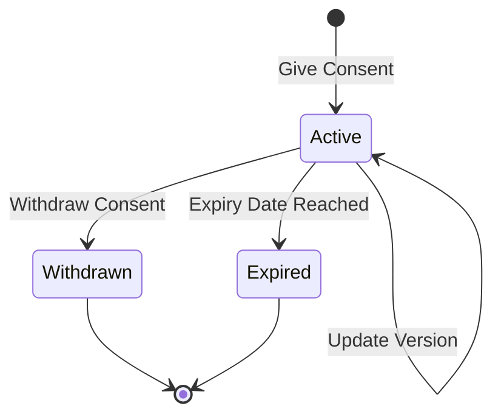
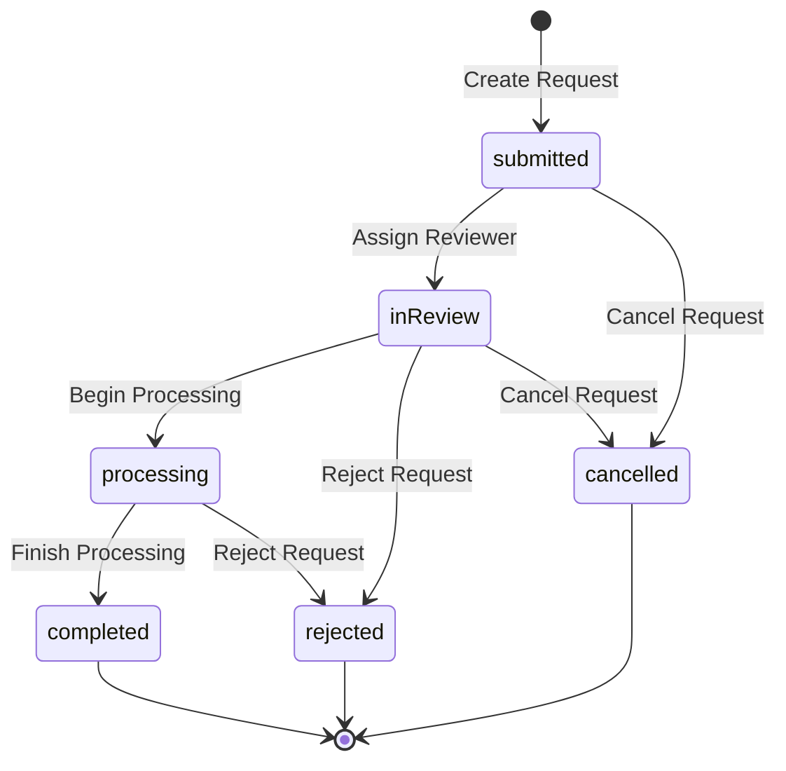
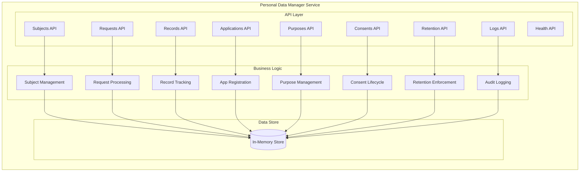
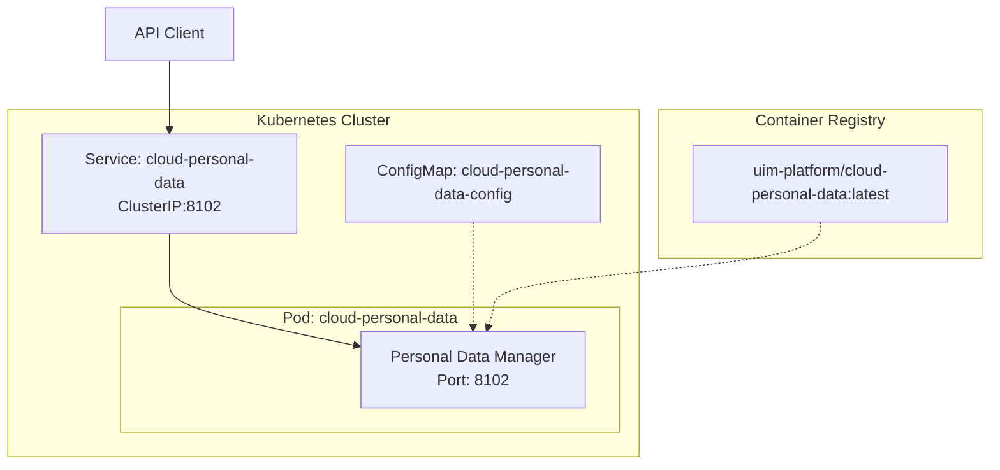

# Personal Data Manager Service - UML Diagrams

## Domain Class Diagram

## Hexagonal Architecture

## GDPR Request Processing Sequence

## Data Subject Erasure Sequence

## Consent Lifecycle State Diagram

## Request Status State Diagram

## Component Diagram

## Deployment Diagram

