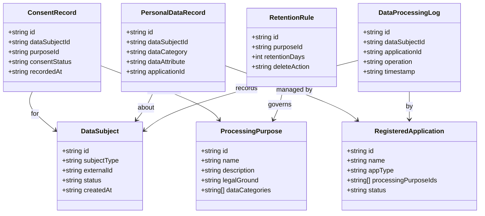
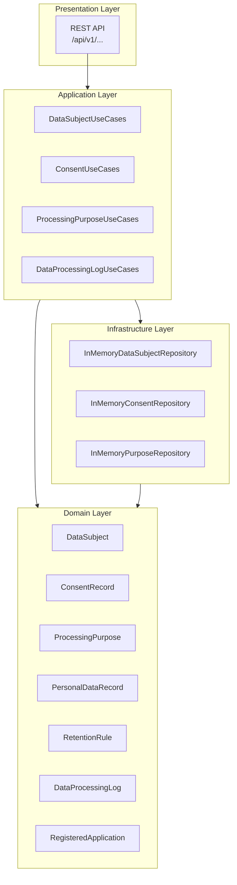
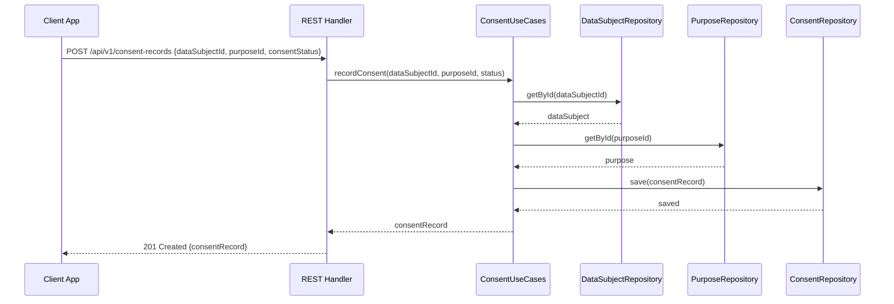

# UML Diagrams — Personal Data Service

## Class Diagram

```mermaid
classDiagram
    class DataSubject {
        +string id
        +string subjectType
        +string externalId
        +string status
        +string createdAt
    }
    class ConsentRecord {
        +string id
        +string dataSubjectId
        +string purposeId
        +string consentStatus
        +string recordedAt
    }
    class ProcessingPurpose {
        +string id
        +string name
        +string description
        +string legalGround
        +string[] dataCategories
    }
    class PersonalDataRecord {
        +string id
        +string dataSubjectId
        +string dataCategory
        +string dataAttribute
        +string applicationId
    }
    class RetentionRule {
        +string id
        +string purposeId
        +int retentionDays
        +string deleteAction
    }
    class DataProcessingLog {
        +string id
        +string dataSubjectId
        +string applicationId
        +string operation
        +string timestamp
    }
    class RegisteredApplication {
        +string id
        +string name
        +string appType
        +string[] processingPurposeIds
        +string status
    }

    ConsentRecord --> DataSubject : for
    ConsentRecord --> ProcessingPurpose : consents to
    PersonalDataRecord --> DataSubject : about
    PersonalDataRecord --> RegisteredApplication : managed by
    RetentionRule --> ProcessingPurpose : governs
    DataProcessingLog --> DataSubject : records
    DataProcessingLog --> RegisteredApplication : by
```

## Component Diagram

```mermaid
flowchart TB
    subgraph Presentation["Presentation Layer"]
        REST["REST API\n/api/v1/..."]
    end
    subgraph Application["Application Layer"]
        DS_UC["DataSubjectUseCases"]
        CONSENT_UC["ConsentUseCases"]
        PURPOSE_UC["ProcessingPurposeUseCases"]
        LOG_UC["DataProcessingLogUseCases"]
    end
    subgraph Domain["Domain Layer"]
        DS["DataSubject"]
        CR["ConsentRecord"]
        PP["ProcessingPurpose"]
        PDR["PersonalDataRecord"]
        RR["RetentionRule"]
        DPL["DataProcessingLog"]
        RA["RegisteredApplication"]
    end
    subgraph Infrastructure["Infrastructure Layer"]
        DS_REPO["InMemoryDataSubjectRepository"]
        CR_REPO["InMemoryConsentRepository"]
        PP_REPO["InMemoryPurposeRepository"]
    end

    REST --> Application
    Application --> Domain
    Infrastructure --> Domain
    Application --> Infrastructure
```

## Sequence Diagram — Record Consent

```mermaid
sequenceDiagram
    participant C as Client App
    participant R as REST Handler
    participant UC as ConsentUseCases
    participant DSR as DataSubjectRepository
    participant PPR as PurposeRepository
    participant CRR as ConsentRepository

    C->>R: POST /api/v1/consent-records {dataSubjectId, purposeId, consentStatus}
    R->>UC: recordConsent(dataSubjectId, purposeId, status)
    UC->>DSR: getById(dataSubjectId)
    DSR-->>UC: dataSubject
    UC->>PPR: getById(purposeId)
    PPR-->>UC: purpose
    UC->>CRR: save(consentRecord)
    CRR-->>UC: saved
    UC-->>R: consentRecord
    R-->>C: 201 Created {consentRecord}
```
