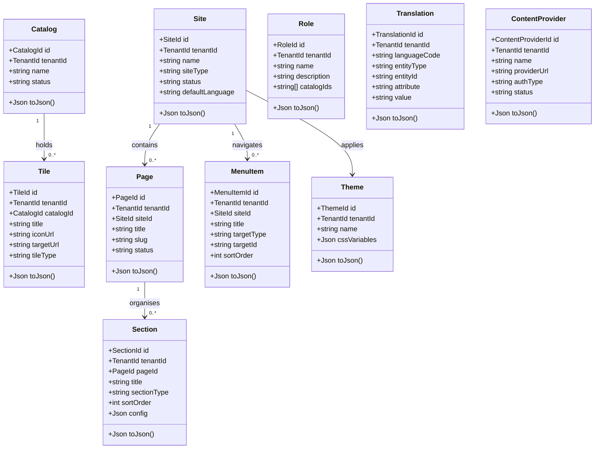
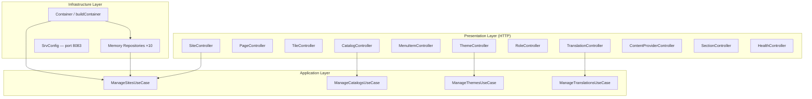
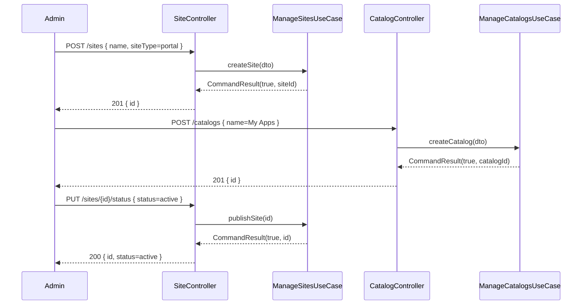

# UML — Portal Service

## Class Diagram — Domain Entities

```mermaid
classDiagram
    class Site {
        +SiteId id
        +TenantId tenantId
        +string name
        +string siteType
        +string status
        +string defaultLanguage
        +Json toJson()
    }
    class Page {
        +PageId id
        +TenantId tenantId
        +SiteId siteId
        +string title
        +string slug
        +string status
        +Json toJson()
    }
    class Tile {
        +TileId id
        +TenantId tenantId
        +CatalogId catalogId
        +string title
        +string iconUrl
        +string targetUrl
        +string tileType
        +Json toJson()
    }
    class Catalog {
        +CatalogId id
        +TenantId tenantId
        +string name
        +string status
        +Json toJson()
    }
    class MenuItem {
        +MenuItemId id
        +TenantId tenantId
        +SiteId siteId
        +string title
        +string targetType
        +string targetId
        +int sortOrder
        +Json toJson()
    }
    class Theme {
        +ThemeId id
        +TenantId tenantId
        +string name
        +Json cssVariables
        +Json toJson()
    }
    class Role {
        +RoleId id
        +TenantId tenantId
        +string name
        +string description
        +string[] catalogIds
        +Json toJson()
    }
    class Translation {
        +TranslationId id
        +TenantId tenantId
        +string languageCode
        +string entityType
        +string entityId
        +string attribute
        +string value
        +Json toJson()
    }
    class ContentProvider {
        +ContentProviderId id
        +TenantId tenantId
        +string name
        +string providerUrl
        +string authType
        +string status
        +Json toJson()
    }
    class Section {
        +SectionId id
        +TenantId tenantId
        +PageId pageId
        +string title
        +string sectionType
        +int sortOrder
        +Json config
        +Json toJson()
    }

    Site "1" --> "0..*" Page : contains
    Site "1" --> "0..*" MenuItem : navigates
    Site --> Theme : applies
    Catalog "1" --> "0..*" Tile : holds
    Page "1" --> "0..*" Section : organises
```

---

## Component Diagram

```mermaid
flowchart TB
    subgraph Presentation["Presentation Layer (HTTP)"]
        C1[SiteController]
        C2[PageController]
        C3[TileController]
        C4[CatalogController]
        C5[MenuItemController]
        C6[ThemeController]
        C7[RoleController]
        C8[TranslationController]
        C9[ContentProviderController]
        C10[SectionController]
        HC[HealthController]
    end
    subgraph Application["Application Layer"]
        UC1[ManageSitesUseCase]
        UC2[ManageCatalogsUseCase]
        UC3[ManageThemesUseCase]
        UC4[ManageTranslationsUseCase]
    end
    subgraph Infrastructure["Infrastructure Layer"]
        MEM[Memory Repositories ×10]
        CFG[SrvConfig — port 8083]
        CTR[Container / buildContainer]
    end
    C1 --> UC1
    C4 --> UC2
    C6 --> UC3
    C8 --> UC4
    MEM --> UC1
    CTR --> UC1
    CTR --> MEM
```

---

## Sequence Diagram — Publish Site with Catalog Tiles

```mermaid
sequenceDiagram
    participant Admin
    participant SC as SiteController
    participant SUC as ManageSitesUseCase
    participant CC as CatalogController
    participant CUC as ManageCatalogsUseCase

    Admin->>SC: POST /sites { name, siteType=portal }
    SC->>SUC: createSite(dto)
    SUC-->>SC: CommandResult(true, siteId)
    SC-->>Admin: 201 { id }

    Admin->>CC: POST /catalogs { name=My Apps }
    CC->>CUC: createCatalog(dto)
    CUC-->>CC: CommandResult(true, catalogId)
    CC-->>Admin: 201 { id }

    Admin->>SC: PUT /sites/{id}/status { status=active }
    SC->>SUC: publishSite(id)
    SUC-->>SC: CommandResult(true, id)
    SC-->>Admin: 200 { id, status=active }
```
