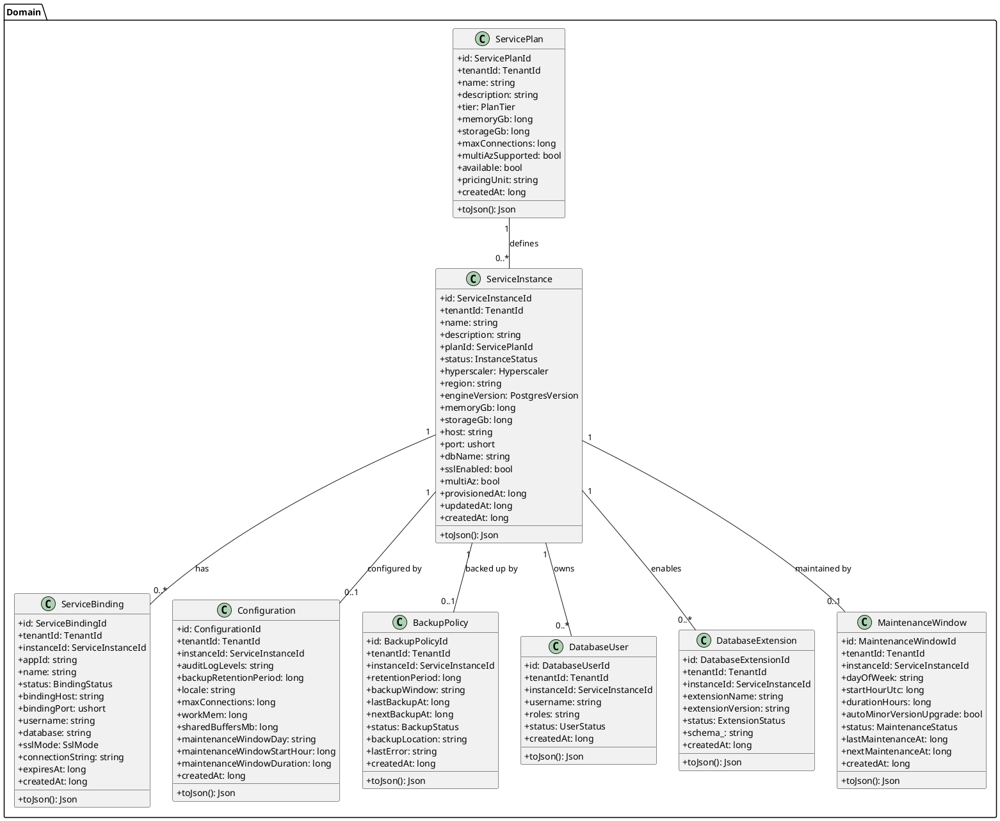
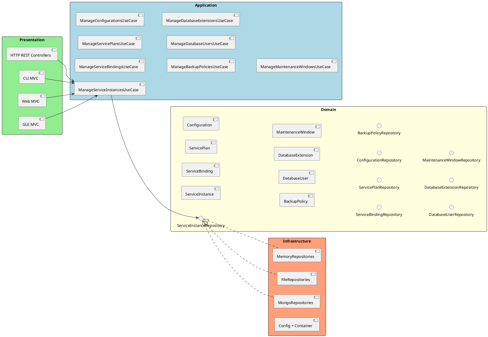
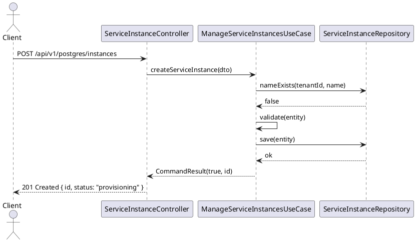
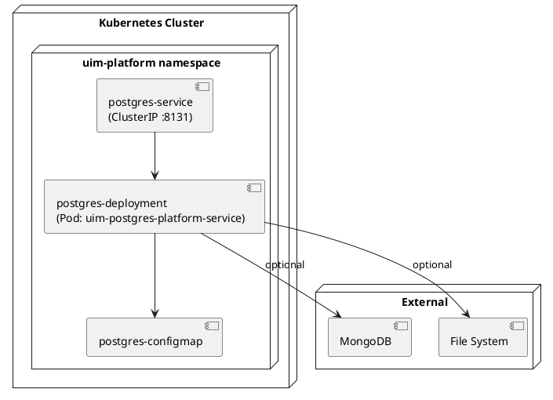

# UML — PostgreSQL on SAP BTP, Hyperscaler Option

## Domain Model (Class Diagram)

```plantuml
@startuml domain
skinparam classAttributeIconSize 0

package "Domain" {
  class ServiceInstance {
    + id: ServiceInstanceId
    + tenantId: TenantId
    + name: string
    + description: string
    + planId: ServicePlanId
    + status: InstanceStatus
    + hyperscaler: Hyperscaler
    + region: string
    + engineVersion: PostgresVersion
    + memoryGb: long
    + storageGb: long
    + host: string
    + port: ushort
    + dbName: string
    + sslEnabled: bool
    + multiAz: bool
    + provisionedAt: long
    + updatedAt: long
    + createdAt: long
    + toJson(): Json
  }

  class ServiceBinding {
    + id: ServiceBindingId
    + tenantId: TenantId
    + instanceId: ServiceInstanceId
    + appId: string
    + name: string
    + status: BindingStatus
    + bindingHost: string
    + bindingPort: ushort
    + username: string
    + database: string
    + sslMode: SslMode
    + connectionString: string
    + expiresAt: long
    + createdAt: long
    + toJson(): Json
  }

  class ServicePlan {
    + id: ServicePlanId
    + tenantId: TenantId
    + name: string
    + description: string
    + tier: PlanTier
    + memoryGb: long
    + storageGb: long
    + maxConnections: long
    + multiAzSupported: bool
    + available: bool
    + pricingUnit: string
    + createdAt: long
    + toJson(): Json
  }

  class Configuration {
    + id: ConfigurationId
    + tenantId: TenantId
    + instanceId: ServiceInstanceId
    + auditLogLevels: string
    + backupRetentionPeriod: long
    + locale: string
    + maxConnections: long
    + workMem: long
    + sharedBuffersMb: long
    + maintenanceWindowDay: string
    + maintenanceWindowStartHour: long
    + maintenanceWindowDuration: long
    + createdAt: long
    + toJson(): Json
  }

  class BackupPolicy {
    + id: BackupPolicyId
    + tenantId: TenantId
    + instanceId: ServiceInstanceId
    + retentionPeriod: long
    + backupWindow: string
    + lastBackupAt: long
    + nextBackupAt: long
    + status: BackupStatus
    + backupLocation: string
    + lastError: string
    + createdAt: long
    + toJson(): Json
  }

  class DatabaseUser {
    + id: DatabaseUserId
    + tenantId: TenantId
    + instanceId: ServiceInstanceId
    + username: string
    + roles: string
    + status: UserStatus
    + createdAt: long
    + toJson(): Json
  }

  class DatabaseExtension {
    + id: DatabaseExtensionId
    + tenantId: TenantId
    + instanceId: ServiceInstanceId
    + extensionName: string
    + extensionVersion: string
    + status: ExtensionStatus
    + schema_: string
    + createdAt: long
    + toJson(): Json
  }

  class MaintenanceWindow {
    + id: MaintenanceWindowId
    + tenantId: TenantId
    + instanceId: ServiceInstanceId
    + dayOfWeek: string
    + startHourUtc: long
    + durationHours: long
    + autoMinorVersionUpgrade: bool
    + status: MaintenanceStatus
    + lastMaintenanceAt: long
    + nextMaintenanceAt: long
    + createdAt: long
    + toJson(): Json
  }
}

ServiceInstance "1" -- "0..*" ServiceBinding : has
ServiceInstance "1" -- "0..1" Configuration : configured by
ServiceInstance "1" -- "0..1" BackupPolicy : backed up by
ServiceInstance "1" -- "0..*" DatabaseUser : owns
ServiceInstance "1" -- "0..*" DatabaseExtension : enables
ServiceInstance "1" -- "0..1" MaintenanceWindow : maintained by
ServicePlan "1" -- "0..*" ServiceInstance : defines

@enduml
```

## Hexagonal Architecture

```plantuml
@startuml hexagonal
left to right direction

rectangle "Domain" #lightyellow {
  component [ServiceInstance] as SI
  component [ServiceBinding] as SB
  component [ServicePlan] as SP
  component [Configuration] as CF
  component [BackupPolicy] as BP
  component [DatabaseUser] as DU
  component [DatabaseExtension] as DE
  component [MaintenanceWindow] as MW
  interface "ServiceInstanceRepository" as SIR
  interface "ServiceBindingRepository" as SBR
  interface "ServicePlanRepository" as SPR
  interface "ConfigurationRepository" as CFR
  interface "BackupPolicyRepository" as BPR
  interface "DatabaseUserRepository" as DUR
  interface "DatabaseExtensionRepository" as DER
  interface "MaintenanceWindowRepository" as MWR
}

rectangle "Application" #lightblue {
  component [ManageServiceInstancesUseCase] as MSIU
  component [ManageServiceBindingsUseCase] as MSBU
  component [ManageServicePlansUseCase] as MSPU
  component [ManageConfigurationsUseCase] as MCU
  component [ManageBackupPoliciesUseCase] as MBPU
  component [ManageDatabaseUsersUseCase] as MDUU
  component [ManageDatabaseExtensionsUseCase] as MDEU
  component [ManageMaintenanceWindowsUseCase] as MMWU
}

rectangle "Presentation" #lightgreen {
  component [HTTP REST Controllers] as HTTP
  component [CLI MVC] as CLI
  component [Web MVC] as WEB
  component [GUI MVC] as GUI
}

rectangle "Infrastructure" #lightsalmon {
  component [MemoryRepositories] as MEM
  component [FileRepositories] as FILE
  component [MongoRepositories] as MONGO
  component [Config + Container] as INFRA
}

HTTP --> MSIU
CLI --> MSIU
WEB --> MSIU
GUI --> MSIU
MSIU --> SIR
SIR <|.. MEM
SIR <|.. FILE
SIR <|.. MONGO
@enduml
```

## Sequence Diagram — Create Instance

```plantuml
@startuml sequence_create
actor Client
participant "ServiceInstanceController" as C
participant "ManageServiceInstancesUseCase" as UC
participant "ServiceInstanceRepository" as R

Client -> C : POST /api/v1/postgres/instances
C -> UC : createServiceInstance(dto)
UC -> R : nameExists(tenantId, name)
R --> UC : false
UC -> UC : validate(entity)
UC -> R : save(entity)
R --> UC : ok
UC --> C : CommandResult(true, id)
C --> Client : 201 Created { id, status: "provisioning" }
@enduml
```

## Deployment Diagram

```plantuml
@startuml deployment
node "Kubernetes Cluster" {
  node "uim-platform namespace" {
    component [postgres-service\n(ClusterIP :8131)] as SVC
    component [postgres-deployment\n(Pod: uim-postgres-platform-service)] as DEP
    component [postgres-configmap] as CM
    SVC --> DEP
    DEP --> CM
  }
}
node "External" {
  database [MongoDB] as MDB
  database [File System] as FS
}
DEP --> MDB : optional
DEP --> FS : optional
@enduml
```
