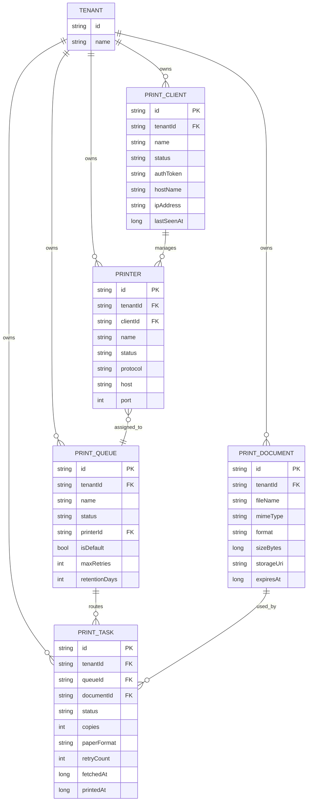
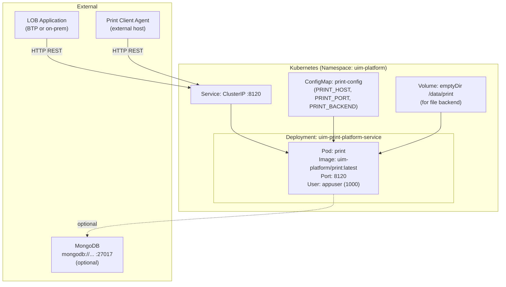

# UIM Print Platform Service — NAF v4 Architecture

## 1. NCV — Capability Taxonomy

```
UIM Platform Capabilities
└── Print Services
    ├── Print Queue Management
    │   ├── Create / Update / Delete Queues
    │   ├── Queue Status Control (active, paused, inactive)
    │   └── Default Queue Resolution
    ├── Print Task Lifecycle
    │   ├── Task Submission
    │   ├── Task Fetching (client polling)
    │   ├── Task Status Tracking (pending→fetched→processing→printed/failed)
    │   └── Retry and Error Handling
    ├── Printer Registry
    │   ├── Printer Registration (IPP, LPD, USB, CUPS, Virtual)
    │   ├── Printer Status Monitoring (online, offline, error)
    │   └── Protocol Abstraction
    ├── Document Management
    │   ├── Document Upload and Storage
    │   ├── Format Validation (PDF, ZPL, PCL, PostScript, PNG, JPEG, TIFF, HTML, RAW)
    │   └── Document Expiry and Cleanup
    └── Client Management
        ├── Client Registration and Authentication (token-based)
        ├── Client Status Tracking (registered, active, inactive, error)
        └── Client-Printer Association
```

---

## 2. NSV — Service View

| Service | Interface | Protocol | Port | Description |
|---|---|---|---|---|
| UIM Print Platform Service | REST API | HTTP/JSON | 8120 | Core print management service |
| Health Endpoint | REST API | HTTP/JSON | 8120 | `/api/v1/health` — liveness probe |
| Print Queue API | REST API | HTTP/JSON | 8120 | CRUD for print queues |
| Print Task API | REST API | HTTP/JSON | 8120 | CRUD + status lifecycle for tasks |
| Printer API | REST API | HTTP/JSON | 8120 | Printer registration and query |
| Document API | REST API | HTTP/JSON | 8120 | Document upload and retrieval |
| Client API | REST API | HTTP/JSON | 8120 | Client registration and token auth |
| Web UI | HTTP/HTML | HTTP | 8120 | Queue and task browser (`/web/print/*`) |
| MongoDB (optional) | Driver | TCP/BSON | 27017 | Persistent storage backend |

---

## 3. NOV — Operational Node Connectivity

```mermaid
graph LR
    subgraph BTP_App[BTP Application]
        APP[Application / LOB System]
    end

    subgraph Print_Service[UIM Print Platform Service]
        API[REST API :8120]
        UC[Use Cases]
        REPO[Repositories]
    end

    subgraph Storage[Storage Backend]
        MEM[In-Memory]
        FILE[File System]
        MONGO[MongoDB]
    end

    subgraph Client_Side[Print Client Side]
        AGENT[Print Client Agent]
        PRINTER[Physical / Virtual Printer]
    end

    APP -->|POST /api/v1/print/tasks| API
    APP -->|POST /api/v1/print/documents| API
    AGENT -->|GET /api/v1/print/tasks (polling)| API
    AGENT -->|PUT /api/v1/print/tasks/:id (status update)| API
    API --> UC --> REPO
    REPO --> MEM
    REPO --> FILE
    REPO --> MONGO
    AGENT -->|Print Job| PRINTER
```

---

## 4. NLV — Logical Data Model



---

## 5. NPV — Physical Deployment



### Container Runtime (Docker / Podman)

The service ships with a multi-stage `Dockerfile` / `Containerfile`:

| Stage | Base Image | Purpose |
|---|---|---|
| builder | `dlang2/ldc-ubuntu:1.40.1` | Compile D source with LDC2 |
| runtime | `ubuntu:24.04` | Minimal production image |

Non-root `appuser` (UID 1000) runs the binary. HEALTHCHECK pings `/api/v1/health` every 30 seconds.
