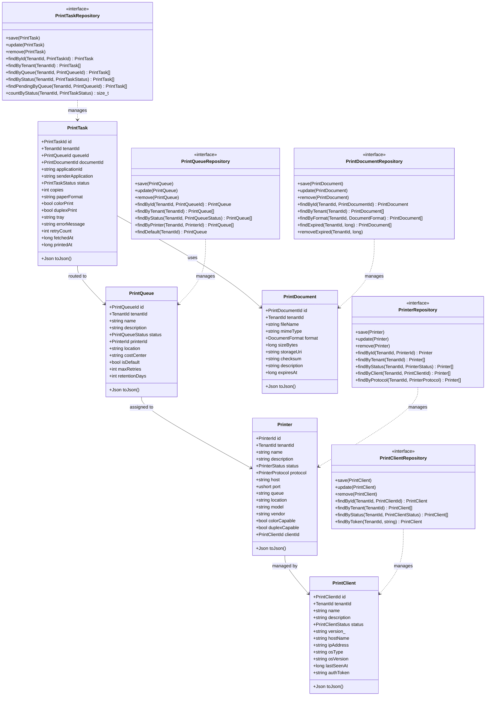
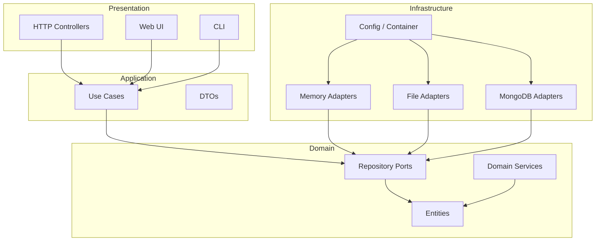
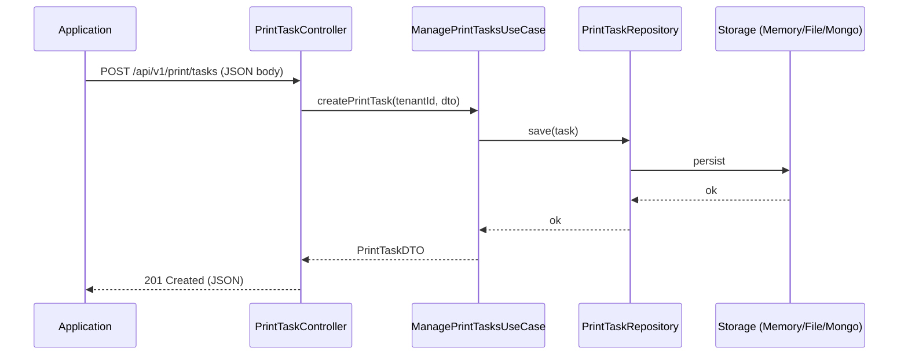

# UIM Print Platform Service — UML

## Class Diagram

```mermaid
classDiagram
    class PrintQueue {
        +PrintQueueId id
        +TenantId tenantId
        +string name
        +string description
        +PrintQueueStatus status
        +PrinterId printerId
        +string location
        +string costCenter
        +bool isDefault
        +int maxRetries
        +int retentionDays
        +Json toJson()
    }

    class PrintTask {
        +PrintTaskId id
        +TenantId tenantId
        +PrintQueueId queueId
        +PrintDocumentId documentId
        +string applicationId
        +string senderApplication
        +PrintTaskStatus status
        +int copies
        +string paperFormat
        +bool colorPrint
        +bool duplexPrint
        +string tray
        +string errorMessage
        +int retryCount
        +long fetchedAt
        +long printedAt
        +Json toJson()
    }

    class Printer {
        +PrinterId id
        +TenantId tenantId
        +string name
        +string description
        +PrinterStatus status
        +PrinterProtocol protocol
        +string host
        +ushort port
        +string queue
        +string location
        +string model
        +string vendor
        +bool colorCapable
        +bool duplexCapable
        +PrintClientId clientId
        +Json toJson()
    }

    class PrintDocument {
        +PrintDocumentId id
        +TenantId tenantId
        +string fileName
        +string mimeType
        +DocumentFormat format
        +long sizeBytes
        +string storageUri
        +string checksum
        +string description
        +long expiresAt
        +Json toJson()
    }

    class PrintClient {
        +PrintClientId id
        +TenantId tenantId
        +string name
        +string description
        +PrintClientStatus status
        +string version_
        +string hostName
        +string ipAddress
        +string osType
        +string osVersion
        +long lastSeenAt
        +string authToken
        +Json toJson()
    }

    class PrintQueueRepository {
        <<interface>>
        +save(PrintQueue)
        +update(PrintQueue)
        +remove(PrintQueue)
        +findById(TenantId, PrintQueueId) PrintQueue
        +findByTenant(TenantId) PrintQueue[]
        +findByStatus(TenantId, PrintQueueStatus) PrintQueue[]
        +findByPrinter(TenantId, PrinterId) PrintQueue[]
        +findDefault(TenantId) PrintQueue
    }

    class PrintTaskRepository {
        <<interface>>
        +save(PrintTask)
        +update(PrintTask)
        +remove(PrintTask)
        +findById(TenantId, PrintTaskId) PrintTask
        +findByTenant(TenantId) PrintTask[]
        +findByQueue(TenantId, PrintQueueId) PrintTask[]
        +findByStatus(TenantId, PrintTaskStatus) PrintTask[]
        +findPendingByQueue(TenantId, PrintQueueId) PrintTask[]
        +countByStatus(TenantId, PrintTaskStatus) size_t
    }

    class PrinterRepository {
        <<interface>>
        +save(Printer)
        +update(Printer)
        +remove(Printer)
        +findById(TenantId, PrinterId) Printer
        +findByTenant(TenantId) Printer[]
        +findByStatus(TenantId, PrinterStatus) Printer[]
        +findByClient(TenantId, PrintClientId) Printer[]
        +findByProtocol(TenantId, PrinterProtocol) Printer[]
    }

    class PrintDocumentRepository {
        <<interface>>
        +save(PrintDocument)
        +update(PrintDocument)
        +remove(PrintDocument)
        +findById(TenantId, PrintDocumentId) PrintDocument
        +findByTenant(TenantId) PrintDocument[]
        +findByFormat(TenantId, DocumentFormat) PrintDocument[]
        +findExpired(TenantId, long) PrintDocument[]
        +removeExpired(TenantId, long)
    }

    class PrintClientRepository {
        <<interface>>
        +save(PrintClient)
        +update(PrintClient)
        +remove(PrintClient)
        +findById(TenantId, PrintClientId) PrintClient
        +findByTenant(TenantId) PrintClient[]
        +findByStatus(TenantId, PrintClientStatus) PrintClient[]
        +findByToken(TenantId, string) PrintClient
    }

    PrintTask --> PrintQueue : routed to
    PrintTask --> PrintDocument : uses
    Printer --> PrintClient : managed by
    PrintQueue --> Printer : assigned to

    PrintQueueRepository ..> PrintQueue : manages
    PrintTaskRepository ..> PrintTask : manages
    PrinterRepository ..> Printer : manages
    PrintDocumentRepository ..> PrintDocument : manages
    PrintClientRepository ..> PrintClient : manages
```

## Layer Diagram

```mermaid
graph TD
    subgraph Presentation
        HTTP[HTTP Controllers]
        WEB[Web UI]
        CLI[CLI]
    end
    subgraph Application
        UC[Use Cases]
        DTO[DTOs]
    end
    subgraph Domain
        ENT[Entities]
        PORT[Repository Ports]
        SVC[Domain Services]
    end
    subgraph Infrastructure
        MEM[Memory Adapters]
        FILE[File Adapters]
        MONGO[MongoDB Adapters]
        CFG[Config / Container]
    end

    HTTP --> UC
    WEB --> UC
    CLI --> UC
    UC --> PORT
    PORT --> ENT
    SVC --> ENT
    MEM --> PORT
    FILE --> PORT
    MONGO --> PORT
    CFG --> MEM
    CFG --> FILE
    CFG --> MONGO
```

## Sequence: Submit Print Task

```mermaid
sequenceDiagram
    participant App as Application
    participant API as PrintTaskController
    participant UC as ManagePrintTasksUseCase
    participant Repo as PrintTaskRepository
    participant DB as Storage (Memory/File/Mongo)

    App->>API: POST /api/v1/print/tasks (JSON body)
    API->>UC: createPrintTask(tenantId, dto)
    UC->>Repo: save(task)
    Repo->>DB: persist
    DB-->>Repo: ok
    Repo-->>UC: ok
    UC-->>API: PrintTaskDTO
    API-->>App: 201 Created (JSON)
```
