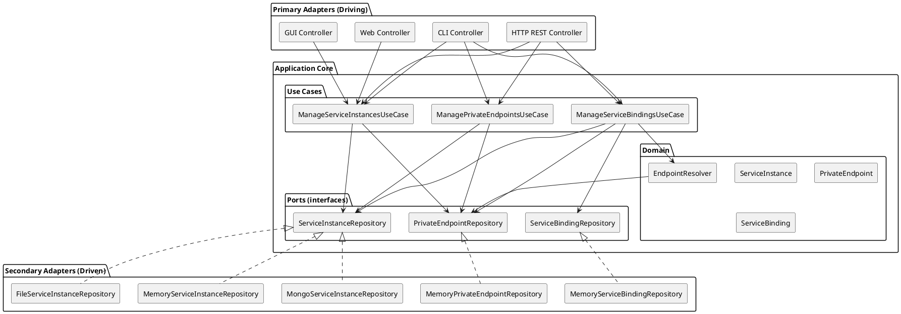
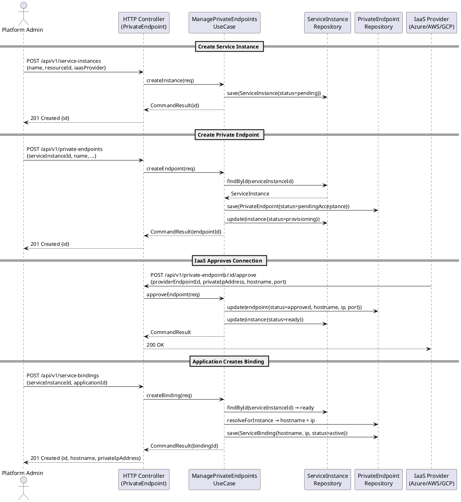
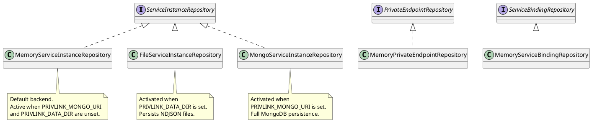

# UML — SAP Private Link Service (UIM Platform)

## 1. Domain Class Diagram

```plantuml
@startuml private-link-domain

skinparam classAttributeIconSize 0
skinparam class {
  BackgroundColor #F8F8FF
  BorderColor     #444
}

package "domain.types" {
  class ServiceInstanceId  { +string value }
  class PrivateEndpointId  { +string value }
  class ServiceBindingId   { +string value }
}

package "domain.enumerations" {
  enum IaasProvider      { azure; aws; gcp }
  enum InstanceStatus    { pending; provisioning; ready; failed; suspended; deleted_ }
  enum EndpointStatus    { pendingAcceptance; approved; rejected; disconnected; ready; failed }
  enum BindingStatus     { creating; active; deleting; deleted_ }
  enum ServicePlan       { standard; premium }
  enum NetworkDirection  { inbound; outbound }
}

package "domain.entities" {
  class ServiceInstance {
    +ServiceInstanceId id
    +TenantId tenantId
    +string name
    +string description
    +string resourceId
    +IaasProvider iaasProvider
    +ServicePlan plan
    +string region
    +string subaccountId
    +InstanceStatus status
    +string statusMessage
    +PrivateEndpointId privateEndpointId
    +long createdAt
    +long updatedAt
    +Json toJson()
  }

  class PrivateEndpoint {
    +PrivateEndpointId id
    +TenantId tenantId
    +ServiceInstanceId serviceInstanceId
    +string name
    +string privateIpAddress
    +string hostname
    +ushort port
    +EndpointStatus status
    +string statusMessage
    +string providerEndpointId
    +IaasProvider iaasProvider
    +string region
    +long approvedAt
    +long createdAt
    +long updatedAt
    +Json toJson()
  }

  class ServiceBinding {
    +ServiceBindingId id
    +TenantId tenantId
    +ServiceInstanceId serviceInstanceId
    +string applicationId
    +string hostname
    +string privateIpAddress
    +ushort port
    +BindingStatus status
    +long createdAt
    +long deletedAt
    +Json toJson()
  }
}

package "domain.ports.repositories" {
  interface ServiceInstanceRepository {
    +bool existsByName(TenantId, string)
    +ServiceInstance findByName(TenantId, string)
    +ServiceInstance[] findByStatus(TenantId, InstanceStatus)
    +ServiceInstance[] findByIaasProvider(TenantId, IaasProvider)
  }

  interface PrivateEndpointRepository {
    +PrivateEndpoint[] findByServiceInstance(TenantId, ServiceInstanceId)
    +PrivateEndpoint[] findByStatus(TenantId, EndpointStatus)
    +void removeByServiceInstance(TenantId, ServiceInstanceId)
  }

  interface ServiceBindingRepository {
    +ServiceBinding[] findByServiceInstance(TenantId, ServiceInstanceId)
    +ServiceBinding[] findByApplication(TenantId, string)
    +void removeByServiceInstance(TenantId, ServiceInstanceId)
  }
}

package "domain.services" {
  class EndpointResolver {
    -PrivateEndpointRepository endpoints
    +PrivateEndpoint resolveForInstance(TenantId, ServiceInstanceId)
    +bool isReachable(TenantId, ServiceInstanceId)
  }
}

ServiceInstance       "1" --> "0..1" PrivateEndpoint : references
PrivateEndpoint       "0..*" -- "1"  ServiceInstance : belongs to
ServiceBinding        "0..*" -- "1"  ServiceInstance : binds
EndpointResolver      --> PrivateEndpointRepository : uses

ServiceInstanceRepository ..> ServiceInstance
PrivateEndpointRepository ..> PrivateEndpoint
ServiceBindingRepository  ..> ServiceBinding

@enduml
```

---

## 2. Hexagonal Architecture Diagram



---

## 3. Private Endpoint Approval Sequence Diagram



---

## 4. Infrastructure / Persistence Strategy Diagram


